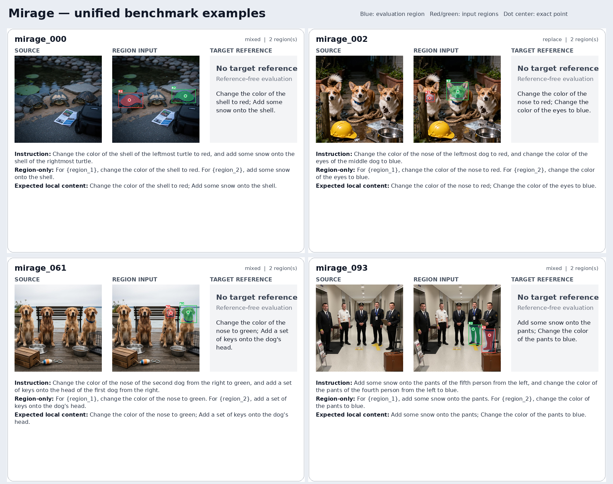

# SAMTok 细粒度交互式编辑 Benchmark：构造与使用

本文档只记录数据筛选、统一格式、构造、冻结输入与使用方式。模型调用、运行记录和结果见 [MODEL_RESULTS.md](MODEL_RESULTS.md)。

## 1. 评测目标

本 benchmark 关注同类多实例场景中的指代性、细粒度局部编辑：当一张图中
存在多个外观相近的实例时，模型能否只编辑被文字或交互信号指向的一个或
多个目标，并保持其他实例和背景不变。

每个 case 提供四种输入 setting：

| Setting | 定位信息 | 主要考察内容 |
| --- | --- | --- |
| `text_only` | 原始空间/指代 instruction | 模型能否理解“第二个、最右侧、中间、位于两者之间”等文字指代 |
| `mask_annotation` | 精确或人工笔刷 mask | 显式区域能否帮助模型完成局部编辑 |
| `box_annotation` | 目标外接框 | 较弱区域提示下的实例选择与编辑能力 |
| `point_annotation` | 目标内部点 | 最稀疏交互下的目标定位能力 |

人工检查时主要观察：目标是否选对、编辑内容是否正确、编辑是否外溢、非目标
区域是否保持，以及模型是否错误保留了临时 mask/box/point。指标设计和 judge
不属于当前阶段，推理脚本也不会触发它们。

## 2. 当前数据

正式 benchmark 位于：

```text
/mnt/bn/strategy-mllm-train/user/tanyue/datasets/samtok_edit_benchmark/
```

| 统计项 | 数量 |
| --- | ---: |
| case / 唯一 ID | 656 / 656 |
| 唯一 source image | 655 |
| CompBench / HumanEdit / MIRAGE | 532 / 24 / 100 |
| add / remove / replace / mixed | 260 / 268 / 94 / 34 |
| 单 region / 双 region | 517 / 139 |
| input region mask / evaluation mask | 795 / 656 |
| target reference image | 556 |

CompBench 中两个不同任务共享一张 source，因此唯一 source 数为 655。全部
CompBench/HumanEdit case 有 target；MIRAGE 未发布编辑后 GT，100 条的
`target.reference_image` 均为 `null`。ReShapeBench 已排除。

### 2.1 源数据

```text
/mnt/bn/strategy-mllm-train/user/tanyue/datasets/CompBench/
/mnt/bn/strategy-mllm-train/user/tanyue/datasets/HumanEdit/
/mnt/bn/strategy-mllm-train/user/tanyue/datasets/MIRAGE/benchmark/
```

| 数据集 | Hugging Face 仓库 | 固定 revision | 入选数 |
| --- | --- | --- | ---: |
| CompBench | `BohanJia/CompBench` | `a4c5a4d1854056d24aad43a494772dc90588d426` | 532 |
| HumanEdit | `BryanW/HumanEdit` | `dbc60b9ba3c17adf59e1effd8a9d92bdf2f14041` | 24 |
| MIRAGE | `ziqiangoodgood/MIRAGE` | `11eff1e3f396e189e61bd1f0ca596286d8a0b183` | 100 |

所有筛选只使用源图片、原始 instruction、发布标注，以及 CompBench/HumanEdit
的 target 做数据一致性检查；没有使用任何模型输出、指标或 judge 分数。

#### CompBench（532 条）

先按文本检索极值位置、序数、中间、between、相对方位和 `all except ...` 等
指代，再逐图检查：同类比较实例确实存在，文字能够唯一解析目标，发布 mask
与 target 的局部变化一致。add/remove/replace 分别为 255/255/22，其中 40 条
是双实例编辑。选择与源 parquet 行号记录在
`selection/selected_cases.jsonl`。

#### HumanEdit（24 条）

从候选中只保留同类多实例、小部件或排除式编辑，并核对 source、人工笔刷
mask、target 的尺寸和语义一致性。保留原始 `MASK_IMG` 的人工 alpha 笔刷，
不使用 SAM 精修。add/remove/replace 为 3/10/11；全部为单 region。选择记录
与 CompBench 共用 `selection/selected_cases.jsonl`。

#### MIRAGE（100 条）

MIRAGE 每张 1024×1024 source 发布 5 个候选编辑及其 polygon。这里对全部 100
张逐条做 five-to-one/two 筛选，而不执行原始 5 区域联合指令：优先选择眼、鼻、
喙、衣物局部等小部件，remove/replace 等结构敏感任务，以及 `leftmost`、
`middle`、`first/second from the left/right` 这类容易混淆的指代。只有当两个
编辑落在不同同类实例上、组合会增加“编辑内容—实例”绑定难度时才组成双
region；否则保留单 region。最终为 99 条双 region、1 条单 region，共 199 个
region；34 条跨操作组合用 `edit_type=mixed` 表示。

MIRAGE 未提供编辑后 target，且当前上游数据仓库未声明 license；本仓库只保存
清单和派生路径，正式发布或再分发图片前应先补充确认授权。

固定索引、原子编辑、最终 instruction 和逐条理由位于
`selection/mirage_selected_regions.jsonl`，生成器为
`selection/build_mirage_selection.py`，统计为
`selection/mirage_selection_stats.json`。五页全量审查图可用
`selection/render_mirage_selection.py` 生成到临时目录。总统计位于
`selection/selection_stats.json`。

### 2.2 统一字段

`benchmark/benchmark.jsonl` 每行是一条编辑任务，顶层字段固定为：

```text
id, source_dataset, edit_type, source_image, instruction,
regions, evaluation_mask, target, difficulty
```

核心结构如下：

```json
{
  "id": "case id",
  "source_dataset": "compbench | humanedit | mirage",
  "edit_type": "add | remove | replace | mixed",
  "source_image": "images/source/...png",
  "instruction": {
    "with_location_reference": "原始位置/指代 instruction",
    "region_only": "使用 {region_1}, {region_2} 绑定交互区域的 instruction"
  },
  "regions": [
    {
      "mask": "regions/input/...png",
      "box": [0, 0, 100, 100],
      "point": [50, 50]
    }
  ],
  "evaluation_mask": "regions/evaluation/...png",
  "target": {
    "reference_image": "images/target/...png | null",
    "expected_local_content": "期望的编辑后局部内容",
    "expected_global_description": null
  },
  "difficulty": {
    "same_class_multi_instance": true,
    "multi_object_scene": true
  }
}
```

所有路径相对于正式 benchmark 根目录。box 使用半开区间像素坐标
`[x1, y1, x2, y2)`，point 使用像素坐标 `[x, y]`。`regions` 的数组顺序
对应 `{region_1}`、`{region_2}` 以及可视化中的 R1、R2。

`mixed` 仅用于 MIRAGE 双 region 中包含不同原子操作的 case。MIRAGE 没有
编辑后 GT，因此 `reference_image=null`，`expected_local_content` 保存所选局部
编辑的目标语义；不得据此计算需要 GT 图的指标。

`target.*` 和 `evaluation_mask` 只用于人工检查或未来评价。推理结果 sidecar
可以记录这些路径作为 provenance，但它们不会进入模型的图片列表或 prompt。

### 2.3 Mask、box、point 构建

- CompBench 保留发布的二值 mask。
- HumanEdit 使用 `MASK_IMG` 中 `alpha < 128` 的原始人工笔刷区域，不做 SAM
  精修。
- MIRAGE 只栅格化入选的 1/2 个发布 polygon，方法与官方 metric 相同：PIL
  `ImageDraw.polygon(..., outline=1, fill=1)`；不改写或精修区域。
- 39 条双目标 CompBench case 的两个连通分量直接成为 R1/R2。
- 另有一条双鸟 case 的发布 mask 是连通 union。构建时使用固定版本的
  Grounding DINO 与 SAM2 只在原 union 内进行语义分区；两个子 mask 不重叠，
  union 与发布 mask 逐像素一致，没有添加或删除 mask 像素。
- box 是 mask 紧致外接框向外扩张图像短边的 2%。
- point 是 mask 内到边界欧氏距离最大的像素；距离变换前在画布外补一圈背景，
  从而同时考虑图像边界。
- evaluation mask 是所有 input mask 的 union，再向外膨胀短边的 2%。

用于唯一一次连通 union 分区的模型固定为：

```text
IDEA-Research/grounding-dino-tiny@a2bb814dd30d776dcf7e30523b00659f4f141c71
facebook/sam2.1-hiera-small@e07df6aa19f5c6545121551bf89957b7663ee715
```

`verify_source_masks.py` 已重新读取 CompBench/HumanEdit 源 parquet，并读取
MIRAGE 发布 polygon；656 条 case 的物化 region union 与对应发布标注 mismatch
为 0。`benchmark/validation_report.json` 状态为
`passed`，检查了 schema、ID、资源路径、图片尺寸、二值 mask、box、point、
region placeholder，以及按数据源约束的 target reference。

### 2.4 数据重建

```bash
cd /opt/tiger/tanyue/samtok_edit_benchmark
BUILD_PY=/opt/tiger/tanyue/sam3-crispedit/.venv-prefilter-improved/bin/python
"$BUILD_PY" selection/build_mirage_selection.py
CUDA_VISIBLE_DEVICES=0 "$BUILD_PY" build_unified_benchmark.py
"$BUILD_PY" verify_source_masks.py
"$BUILD_PY" render_unified_examples.py --output benchmark/visual_examples
```

该构造环境含 `cv2`、`pyarrow` 和 `transformers` 中的 Grounding DINO / SAM2 实现；当前基模推理环境不含 `cv2`，因此重建与推理分别使用上述两个 Python。完整重建会为一条连通 union mask 加载固定 revision 的 Grounding DINO 和 SAM2。已有数据的日常评测只需第 3 节的冻结输入检查。

代表性原始数据：




## 3. 使用已经构造好的 benchmark

正式数据位于 `/mnt/bn/strategy-mllm-train/user/tanyue/datasets/samtok_edit_benchmark/`；`benchmark/benchmark.jsonl` 是仓库内对应的清单副本。图片和 mask 路径相对于正式数据根目录。若只做评测，不需要重新构建数据。

先检查构造结果，再为四个设置准备冻结输入：

```bash
cd /opt/tiger/tanyue/samtok_edit_benchmark
BUILD_PY=/opt/tiger/tanyue/sam3-crispedit/.venv-prefilter-improved/bin/python
BASELINE_PY=/opt/tiger/tanyue/samtok_edit_eval_stage2/.venv/bin/python
"$BUILD_PY" verify_source_masks.py
"$BASELINE_PY" evaluation/prepare_inputs.py --resume
```

准备后的清单位于 `.../referential_finegrained_edit_benchmark_656_two_image_locator/prepared/benchmark_baseline_eval_inputs.jsonl`，每条含四个 setting 实际会用的图片顺序、角色与完整 prompt。`text_only` 只用 clean source，交互设置依次用 clean source 与 annotated locator。模型评测必须使用此冻结清单；参考目标和 evaluation mask 只用于检查结果，不能输入模型。

两个裸基模及其对应的 RePlan 方法的运行命令、已完成产物、验证状态及人工观察见 [MODEL_RESULTS.md](MODEL_RESULTS.md)。本仓库暂不提供质量分数或 judge；结果需要按 case 阅读输出与 sidecar。
