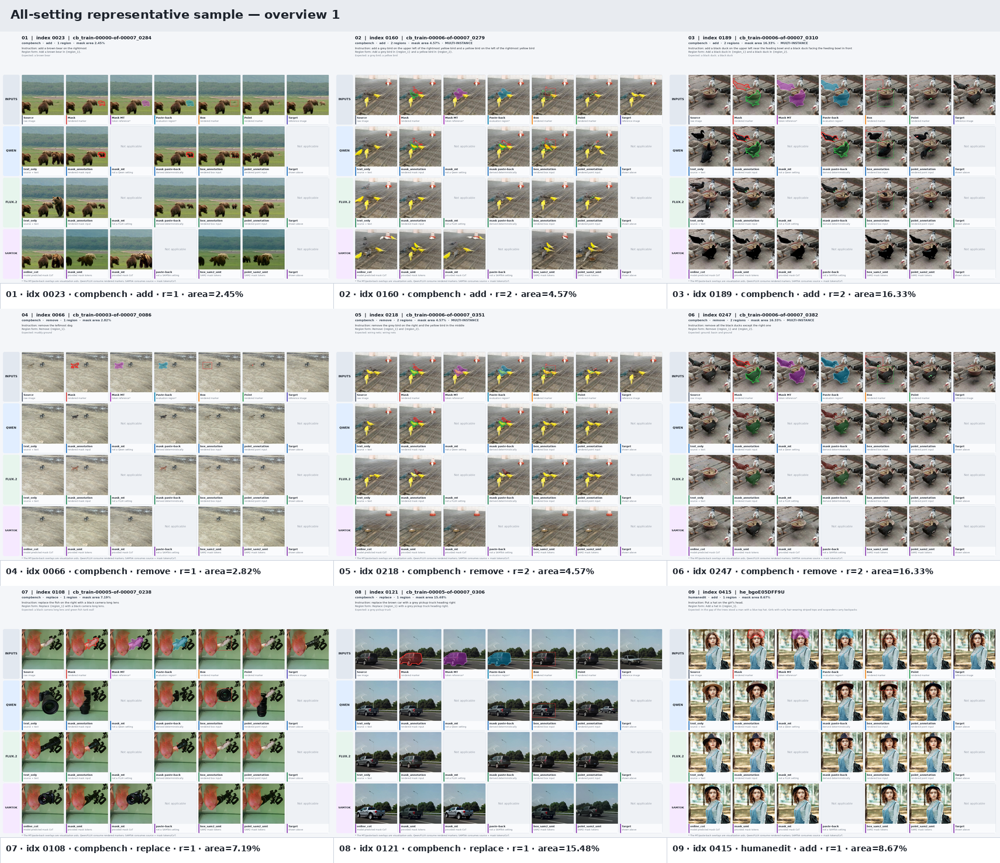
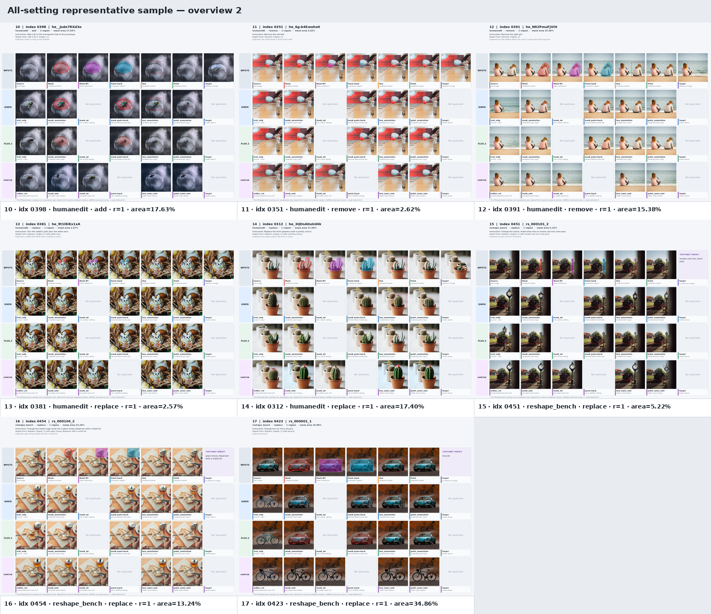
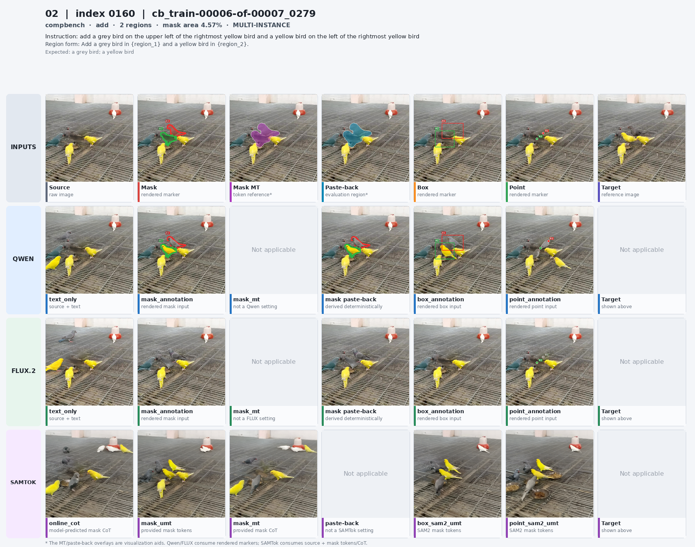
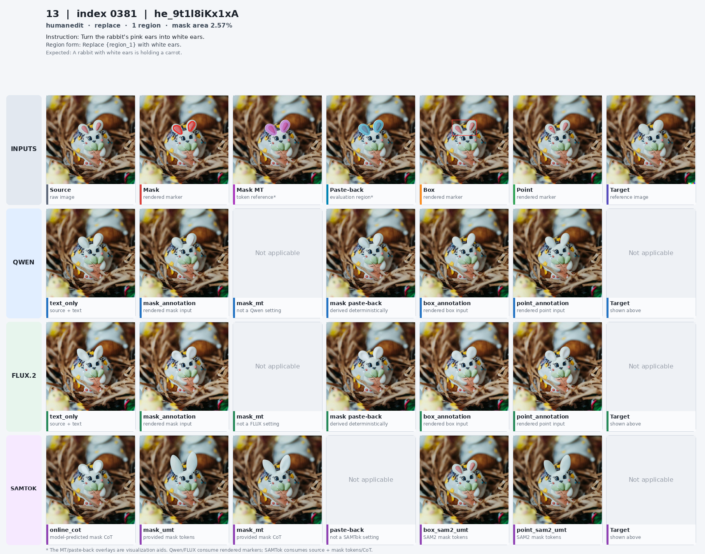
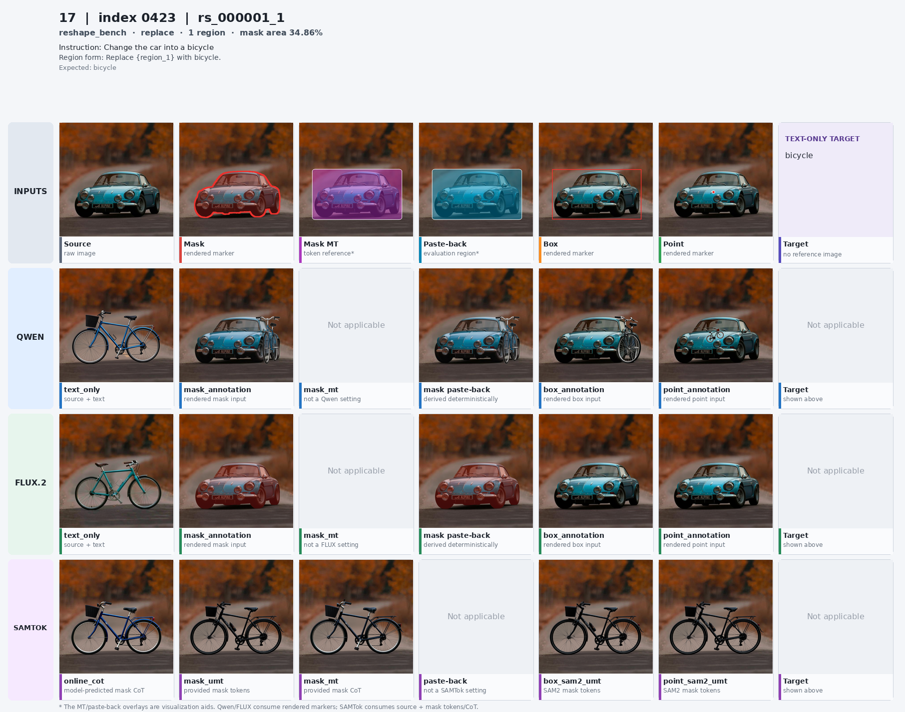

# Benchmark construction, annotation, and inference record

Last updated: 2026-09-13 (UTC)

## 1. Current snapshot

This document is the canonical operational record for the current benchmark. It
covers how the 500 cases were selected and normalized, how mask/box/point inputs
were prepared, how the three evaluated models were loaded, how the 15 inference
settings were run, and where every result is stored.

The current state is:

| Stage | Status | Main artifact |
| --- | --- | --- |
| Source data download | Complete | Three pinned Hugging Face snapshots under `/mnt/.../datasets/` |
| Candidate selection and refinement | Complete | `selection/selected_500.jsonl` |
| Unified benchmark materialization | Complete and validated | `/mnt/bn/strategy-mllm-train/user/tanyue/datasets/samtok_edit_benchmark/benchmark.jsonl` |
| Interaction-input preparation | Complete | `prepared/benchmark_eval_inputs.jsonl` under the experiment root |
| 15-setting full inference | Complete and validated | 7,500 result images and sidecars |
| Quality metrics / VLM judges | Not started | Deliberately deferred pending manual result inspection |

The benchmark contains 500 cases and 500 unique source images:

| Property | Count |
| --- | ---: |
| CompBench / HumanEdit / ReShapeBench | 269 / 154 / 77 |
| Add / remove / replace | 148 / 172 / 180 |
| One-region / two-region cases | 384 / 116 |
| Explicit multi-instance cases | 116 (23.2%) |
| Small-target cases (`input mask area < 2%`) | 137 (27.4%) |
| Region area at most 10% | 367 |
| Region area over 20% | 26 |
| Median input-region area | 5.89% |
| Cases with a target reference image | 423 |
| Input instance masks / evaluation masks | 616 / 500 |

## 2. Authoritative locations

### 2.1 Downloaded source datasets

```text
/mnt/bn/strategy-mllm-train/user/tanyue/datasets/CompBench/
/mnt/bn/strategy-mllm-train/user/tanyue/datasets/HumanEdit/
/mnt/bn/strategy-mllm-train/user/tanyue/datasets/ReShapeBench/
```

The snapshots are pinned in `benchmark/benchmark_meta.json`:

| Dataset | Hugging Face repository | Revision | Role |
| --- | --- | --- | --- |
| CompBench | `BohanJia/CompBench` | `a4c5a4d1854056d24aad43a494772dc90588d426` | Instance-local add/remove/replace and explicit two-instance edits |
| HumanEdit | `BryanW/HumanEdit` | `dbc60b9ba3c17adf59e1effd8a9d92bdf2f14041` | Human-drawn local add/remove/replace masks |
| ReShapeBench | `3087richard/ReShapeBench` | `6250f37e29552b33a07f18f4c9a93156435ac027` | Reference-free object replacement and large shape changes |

### 2.2 Materialized benchmark

```text
/mnt/bn/strategy-mllm-train/user/tanyue/datasets/samtok_edit_benchmark/
```

This is the data root consumed by evaluation. It contains the authoritative
`benchmark.jsonl`, source/target images, input masks, evaluation masks,
`benchmark_meta.json`, `build_report.json`, and `validation_report.json`.
Paths stored in `benchmark.jsonl` are relative to this directory.

The repository's `benchmark/` directory is a lightweight copy of the manifest,
metadata, validation report, and examples. Large image assets are intentionally
kept outside Git.

### 2.3 Inference experiment

```text
/mnt/bn/strategy-mllm-train/user/tanyue/experiments/SAMTokEdit/finegrained_edit_benchmark/
```

This directory contains frozen prepared inputs, per-setting images and JSON
sidecars, `results.jsonl` files, immutable run configurations, logs, and audit
reports. It is separate from the benchmark data root so that model outputs never
modify the test data.

## 3. Selection and annotation workflow

### 3.1 Automatic candidate scan

The first pass scanned the local-edit task families from all three sources and
computed a common set of features without modifying the downloaded data:

- source identity and scene identity;
- normalized edit type;
- input-mask area, bounding box, connected components, and target count;
- whether the instruction contains positional or same-class multi-instance cues;
- for GT-backed CompBench/HumanEdit cases, source-target change locality;
- deterministic ranking and tie-breaking with seed `20260907`.

For GT-backed data, a changed pixel used an RGB change threshold of `12/255`.
Strict local candidates required at least 80% of changed pixels to lie inside the
2%-dilated edit region and at least 40% of RGB difference mass to lie there.
The ranking favored strict cases, areas near 8%, genuinely small targets,
multi-target or same-class scenes, and scene diversity. This produced an initial
500-case selection from 5,106 task-compatible candidates and paginated review
sheets showing source, region overlay, target when available, instruction, and
automatic flags.

The one-time scan/review helpers and their large intermediate sheets were removed
when the repository was consolidated to a single canonical dataset. They remain
recoverable in Git history at commit `235163a` (initial selection) and the parent
of `9c06311` (last pre-consolidation state). The final construction-facing records
needed by the materializer are retained in `selection/selected_500.jsonl`.

### 3.2 Multi-instance and quality refinement

The selection was then explicitly rebalanced for the benchmark's central use
case: fine-grained multi-instance editing. The final set includes all 116 strict
CompBench two-instance add/remove cases. To keep exactly 500 unique source images,
the added cases replaced:

- 18 HumanEdit counting cases that could not yield a reliable local-only prompt;
- 20 redundant ReShapeBench target variants sharing the same source/region;
- 18 remaining single-target cases with the largest final regions.

This removed counting entirely, increased explicit two-instance coverage from 60
to 116 cases, reduced regions over 20% from 51 to 26, and changed the number of
unique source images from 480 to 500. The final source/type breakdown is recorded
in `selection/selection_stats.json`.

### 3.3 Source-specific region materialization

`build_unified_benchmark.py` maps the selected records into one schema and writes
all image/mask assets:

- **CompBench:** released instance masks are used directly. Two-object union
  masks are split into two ordered instance regions. Most split by significant
  connected components; touching instances use pinned Grounding DINO plus SAM2;
  one dense fish pair uses an instruction-constrained spatial partition. The two
  regions are forced to be disjoint while preserving the released union.
- **HumanEdit:** the original human brush is recovered from `MASK_IMG` using
  `alpha < 128`; black RGB content is not mistaken for the mask.
- **ReShapeBench:** the released locator is only a weak prior because some boxes
  are visibly misplaced. Foreground text is grounded and the selected box is
  segmented with SAM2. All 77 cases completed with no grounding or segmentation
  fallback; target supervision is text-only.

Derived geometry is consistent across sources:

- `regions[].box` is the instance-mask bounding box padded by 2% of the shorter
  image side, stored as half-open pixel coordinates `[x1, y1, x2, y2)`;
- `regions[].point` is the mask pixel with the maximum Euclidean distance to the
  mask boundary;
- the CompBench/HumanEdit evaluation mask is the union of input masks dilated by
  2%; the ReShapeBench evaluation mask is the grounded instance rectangle dilated
  by 2% to permit legitimate large-shape replacement.

Grounding and segmentation are pinned to:

```text
IDEA-Research/grounding-dino-tiny@a2bb814dd30d776dcf7e30523b00659f4f141c71
facebook/sam2.1-hiera-small@e07df6aa19f5c6545121551bf89957b7663ee715
```

### 3.4 Prompt annotation

Every case has two instruction views:

- `instruction.with_location_reference` retains the source instruction's spatial
  or referential wording and is used by text-only, online-CoT, and explicit-MT
  settings;
- `instruction.region_only` expresses the operation through ordered
  `{region_1}`, `{region_2}` placeholders and removes the need for textual spatial
  disambiguation. It is used for rendered-marker baselines and UMT settings.

The `regions` array order is authoritative: its first entry corresponds to
`{region_1}`/R1/the first SAMTok span, and its second to region 2.

### 3.5 Unified benchmark record

Each line of `benchmark.jsonl` has exactly these top-level fields:

```json
{
  "id": "unique case id",
  "source_dataset": "compbench | humanedit | reshape_bench",
  "edit_type": "add | remove | replace",
  "source_image": "relative/path/to/source.png",
  "instruction": {
    "with_location_reference": "original referential instruction",
    "region_only": "operation bound to {region_1}, {region_2}, ..."
  },
  "regions": [
    {
      "mask": "relative/path/to/binary_input_mask.png",
      "box": [0, 0, 100, 100],
      "point": [50, 50]
    }
  ],
  "evaluation_mask": "relative/path/to/evaluation_mask.png",
  "target": {
    "reference_image": "relative/path/to/target.png or null",
    "expected_local_content": "expected post-edit local content",
    "expected_global_description": "expected post-edit scene or null"
  },
  "difficulty": {
    "same_class_multi_instance": false,
    "multi_object_scene": true
  }
}
```

All `target.*` fields describe the desired post-edit result and are
**evaluator-only**. They are never passed to an editing model. In particular,
`expected_local_content` is not the content removed from the source.

### 3.6 Construction validation

`validation_report.json` has status `passed` and zero errors. The validator checks:

- 500 records, 500 unique IDs, and 500 unique source images;
- exact compact schema and valid add/remove/replace types;
- all relative paths remain inside the benchmark root and exist;
- source, target (where present), input masks, and evaluation masks have compatible
  dimensions;
- all masks are non-empty single-channel binary PNG files;
- boxes are valid half-open pixel ranges and every point lies inside its mask;
- region placeholders are complete and ordered;
- target references exist for CompBench/HumanEdit and are null only for
  ReShapeBench.

The frozen benchmark manifest SHA256 is:

```text
a795cf1b935e5a55d9122dad1ca9cd77e2a268dd70b515f24e6e2a2484ec4507
```

## 4. Evaluation input preparation

`evaluation/prepare_inputs.py` creates model-specific inputs without changing the
benchmark manifest.

### 4.1 Rendered baseline inputs

For Qwen and FLUX, the region is rendered into the source image:

- one region: unnumbered red marker;
- two regions: R1 red and R2 green, in `regions` order;
- mask: alpha 70 fill plus a boundary of `max(3 px, 0.6% short side)`;
- box: antialiased rectangle;
- point: solid circle with white outline and radius
  `max(7 px, 1.4% short side)`.

The baseline prompt describes the specific marker modality, binds each region to
its color/number, asks the model to edit only the marked region, and explicitly
asks it not to reproduce the marker. Therefore point/box/mask settings differ in
both the rendered input and marker wording while keeping the edit operation fixed.

### 4.2 Box/point to SAM2 to SAMTok

For SAMTokEdit, a box or one positive point per region is sent to
`facebook/sam2.1-hiera-small` at the pinned revision. SAM2 produces multiple masks
and the candidate with the highest predicted IoU is selected. An empty result
would use a geometry fallback, but no hidden benchmark-mask replacement is used.
This matters for add edits: because the requested object does not yet exist, SAM2
may select background around the placement cue. The preparation report retains
IoU against the benchmark input mask as a diagnostic, not as a model input.

| Interaction | Add mean / median IoU | Remove mean / median IoU | Replace mean / median IoU |
| --- | ---: | ---: | ---: |
| Box to SAM2 | 0.343 / 0.353 | 0.808 / 0.898 | 0.843 / 0.925 |
| Point to SAM2 | 0.180 / 0.128 | 0.768 / 0.888 | 0.648 / 0.777 |

### 4.3 SAMTok encoding

The released SAMTok VQ-SAM2 codec is used through
`/opt/tiger/tanyue/samtok_edit/scripts/data/samtok_codec.py`; spans are not
handwritten. It loads the SAMTok TE directory's `sam2.1_hiera_large.pt` and
`mask_tokenizer_256x2.pth` in FP32 with strict tokenizer-weight loading. Each mask
is encoded as four atomic tokens:

```text
<|mt_start|><|mt_0xxx|><|mt_0xxx|><|mt_end|>
```

The first code lies in `[0, 255]` and the second in `[256, 511]`. The three encoded
modalities are benchmark mask, box-SAM2 mask, and point-SAM2 mask. Multi-region
order remains benchmark order. Seven two-region point cases have identical spans
for their two SAM2 masks; this is disclosed in `preparation_report.json` and is a
codec/interaction diagnostic rather than an inference wiring error.

For explicit `mask_mt`, the assistant CoT is canonical JSON using the exact
benchmark-mask spans and neutral labels `region 1`, `region 2`. Neutral labels
ensure evaluator-only target fields never leak into model input; this setting is
therefore an **oracle-mask MT reference**, not an oracle semantic-label setting.

### 4.4 Frozen prepared artifacts

```text
prepared manifest:
/mnt/bn/strategy-mllm-train/user/tanyue/experiments/SAMTokEdit/finegrained_edit_benchmark/prepared/benchmark_eval_inputs.jsonl

SHA256:
a50721359ecc1ac79986dc7959cc76a90bc47e550215d946e57379c4894e66e9
```

It contains 500 rows, 1,500 rendered baseline inputs, 1,232 box/point SAM2 masks,
and 1,848 region/modality SAMTok spans. `prepared/preparation_report.json` records
all rendering constants, model revisions, SAM2 diagnostics, and token collisions.

## 5. Inference implementation and audit

### 5.1 Reference code

The implementation was checked against these local references:

```text
SAMTokEdit method repository:
/opt/tiger/tanyue/samtok_edit

SAMTokEdit official local inference wrapper:
/opt/tiger/tanyue/samtok_edit/scripts/inference/infer_samtok_edit.py

Vendored DiffSynth implementation and examples:
/opt/tiger/tanyue/samtok_edit/DiffSynth-Studio
```

The benchmark runner is `evaluation/run_inference.py`. It does not reimplement
the method pipeline: SAMTokEdit calls the method repository's `build_pipeline`
and `run_edit` directly. Qwen uses the method repository's canonical stock loader,
which loads DiffSynth `QwenImagePipeline`; FLUX loads DiffSynth
`Flux2ImagePipeline` using the official Klein component layout.

The post-run source audit used the clean SAMTokEdit checkout at
`b881ba034b874a00e51e69b314574ebd03e7ec01`. The implementation verdict is:

| Adapter | Reference path checked | Verdict |
| --- | --- | --- |
| Qwen-Image-Edit-2511 | DiffSynth 2511 example plus `run_eval.load_stock_pipeline` | Correct checkpoint composition and official 2511 edit arguments |
| FLUX.2-klein-4B | DiffSynth Klein example plus `flux2_image.py` | Correct component layout and distilled four-step arguments |
| SAMTokEdit | `infer_samtok_edit.build_pipeline` and `run_edit`, plus `qwen_image_samtok.py` | Direct method delegation with the Refined four-node TE/DiT checkpoints and correct online/UMT/MT branches |

The frozen `run_config.json` files and all output sidecars were then checked
against these adapter definitions, so the verdict covers both the current code
and the already-generated result provenance.

During this audit, the benchmark runner was found to retain the historical module
name `run_stage1_eval.py`; the method repository had already consolidated it into
`run_eval.py`. The stale name would make a new run against the current checkout
fail at import time. The historical and current `load_stock_pipeline` function
bodies were compared and are identical, so the benchmark import was updated to
`run_eval.load_stock_pipeline` without changing model loading or generation
semantics. This is a rerun/reproducibility repair, not a regeneration of the
completed outputs.

### 5.2 Model identities

#### Qwen-Image-Edit-2511

```text
/mnt/bn/strategy-mllm-train/user/tanyue/models/pretrained_models/Qwen-Image-Edit-2511
DiffSynth pipeline: QwenImagePipeline
checkpoint layout: 5 DiT shards, 4 text-encoder shards, Qwen VAE/processor/tokenizer
steps: 40
CFG: 4.0
zero_cond_t: true
```

The call uses a one-element `edit_image` list, `edit_image_auto_resize=True`, and
the 2511-specific `zero_cond_t=True`, matching the DiffSynth
`Qwen-Image-Edit-2511.py` example.

#### FLUX.2-klein-4B

```text
black-forest-labs/FLUX.2-klein-4B@e7b7dc27f91deacad38e78976d1f2b499d76a294
/mnt/bn/strategy-mllm-train/user/tanyue/models/pretrained_models/FLUX.2-klein-4B
DiffSynth pipeline: Flux2ImagePipeline
steps: 4
CFG: 1.0
embedded guidance: 4.0
random tensor device: worker CUDA device
```

These are the official distilled Klein defaults in the vendored pipeline and
example. `FLUX.2-dev` was attempted first but is gated for the configured Hugging
Face account. The benchmark design explicitly permits dev or Klein, so the
accessible Klein revision was pinned rather than silently mixing checkpoints.

#### SAMTokEdit Refined four-node

```text
pipeline: QwenImageSamtokPipeline
base DiT/VAE: Qwen-Image-Edit-2511
SAMTok text encoder:
/mnt/bn/strategy-mllm-train/user/tanyue/models/SAMTok/Qwen2.5-VL-7B-SAMTok-gres-ft

merged SAMTok processor/tokenizer:
/mnt/bn/strategy-mllm-train/user/tanyue/experiments/SAMTokEdit/artifacts/merged_samtok_te

Stage-1 TE LoRA:
/mnt/bn/strategy-mllm-train/user/tanyue/experiments/SAMTokEdit/crispedit_refined_4node/crispedit-refined-4node-20260910-run2/stage1_te_lora/step-2648.safetensors
SHA256: 9ce0ad749df5b8602d9b741d4fb95b3081cdd86cd1dbba4a590b210f171aa119
schema: 392 tensors / 196 LoRA pairs, TE-only keys

Stage-2 DiT LoRA:
/mnt/bn/strategy-mllm-train/user/tanyue/experiments/SAMTokEdit/crispedit_refined_4node/crispedit-refined-4node-20260910-run2/stage2_dit_lora/step-5296.safetensors
SHA256: b37743956d44704f0294d045d34b22217c8c17e294afba2de97693a98524d2b4
schema: 1,440 tensors / 720 LoRA pairs, DiT-only keys

steps: 40
CFG: 4.0
zero_cond_t: true
online pass-1 maximum new tokens: 128
```

Both LoRA hashes and key schemas are checked before model loading. The method call
matches `infer_samtok_edit.run_edit`: source image in a one-element edit-image
list, BF16 pipeline, auto resize, `zero_cond_t=True`, and the same output shape.

### 5.3 Frozen 15 settings

| Model | Setting | Image consumed | Instruction / conditioning |
| --- | --- | --- | --- |
| Qwen | `text_only` | Source | With-location instruction |
| Qwen | `mask_annotation` | Rendered mask | Region-only marker prompt |
| Qwen | `box_annotation` | Rendered box | Region-only marker prompt |
| Qwen | `point_annotation` | Rendered point | Region-only marker prompt |
| Qwen | `mask_annotation_pasteback` | No second generation | Exact `mask_annotation` result pasted inside evaluation mask; source outside |
| FLUX | `text_only` | Source | With-location instruction |
| FLUX | `mask_annotation` | Rendered mask | Region-only marker prompt |
| FLUX | `box_annotation` | Rendered box | Region-only marker prompt |
| FLUX | `point_annotation` | Rendered point | Region-only marker prompt |
| FLUX | `mask_annotation_pasteback` | No second generation | Exact `mask_annotation` result pasted inside evaluation mask; source outside |
| SAMTokEdit | `online_cot` | Source | With-location instruction; greedy pass-1 predicts canonical mask-token CoT |
| SAMTokEdit | `mask_umt` | Source | Region-only instruction with benchmark-mask spans in the user message; pass-1 disabled |
| SAMTokEdit | `box_sam2_umt` | Source | Region-only instruction with box-SAM2 spans; pass-1 disabled |
| SAMTokEdit | `point_sam2_umt` | Source | Region-only instruction with point-SAM2 spans; pass-1 disabled |
| SAMTokEdit | `mask_mt` | Source | With-location instruction plus exact benchmark-mask CoT in the assistant segment; pass-1 disabled |

All stochastic settings use constant seed 0 for every case and setting, as
specified in the benchmark plan. Each model first generates near one megapixel at
the source aspect ratio, rounded to multiples of 32. The saved result is then
resized with Lanczos to the exact source dimensions. Target images and target text
are never model inputs. The evaluation mask is hidden during generation except
for the explicitly named deterministic paste-back control.

### 5.4 Record-level audit result

Each generated PNG has a JSON sidecar containing model/setting identity, exact
input and output paths, exact conditioned prompt, source/target/evaluation paths,
seed, native and saved sizes, worker rank, and method telemetry. Each setting also
has an ordered `results.jsonl`; each model has an immutable `run_config.json` and
completion `report.json`.

The following checks passed:

- all 7,500 sidecars match the prepared row, model, setting, prompt, path,
  dimensions, seed, and rank partition;
- all 15 `results.jsonl` files contain contiguous indices 0--499 and exactly match
  their sidecars;
- Qwen/FLUX run configs identify the expected DiffSynth pipeline and official
  generation arguments;
- SAMTok run config identifies the exact Refined four-node checkpoints and hashes;
- `online_cot`: 500/500 strict parses and 500/500 contain at least one valid span;
- each UMT setting: 500/500 prompts retain the expected number of four-token spans
  as contiguous atomic tokens in the 2511 image template, with no pass-1 CoT;
- `mask_mt`: 500/500 conditioned CoTs exactly equal the frozen canonical CoT and
  parse as `provided:strict`;
- all 1,000 Qwen/FLUX paste-back images exactly equal the source outside the binary
  evaluation mask and the corresponding mask-annotation output inside it;
- the top-level logs contain no traceback, CUDA OOM, runtime/value/assertion error,
  NCCL failure, or worker failure.

Online pass-1 span diagnostics are:

| Predicted span count | Cases |
| --- | ---: |
| 1 | 407 |
| 2 | 91 |
| 3 | 2 |

Among 116 two-region cases, 89 predict two spans, 25 predict one, and 2 predict
three. Among 384 one-region cases, 382 predict one and 2 predict two. This is the
method's observed pass-1 behavior and must be retained when interpreting future
quality scores; it is not normalized after generation.

Durable reports:

```text
/mnt/bn/strategy-mllm-train/user/tanyue/experiments/SAMTokEdit/finegrained_edit_benchmark/reports/full_inference_report.json
/mnt/bn/strategy-mllm-train/user/tanyue/experiments/SAMTokEdit/finegrained_edit_benchmark/reports/inference_protocol_audit.json
```

The first report performs full image/sidecar completeness and decode validation.
The second reproduces prompt, setting, telemetry, provenance, checkpoint, and
paste-back pixel checks. Neither computes an image-quality metric or calls a
judge.

## 6. Running and monitoring evaluation

Use the SAMTokEdit virtual environment so the benchmark and reference pipeline
share one dependency set.

### 6.1 Prepare interaction inputs

```bash
cd /opt/tiger/tanyue/finegrained_edit_benchmark_selection
CUDA_VISIBLE_DEVICES=0 \
  /opt/tiger/tanyue/samtok_edit/.venv/bin/python \
  evaluation/prepare_inputs.py --resume
```

### 6.2 Validate configuration without loading models

```bash
/opt/tiger/tanyue/samtok_edit/.venv/bin/python \
  evaluation/run_inference.py --model qwen --dry_run

/opt/tiger/tanyue/samtok_edit/.venv/bin/python \
  evaluation/run_inference.py --model flux2 --dry_run

/opt/tiger/tanyue/samtok_edit/.venv/bin/python \
  evaluation/run_inference.py --model samtok_edit --dry_run
```

### 6.3 One-case smoke test

Use a new output directory because a non-resume run refuses to write into a
non-empty model directory:

```bash
CUDA_VISIBLE_DEVICES=0 \
  /opt/tiger/tanyue/samtok_edit/.venv/bin/python \
  evaluation/run_inference.py \
  --model samtok_edit \
  --settings all \
  --max_samples 1 \
  --experiment_root /mnt/bn/strategy-mllm-train/user/tanyue/experiments/SAMTokEdit/finegrained_edit_benchmark/smoke/manual_check
```

### 6.4 Full resumable eight-GPU run

```bash
tmux new-session -d -s samtok_finegrained_benchmark \
  "cd /opt/tiger/tanyue/finegrained_edit_benchmark_selection && \
  bash evaluation/launch_full_evaluation.sh > \
  /mnt/bn/strategy-mllm-train/user/tanyue/experiments/SAMTokEdit/finegrained_edit_benchmark/logs/controller.log 2>&1"
```

The launcher runs one model at a time and uses eight workers per model. Worker
`r` processes `selected_rows[r::8]`; each model pipeline is loaded once per
worker. `--resume` accepts an existing result only when PNG, sidecar identity, and
source dimensions are valid, and it refuses to continue if `run_config.json`
differs from the requested configuration.

Monitor with:

```bash
cat /mnt/bn/strategy-mllm-train/user/tanyue/experiments/SAMTokEdit/finegrained_edit_benchmark/controller.status
tail -f /mnt/bn/strategy-mllm-train/user/tanyue/experiments/SAMTokEdit/finegrained_edit_benchmark/logs/controller.log
```

### 6.5 Re-run non-metric validation

```bash
/opt/tiger/tanyue/samtok_edit/.venv/bin/python \
  evaluation/validate_outputs.py

/opt/tiger/tanyue/samtok_edit/.venv/bin/python \
  evaluation/audit_inference_protocol.py
```

## 7. Completed inference results

The controller ran from 2026-09-11 20:04:50 UTC to 2026-09-12 09:49:03 UTC:

| Model stage | Completed at (UTC) | Result count |
| --- | --- | ---: |
| Qwen-Image-Edit-2511 | 2026-09-12 02:03:10 | 2,500 |
| FLUX.2-klein-4B | 2026-09-12 02:18:45 | 2,500 |
| SAMTokEdit Refined four-node | 2026-09-12 09:41:10 | 2,500 |
| Full output validation | 2026-09-12 09:49:03 | 7,500 / 7,500 passed |

There are 6,500 actual stochastic generations. The other 1,000 images are the two
documented deterministic paste-back controls. All 7,500 use seed 0 and there are
zero missing results.

Result layout:

```text
finegrained_edit_benchmark/
├── controller.status
├── prepared/
│   ├── benchmark_eval_inputs.jsonl
│   ├── benchmark_validation.json
│   ├── preparation_report.json
│   ├── cases/
│   └── token_spans/
├── inputs/
│   ├── mask_annotation/
│   ├── box_annotation/
│   ├── point_annotation/
│   ├── box_sam2_masks/
│   └── point_sam2_masks/
├── inference/
│   ├── qwen/
│   ├── flux2/
│   └── samtok_edit/
├── logs/
└── reports/
```

Inside each setting directory, `0000.png` is the output for `eval_index=0`,
`0000.json` is its sidecar, and `results.jsonl` concatenates all 500 sidecars in
index order. Start from each model's `run_config.json` when auditing how an output
was produced.

No PF/PQ/Cons, background fidelity, CLIP/DINO, functional correctness, or judge
scores have been computed. The current result is inference completion and
protocol correctness only.

## 8. Representative all-setting visualizations

The following gallery was sampled deterministically across source dataset, edit
type, single/multi-region status, and evaluation-mask area. It contains 17 cases
and all 15 settings. In each case panel, the first row shows source, interaction
representations, paste-back region, and target; output rows align Qwen, FLUX, and
SAMTokEdit settings beneath the corresponding modality. ReShapeBench has no target
image, so its target cell explicitly shows the text-only target.





### Multi-instance CompBench add



### Fine-grained HumanEdit replacement



### Reference-free ReShapeBench replacement



The exact 17-case sampling manifest is
`docs/assets/benchmark_evaluation/selection.json`. The original temporary gallery
with all 17 full-resolution panels is also available on the current machine at:

```text
/tmp/samtok_benchmark_all_settings_20260912_CPx7vP/
```

## 9. Interpretation notes before metric evaluation

- `mask_annotation_pasteback` is an oracle post-processing control, not an
  independently sampled model setting.
- `mask_mt` uses oracle mask spans but neutral region labels; it must not be
  described as using evaluator target text.
- Box/point SAM2 masks, especially for add edits, can differ substantially from
  the benchmark input mask. Report these interaction diagnostics alongside future
  quality scores.
- Seven two-region point cases have duplicate SAMTok spans. Keep them in the
  point-setting result because they expose an actual point-to-SAM2-to-token
  limitation; do not silently replace them with benchmark masks.
- Online CoT span-count mismatch is an observed method output and should be
  analyzed rather than repaired after inference.
- FLUX results are specifically FLUX.2-klein-4B and must not be labeled
  FLUX.2-dev.
- Quality metrics and judge code remain intentionally absent until the generated
  images have been manually accepted.
