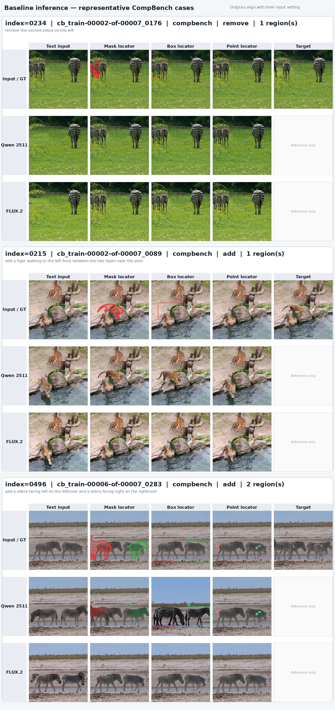
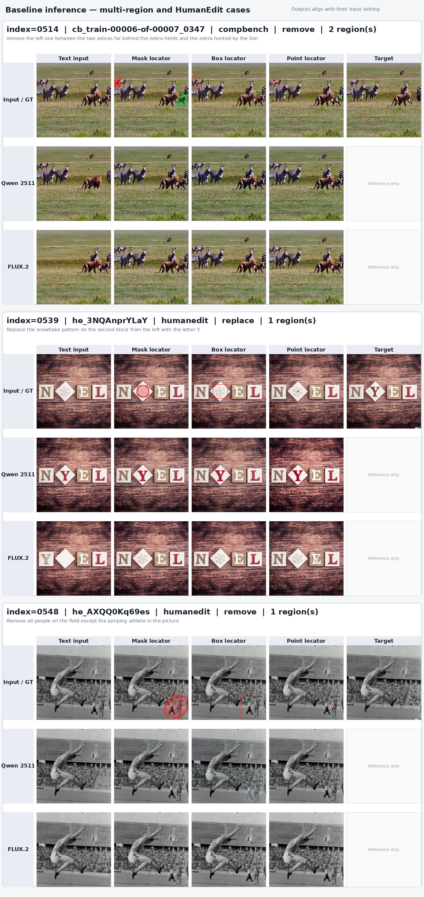
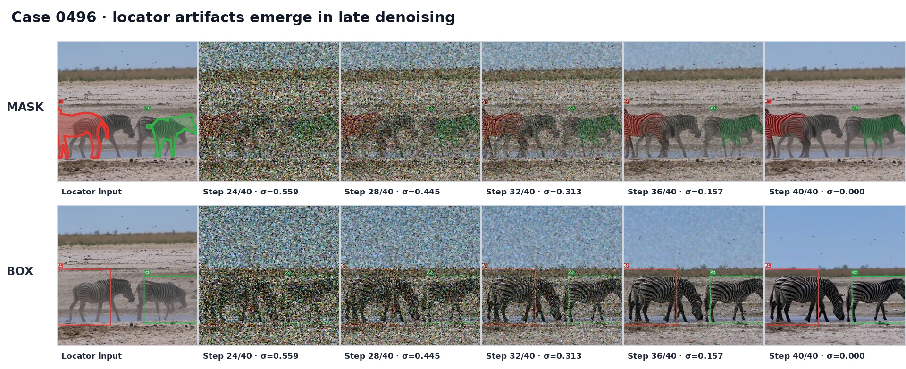
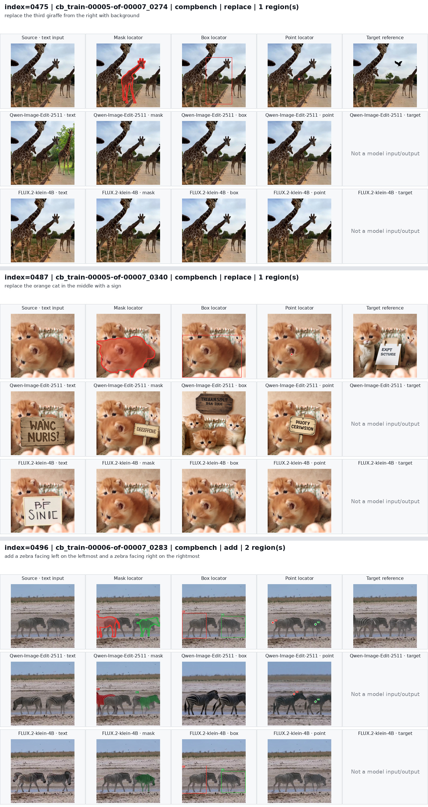

# SAMTok 细粒度交互式编辑 Benchmark：模型评测运行与结果

本文档只记录模型评测协议、运行方式、已完成结果和目视分析。数据构造、筛选和统一字段见 [BENCHMARK.md](BENCHMARK.md)。目前有 Qwen-Image-Edit-2511 与 FLUX.2-klein-4B 两个裸基模，以及使用这两个 editor 的 RePlan。结构验证只检查产物与输入来源；人工观察不是全量成功率。

| 方法 | 当前 656-case、prompt v2 | 历史结果 |
| --- | --- | --- |
| 裸 Qwen-Image-Edit-2511 | 15 例 × 四设置完成且验证通过；656 全量尚未运行 | 旧协议 556 例 × 四设置完成 |
| 裸 FLUX.2-klein-4B | 15 例 × 四设置完成且验证通过；656 全量尚未运行 | 旧协议 556 例 × 四设置完成 |
| RePlan + Qwen | 656 例 × 四设置完成且验证通过 | 无 |
| RePlan + FLUX.2 | 656 例 × 四设置完成且验证通过 | 无 |

## 1. 两个基模的评测实现

### 1.1 模型与代码

| 模型 | 本地权重 | DiffSynth pipeline |
| --- | --- | --- |
| Qwen-Image-Edit-2511 | `/mnt/bn/strategy-mllm-train/user/tanyue/models/pretrained_models/Qwen-Image-Edit-2511/` | `QwenImagePipeline` |
| FLUX.2-klein-4B | `/mnt/bn/strategy-mllm-train/user/tanyue/models/pretrained_models/FLUX.2-klein-4B/` | `Flux2ImagePipeline` |

两者均使用下列 vendored DiffSynth：

```text
/opt/tiger/tanyue/samtok_edit/DiffSynth-Studio/
Git commit: 6268a9c808584fc866d2e78d9cbe9afab9e8a5d5
```

Qwen 直接从本地 transformer、text encoder、VAE、tokenizer 和 processor
构造 `QwenImagePipeline`；FLUX.2 直接从本地 text encoder、transformer、
VAE 和 tokenizer 构造 `Flux2ImagePipeline`。运行前会检查模型索引和权重分片。

### 1.2 最终双图 locator 协议

基模没有 benchmark 所需的统一原生 mask/box/point control 参数。最终协议
使用两个模型均支持的多参考图接口，并把干净内容与临时标记分开：

| Setting | 传入 DiffSynth 的有序 `edit_image` |
| --- | --- |
| `text_only` | `[clean_source]` |
| `mask_annotation` | `[clean_source, mask_locator]` |
| `box_annotation` | `[clean_source, box_locator]` |
| `point_annotation` | `[clean_source, point_locator]` |

locator 是 source 的独立副本：单 region 使用无编号红色标记，双 region 按
benchmark 顺序使用红色 R1、绿色 R2。mask 使用半透明填充和实线边界；box
使用矩形；point 使用大小适中的实心圆点和细白色描边，圆心严格等于
`regions[].point`。

交互 prompt 使用冻结的精简 v2 模板，不再重复解释两张图的所有角色。模板只
保留三个必要约束：编辑 Image 1、用 Image 2 中的标记绑定 region、保持其他
内容并且不复现 marker。例如双区域 mask 的完整形式为：

```text
Edit Image 1. For R1 (red mask) in Image 2, <edit 1>.
For R2 (green mask) in Image 2, <edit 2>. Keep everything else unchanged.
Return only the edited Image 1 without any markers from Image 2.
```

point 会额外把 region 表述为 point 中心处的对象或位置。全体 1,968 条交互
prompt 的平均字符数由 781.4 降为 228.8，减少 70.7%；`text_only` prompt 不变。
target reference 从不作为第三张输入图。

该调用方式位于模型支持范围内：Qwen 2511 的 DiffSynth 示例将其定义为
multi-image editing model，并要求 `edit_image` 使用 list；FLUX.2-klein-4B
模型说明和 DiffSynth pipeline 均支持 multi-reference。需要区分的是，“第二张
图仅用于定位”是本 benchmark 的 prompt 约定，不是模型原生的 mask-control
张量。若模型仍复制 marker，则作为模型失败保留，不做事后擦除。

选择双图而不是只输入标注图，是因为单图协议把 marker 覆盖在唯一的待编辑
图像上，同时要求模型保留原图又去掉 marker，容易产生 mask 轮廓、box 或
point 残留。代表性 smoke test 表明双图通常能减轻这一问题，但并非完全消除。

### 1.3 冻结输入

`evaluation/prepare_inputs.py` 并行渲染三种 locator，并为每个 case 冻结四个
setting。每个 setting 保存：

- `images`：模型接收的绝对路径列表，顺序不可交换；
- `image_roles`：与图片逐项对应的角色；
- `prompt`：实际传入模型的完整文本。

正式输入位于：

```text
/mnt/bn/strategy-mllm-train/user/tanyue/experiments/SAMTokEdit/
  referential_finegrained_edit_benchmark_656_two_image_locator/
    inputs/mask_annotation/                 # 656 locator images
    inputs/box_annotation/                  # 656 locator images
    inputs/point_annotation/                # 656 locator images
    prepared/baseline_inputs.jsonl
    prepared/benchmark_baseline_eval_inputs.jsonl
    prepared/baseline_input_report.json
```

当前冻结输入协议为 `baseline_two_image_locator_inputs_v2`。交互 prompt 采用直接、
精简的形式：编辑 Image 1，用 Image 2 中的 mask/box/point 定位目标，保持其他内容
不变，并且不在输出中复现 marker。共有 1,968 张
locator，656 行 inference manifest，每行四个 setting；已验证的不同输入图片
共 2,623 张（655 张唯一 clean source + 1,968 张 locator）。冻结 inference
manifest 的 SHA256 为
`8a46bb7a2693984132ca203fcf7dc8f118b2563497dbea8c70497552865c56e2`。
输入准备不读取任何 target 内容来构造图片或 prompt。

### 1.4 Inference 参数与输出

| 参数 | Qwen-Image-Edit-2511 | FLUX.2-klein-4B |
| --- | ---: | ---: |
| seed | 0 | 0 |
| sampling steps | 40 | 4 |
| CFG | 4.0 | 1.0 |
| 额外参数 | `zero_cond_t=True` | `embedded_guidance=4.0` |

生成尺寸保持 source 宽高比、面积约为 1024×1024，并对齐到 32；生成后使用
Lanczos resize 回 source 的准确尺寸。8 卡运行时每个 worker 只加载一次模型，
case 按 `rows[rank::world_size]` 确定性切分。

每张输出同时写入 PNG 和 JSON sidecar。sidecar 包含 case/model/setting、实际
有序输入路径与角色、完整 prompt、seed、原生生成尺寸、保存尺寸、耗时和输出
路径。`run_config.json` 固定整个运行的模型、manifest hash、参数与并行配置，
因此 `--resume` 不会混入不同协议生成的结果。

相关代码只保留当前两基模所需部分：

```text
evaluation/common.py                    协议、渲染和公共校验
evaluation/prepare_inputs.py             构造双图输入与冻结 manifest
evaluation/run_inference.py              两个 DiffSynth inference adapter
evaluation/launch_baseline_inference.sh  8 卡 tmux 任务入口
evaluation/report_baseline_progress.py   实时进度
evaluation/validate_baseline_outputs.py  输出结构与 provenance 校验
```

## 2. 运行方式

### 2.1 准备输入

```bash
cd /opt/tiger/tanyue/samtok_edit_benchmark
/opt/tiger/tanyue/samtok_edit_eval_stage2/.venv/bin/python \
  evaluation/prepare_inputs.py --resume
```

### 2.2 配置检查和单模型运行

```bash
# 不加载模型，只检查 Qwen 配置、权重和全部冻结输入。
/opt/tiger/tanyue/samtok_edit_eval_stage2/.venv/bin/python \
  evaluation/run_inference.py --model qwen --dry_run

# 独立实验目录中的单 case smoke test。
CUDA_VISIBLE_DEVICES=0 \
/opt/tiger/tanyue/samtok_edit_eval_stage2/.venv/bin/python \
  evaluation/run_inference.py \
  --model flux2 --settings all --max_samples 1 \
  --experiment_root /tmp/samtok_flux2_smoke
```

### 2.3 8 卡全量推理

`evaluation/launch_baseline_inference.sh` 默认使用本机可用的 `/opt/tiger/tanyue/samtok_edit_eval_stage2/.venv` 中的 Python 与 `torchrun`，并从上述固定的 DiffSynth-Studio checkout 导入 pipeline。`REPO_ROOT` 自动取本仓库路径；可通过 `ENV_ROOT`、`PYTHON_BIN`、`TORCHRUN_BIN` 和 `SAMTOK_REPO` 显式指定其他安装位置。对新环境先运行上一节的两个 dry run。

```bash
tmux new-session -d -s samtok_baselines_656 \
  -c /opt/tiger/tanyue/samtok_edit_benchmark \
  'bash evaluation/launch_baseline_inference.sh'
```

controller 依次运行 Qwen 和 FLUX.2，每个模型包含 656 × 4 个 setting；总计
5,248 张输出。任务可恢复，并在两个模型结束后自动运行结构验证。它不会运行
paste-back、质量指标或 judge。

### 2.4 查看进度与验证

```bash
/opt/tiger/tanyue/samtok_edit_eval_stage2/.venv/bin/python \
  evaluation/report_baseline_progress.py

tail -f /mnt/bn/strategy-mllm-train/user/tanyue/experiments/SAMTokEdit/\
referential_finegrained_edit_benchmark_656_two_image_locator/logs/baseline_progress.log

tail -f /mnt/bn/strategy-mllm-train/user/tanyue/experiments/SAMTokEdit/\
referential_finegrained_edit_benchmark_656_two_image_locator/logs/baseline_inference.log

# 全部完成后检查 5,248 张图片、sidecar、输入顺序、prompt 和 run config。
/opt/tiger/tanyue/samtok_edit_eval_stage2/.venv/bin/python \
  evaluation/validate_baseline_outputs.py
```

## 3. 已归档的 556-case 基模评测结果（不含 MIRAGE）

本节是接入 MIRAGE 前的 532 CompBench + 24 HumanEdit 历史结果，用于保留可追溯
实验记录；它不代表当前 656-case benchmark 已经完成全量 inference。当前 656
条已完成数据构建、locator 与 prompt v2 冻结，并完成第 4 节的 15-case 小规模
推理；两个裸基模尚未启动 656 条全量生成；RePlan 已完成 656 条全量生成。旧结果继续保存在原目录，未被覆盖。

### 3.1 完成状态与结果位置

两基模的 8 卡全量 inference 已完成。运行从 2026-09-14 07:30:25 UTC
开始，Qwen 于 12:35:52 UTC 完成，FLUX.2 于 12:48:41 UTC 完成；controller
在输出结构验证通过后于 12:55:26 UTC 正常退出。

结果根目录为：

```text
/mnt/bn/strategy-mllm-train/user/tanyue/experiments/SAMTokEdit/
  referential_finegrained_edit_benchmark_two_image_locator/
```

其中主要内容为：

```text
inference/qwen/<setting>/{0000..0555}.{png,json}
inference/qwen/report.json
inference/qwen/run_config.json
inference/flux2/<setting>/{0000..0555}.{png,json}
inference/flux2/report.json
inference/flux2/run_config.json
reports/baseline_inference_validation.json
logs/baseline_inference.log
logs/baseline_progress.log
baseline_controller.status
```

完整性计数如下：

| 模型 | `text_only` | `mask_annotation` | `box_annotation` | `point_annotation` | 合计 |
| --- | ---: | ---: | ---: | ---: | ---: |
| Qwen-Image-Edit-2511 | 556 | 556 | 556 | 556 | 2,224 |
| FLUX.2-klein-4B | 556 | 556 | 556 | 556 | 2,224 |
| 总计 | 1,112 | 1,112 | 1,112 | 1,112 | 4,448 |

本次结果使用第 1 节所述的 DiffSynth pipeline 和双图 locator 方式，但冻结输入是
`baseline_two_image_locator_inputs_v1`，交互 prompt 早于当前精简 v2 版本，不能与
第 4–7 节的 v2 结果直接配对比较。`text_only` 输入一张 clean source，其他三种 setting 按顺序输入
`[clean source, annotated locator]`；target reference 和 evaluation mask 均未进入
生成。Qwen 使用 40 steps、CFG 4.0、`zero_cond_t=True`，FLUX.2 使用 4 steps、
CFG 1.0、`embedded_guidance=4.0`，两者均使用固定 seed 0 和 8 卡数据并行。

### 3.2 完整性验证

`reports/baseline_inference_validation.json` 的状态为 `passed`，`error_count=0`。
验证逐条检查了：

- 4,448 张结果 PNG 和 4,448 个 JSON sidecar 均存在；每个 setting 的
  `results.jsonl` 也均为 556 行；
- 所有输出均可解码，保存尺寸与对应 source 完全一致；
- sidecar 中的 case ID、模型、setting、实际输入图片顺序与角色、完整 prompt
  均与冻结 manifest 一致；
- 两个 `run_config.json` 均对应 8 卡运行及同一个冻结 manifest hash
  `05e7669f36fe82c03671886f249ad522ac4ef1299330f53d5bbb81f69609c401`；
- 全量缩略像素扫描未发现空白或近纯色输出；运行日志中没有 traceback、
  RuntimeError 或 CUDA OOM。

以上只确认推理正常完成、产物可读且 provenance 正确，不代表编辑质量已经
达标。按照当前阶段约定，本次没有计算任何质量指标，也没有调用 judge。

### 3.3 抽样可视化

下图按 setting 对齐展示输入和输出：第一行依次是 text 使用的 clean source、
mask/box/point locator 和仅供检查的 target；第二、三行是在相应输入 setting
下的 Qwen 与 FLUX.2 输出。target 未作为模型输入。

第一组覆盖 CompBench 的序数单实例删除、位于同类实例之间的新增，以及左右
两端双目标新增：



第二组覆盖 CompBench 双区域复合删除，以及 HumanEdit 的小目标属性替换和
`all ... except ...` 排除式编辑：



图中包含以下六条代表性 case：

| index | case ID | 数据集 | 类型 | 代表性 |
| ---: | --- | --- | --- | --- |
| 0234 | `cb_train-00002-of-00007_0176` | CompBench | remove | 删除左起第二只斑马 |
| 0215 | `cb_train-00002-of-00007_0089` | CompBench | add | 在两只老虎之间新增实例 |
| 0496 | `cb_train-00006-of-00007_0283` | CompBench | add | 左右两端双区域、不同朝向 |
| 0514 | `cb_train-00006-of-00007_0347` | CompBench | remove | 双区域且包含 between 与事件指代 |
| 0539 | `he_3NQAnprYLaY` | HumanEdit | replace | 左起第二块上的细粒度图案替换 |
| 0548 | `he_AXQQ0Kq69es` | HumanEdit | remove | 删除所有人但保留跳跃运动员 |

这些图片用于快速人工抽查，不构成定量结果。可以直接到结果根目录查看任意
`eval_index` 的四种 setting，并结合相邻 JSON sidecar 复核模型实际收到的输入
和 prompt。

### 3.4 Qwen locator 标记残留分析

index 0496（`cb_train-00006-of-00007_0283`）的 Qwen mask/box 输出保留了红绿
区域、边框及 `R1/R2`。这不是可视化叠加或文件格式错误：使用相同模型、完整
prompt、seed 0、40 steps、CFG 4.0 和 `zero_cond_t=True` 复跑后，mask 与 box
结果分别与原输出 PNG 的 SHA256 完全一致。

根因是双图 locator 只是输入协议，不是 Qwen/DiffSynth 的结构化控制通道。
`[clean source, annotated locator]` 中两张 RGB 图都会被 VAE 编码为
`edit_latents`，并以同类条件拼接给 DiT；模型没有架构级的“第二张只定位、
不可渲染”标志，prompt 中的禁止复制约束不足以覆盖强图像条件。该 add case
尤其明显：CompBench 的区域 mask 沿新增斑马轮廓，locator 已同时提供目标形状、
位置和高饱和度标记，模型因而把它当作接近目标的重建模板；box 虽不泄露轮廓，
仍可能连同框线和标签一起重建。

下图直接解码同一条确定性生成轨迹的当前 latent。step 24 前以噪声为主，step
28 开始出现标记，step 32 已形成彩色目标、框线和标签，step 36 后基本锁定，
step 40 得到保存结果。这说明残留在去噪过程中由模型生成，并非输出后处理加入。



因此，结构验证中的“正常完成”仅表示调用、输入和产物正确；这种 locator 复制
应保留为模型失败并在后续质量评测中惩罚。若希望消除该风险，需要使用模型原生
的结构化 mask/box 控制接口；Qwen-Image-Edit-2511 当前这条官方 DiffSynth
多图路径不提供这样的 locator-only 通道。

## 4. 当前 656-case benchmark 的 15-case smoke test

### 4.1 范围与结果位置

2026-09-16 使用当前 `baseline_two_image_locator_inputs_v2` 冻结输入，从 656 条
中选择 15 条进行小规模真实 inference。选择覆盖三个数据源、四种编辑类型、
单/双 region、小部件属性修改、相邻同类实例删除和跨实例双区域编辑：

| 数据集 | eval index | 数量 |
| --- | --- | ---: |
| CompBench | 475, 487, 496, 510, 514, 524 | 6 |
| HumanEdit | 539, 544, 553, 554 | 4 |
| MIRAGE | 557, 606, 608, 620, 641 | 5 |

其中 add/remove/replace/mixed 分别为 4/5/4/2 条。每条同时运行 `text_only`、
`mask_annotation`、`box_annotation` 和 `point_annotation`，两个模型共生成
`15 × 4 × 2 = 120` 张图片。结果根目录为：

```text
/mnt/bn/strategy-mllm-train/user/tanyue/experiments/SAMTokEdit/
  referential_finegrained_edit_benchmark_656_prompt_v2_smoke15/
```

主要文件：

```text
inference/qwen/<setting>/{eval_index}.{png,json}
inference/flux2/<setting>/{eval_index}.{png,json}
inference/{qwen,flux2}/run_config.json
reports/baseline_inference_validation.json
selection.json
validation_report.json
visualizations/cases/                 # 15 张单 case 完整对比图
visualizations/pages/                 # 每页 3 个 case，共 5 页
visualizations/index.html
```

### 4.2 DiffSynth 调用与分辨率

本次没有使用自定义 sampler。两者均通过本仓库 `evaluation/run_inference.py`
调用 vendored DiffSynth 官方 pipeline；GPU 0 当时被其他任务占用，因此只用
GPU 1–7 做 7 卡数据并行。卡数只改变 case 分片和运行时间，不改变单 case
推理。参数为：

| 参数 | Qwen-Image-Edit-2511 | FLUX.2-klein-4B |
| --- | ---: | ---: |
| dtype | bfloat16 | bfloat16 |
| steps | 40 | 4 |
| CFG | 4.0 | 1.0 |
| 额外 guidance | `zero_cond_t=True` | `embedded_guidance=4.0` |
| seed | 0 | 0 |
| 输入 | 有序 `edit_image` list | 有序 `edit_image` list |

`text_only` 输入一张 clean source；交互 setting 输入
`[clean source, annotated locator]`。`edit_image_auto_resize=True`，没有传入
target、evaluation mask、`inpaint_mask`，没有融合、paste-back 或 marker
擦除。

15 条 source 均为正方形：6 条为 640×640，9 条为 1024×1024。两个 pipeline
均在受支持的 1024×1024 原生分辨率生成；代码先断言 pipeline 返回尺寸等于
请求尺寸，再将结果以 Lanczos resize 到 source 的准确尺寸。对 640×640 source
保存为 640×640，对 1024×1024 source 保持 1024×1024。这是统一的 benchmark
输出归一化，使结果与 source、region mask 和 evaluation mask 像素对齐；它发生
在官方 pipeline 推理之后，不改变模型条件或生成过程。

### 4.3 完整性验证

使用支持非连续 `--eval_indices` 的 `evaluation/validate_baseline_outputs.py`
逐条校验。`reports/baseline_inference_validation.json` 状态为 `passed`，结果为：

- 120/120 张 PNG 和对应 sidecar 完整、可解码；
- 每个模型的每个 setting 均为 15 条；
- case/model/setting、输入路径顺序、图片角色、完整 prompt 和 seed 均与冻结
  manifest 一致；
- 120/120 张保存尺寸等于各自 source；原生尺寸与约 1024²、32 对齐的策略一致；
- target reference 和 evaluation mask 均未进入模型输入；
- 没有 traceback、CUDA OOM、质量指标或 judge 调用。

### 4.4 可视化与初步观察

每个 case 的第一行依次显示 source、mask locator、box locator、point locator
和仅用于人工检查的 target；第二行是 Qwen 四种输出，第三行是 FLUX.2 四种
输出。MIRAGE 没有 target，因此对应位置明确显示为空。

第一页：CompBench 单 region replace 与双 region add。



第二页：CompBench 双 region add/remove。


第三页：HumanEdit 小目标 replace/add/remove。


第四页：HumanEdit 小目标 remove，以及 MIRAGE 双区域 replace/mixed。


第五页：MIRAGE 双区域 add/mixed/remove。


这组结果只用于确认调用和快速人工观察，不构成定量结论。可见精简 prompt 能让
Qwen 在部分小目标与双区域任务上正确利用 locator，例如 index 0539、0544、
0608；FLUX.2 在本组中整体编辑强度更弱。index 0496、0510 等 case 仍出现
mask/box/point marker 被复制到输出，两个模型都可能发生。这与第 3.4 节结论
一致：双图 locator 是视觉提示而非架构级结构控制，精简 prompt 不能从机制上
保证 marker 不被重建。后续全量 inference 应保留这些结果作为模型失败，不做
事后擦除；任何质量指标或 judge 仍需另行确认后再运行。

## 5. RePlan：方法、运行与全量产物

### 5.1 方法接入和实际输入

本仓库的 RePlan 适配器位于 `evaluation/replan/`；核心推理入口是 `runner.py`，调用 RePlan 仓库的 `RePlanPipeline`、Qwen2.5-VL planner 与官方方法的区域注意力 editor。RePlan 不是第三个独立基模，而是同一个 planner 分别搭配 Qwen-Image-Edit-2511 和 FLUX.2-klein-4B 两个 editor。因此结果记为 **RePlan + Qwen** 和 **RePlan + FLUX.2**。

今后的 benchmark 启动与验证以本仓库 `evaluation/replan/` 为准；RePlan 方法仓库内的旧 SAMTok 脚本保留为 2026-09-19 完成运行的历史来源。方法本体仍由 RePlan 仓库提供。

| 组件 | 使用的本地 checkpoint / 实现 |
| --- | --- |
| planner | `/mnt/bn/strategy-mllm-train/user/tanyue/models/posttrain_models/replan_qwen2_5_vl_7b`，`TainU/RePlan-Qwen2.5-VL-7B` revision `518f82339520058d043c4fbc270481876d8463e4` |
| Qwen editor | 与裸基模相同的 Qwen-Image-Edit-2511 权重；RePlan `QwenImageEditPlusPipeline` |
| FLUX.2 editor | 与裸基模相同的 FLUX.2-klein-4B 权重；RePlan `MultiRegionFlux2KleinPipeline` |
| 方法代码 | `/opt/tiger/tanyue/RePlan`，上游 Git commit `6c9b12f0c619cc8ca6f50b536b24aff377525f8c`；`replan/pipelines/replan.py` 经本仓库 `evaluation/replan/replan_pipeline_compat.patch` 适配后 SHA256 为 `3fa5d0e0d03001b8b01cb520c120a6a49011bd644843682b657cf95e802dacc0` |

适配器读取与裸基模**完全相同**的冻结 656-case manifest、四设置图片顺序和完整 prompt。T 设置给 planner 一张 clean source；M/B/P 给 planner `[clean source, annotated locator]`。RePlan planner 生成 bbox、局部 hint 和 global prompt；diffusion editor 只接收 clean source 与这些规划结果，**不接收** locator、参考 target 或 evaluation mask，也不直接使用 benchmark 标注框取代 planner 的预测。生成后只按需要用 Lanczos 调整回 source 的尺寸，不做 paste-back 或 marker 擦除。原始 planner response、实际框和 editor 输入都存于每张输出的 JSON sidecar。

该接入沿用 RePlan 的 `RePlanPipeline` 和对应 editor 的官方调用；兼容补丁只增加有序双图 planner 输入、无 FlashAttention 时的 SDPA、坏 bbox 单项跳过以及 generator 透传。坏框不被改成 GT 框，原始响应仍保留。若在干净的 RePlan checkout 上重建此环境，先应用补丁，并通过 dry run 核对方法代码 SHA。`runner.py` 会拒绝未核对的方法代码版本，防止变更方法后继续混写旧实验目录。

### 5.2 参数与运行

| 参数 | RePlan + Qwen | RePlan + FLUX.2 |
| --- | ---: | ---: |
| seed / dtype | 0 / bfloat16 | 0 / bfloat16 |
| diffusion steps | 40 | 4 |
| guidance | `true_cfg_scale=4.0`, `guidance_scale=1.0` | `guidance_scale=4.0`（distilled checkpoint 的该项可能被 pipeline 忽略） |
| bbox expansion | 0.0 | 0.15 |
| attention switch ratio | 0.5 | 0.05 |
| native output | 约 1024²，对齐 32 | source 原生尺寸 |

从 benchmark 仓库运行，先确认 checkpoint、冻结输入、RePlan 方法源码：

```bash
cd /opt/tiger/tanyue/samtok_edit_benchmark
REPLAN_PY=/opt/tiger/tanyue/RePlan/.venv/bin/python
"$REPLAN_PY" evaluation/replan/runner.py --model qwen2511 --dry-run
"$REPLAN_PY" evaluation/replan/runner.py --model flux2_klein4b --dry-run
```

干净 RePlan checkout 的补丁安装方式为：

```bash
git -C /opt/tiger/tanyue/RePlan apply \
  /opt/tiger/tanyue/samtok_edit_benchmark/evaluation/replan/replan_pipeline_compat.patch
sha256sum /opt/tiger/tanyue/RePlan/replan/pipelines/replan.py
```

本机 RePlan checkout 已应用相同补丁，无需重复应用。八卡后台运行与查看每个 worker 的 tqdm：

```bash
tmux new-session -d -s replan_samtok_8gpu \
  -c /opt/tiger/tanyue/samtok_edit_benchmark \
  'bash evaluation/replan/launch_8gpu.sh'

tail -f /mnt/bn/strategy-mllm-train/user/tanyue/experiments/SAMTokEdit/replan_656/logs/qwen2511_rank0.log
tail -f /mnt/bn/strategy-mllm-train/user/tanyue/experiments/SAMTokEdit/replan_656/logs/progress.log
```

controller 依次运行 FLUX.2 和 Qwen，每个模型 8 个独立 worker，并支持在相同冻结配置下 `--resume`。新适配器允许识别搬迁前由 RePlan 仓库生成的 `adapter_sha256`，但只在模型、输入、方法源码、参数及依赖版本等其余 run-config 字段完全一致时复用旧结果。可用 `PYTHON_BIN`、`REPLAN_ROOT`、`OUTPUT_ROOT` 指定其他环境；改变模型或方法版本应使用独立实验目录。

验证与图库生成：

```bash
"$REPLAN_PY" evaluation/replan/validate_outputs.py
"$REPLAN_PY" evaluation/replan/report_progress.py
"$REPLAN_PY" evaluation/replan/render_gallery.py --workers 8
```

完整图库也可用 `evaluation/replan/launch_gallery_when_complete.sh` 在 controller 完成后生成。主要目录为：

```text
/mnt/bn/strategy-mllm-train/user/tanyue/experiments/SAMTokEdit/replan_656/
  inference/{qwen2511,flux2_klein4b}/<setting>/<eval_index>.{png,json}
  inference/{qwen2511,flux2_klein4b}/run_config.json
  reports/validation.json
  logs/<model>_rank<rank>.log
  visualizations/replan_comparison/index.html
```

### 5.3 已完成结果及正确性边界

2026-09-19 18:38:17 UTC，RePlan 的两个 editor 各完成 **656 × 4 = 2,624** 张，共 **5,248/5,248** 张。2026-09-20 从本仓库重新运行 `evaluation/replan/validate_outputs.py`，`reports/validation.json` 再次为 `passed`、`error_count=0`：图片可解码、尺寸与 source 一致，sidecar 的 case、setting、模型、冻结 prompt、planner 有序输入、clean editor 输入和 manifest SHA 均吻合。图库包含 656 张单例对比图及 82 张八例合页，无缺失输出。完整图库：[RePlan 656 例可搜索页面](/mnt/bn/strategy-mllm-train/user/tanyue/experiments/SAMTokEdit/replan_656/visualizations/replan_comparison/index.html)。

首次 FLUX.2 运行在 0510 M 因 planner 返回一个正常 bbox 和一个只有两维的坏 bbox 而中断。修复后的解析器逐项丢弃坏框、保留原始 VLM 响应；核对方法文件变更后恢复了已有的 2,616 份完整 FLUX.2 输出，并继续完成其余任务。迁移审计位于 `reports/parser_resume_migration.json`。最终验证只证明流程和数据来源正确，不代表 5,248 张图都完成了编辑要求。

## 6. 当前四种方法分别做得怎样

对同一冻结 v2 输入的**直接对齐比较只覆盖 15 个 case**：两裸基模与 RePlan 各有四设置输出，共 240 张。该对比使用同一有序输入、prompt 和 seed 0，120 个“裸基模 vs 对应 RePlan”配对 sidecar 已核对。它是**端到端系统对比**；裸基模走 DiffSynth pipeline，RePlan 走自己的区域注意力 editor，FLUX.2 原生分辨率路径也不同，因此不能把所有差异单独归因于 planner。旧 556-case 运行使用较早协议，不参与这 15 例的直接胜负统计。

| 方法 | 当前可比运行 | 目视观察 |
| --- | --- | --- |
| 裸 Qwen-Image-Edit-2511 | v2 15 例 × 四设置，60 张；旧协议 556 例另存 | 能做对部分细粒度目标：0539 四设置在目标地砖上生成 Y；0544 能在指定花上加蜜蜂；0608 的部分 scarf 绑定比 RePlan 更好。难点是多对象与视觉标记：0496 会生成红绿框、R1/R2 类内容，0510 某些设置虽能新增两只猴，但整体不稳定。 |
| 裸 FLUX.2-klein-4B | v2 15 例 × 四设置，60 张；旧协议 556 例另存 | 常保持场景，但在这组困难例中经常编辑太弱，目标仍在或替换不充分。部分小目标和围巾新增可以起效；不能概括为完全不编辑。 |
| RePlan + Qwen | 656 例 × 四设置，2,624 张；与裸 Qwen 对齐 15 例 | 部分 case 的目标选择和背景保持更好：0553 T/M 较好地只删目标海滩行人，0641 保留白衬衫并移除夹板。但 0539 M/B 把菱形砖改成方形、0544 P 将蜜蜂加到别的花、0608 M/P 绑错围巾或改绿猫脸、0620 T/P 大面积黑背景，均有明显退步。另有 0548 四设置删除人群而保留运动员的绝对正例；该例历史裸基模使用旧协议，不作直接配对比较。 |
| RePlan + FLUX.2 | 656 例 × 四设置，2,624 张；与裸 FLUX.2 对齐 15 例 | 在 15 例中删除、替换通常仍偏保守；扩展抽查中有强项，如 0150 新增斑马较完整、0597 T/M/B 双目标绑定、0655 T/B/P 鸟眼改色。对相似实例双删除、替换和材质改变仍常漏做。 |

[15 例四系统并列图库](/mnt/bn/strategy-mllm-train/user/tanyue/experiments/SAMTokEdit/replan_656/visualizations/qualitative_smoke15_compare/index.html)可逐例检查输入、裸基模、RePlan 与参考图。这里未计算人工成功率或质量分数。

## 7. RePlan 扩展目视抽查：做得不好的情形

在上述 15 例之外，再看 HumanEdit 0548，并于 2026-09-20 先定抽样再观察新增 42 例（CompBench 18、HumanEdit 8、MIRAGE 16）。总共观察 **58 个不同 case**；本轮新增部分对应 336 张 RePlan 输出。分层抽样重点覆盖新增、删除、替换、多对象和小部件，因此只能总结失败类型，不能推出全 benchmark 成功率。完整逐例中文观察、真实 planner 提示和 sidecar：[42 例可筛选图册](/mnt/bn/strategy-mllm-train/user/tanyue/experiments/SAMTokEdit/replan_656/visualizations/qualitative_expanded_20260920/index.html)。

| 失败情形 | 代表例及具体表现 |
| --- | --- |
| 实例与属性绑定错误 | 0632 M/B：应第一鸭红嘴、第三鸭蓝脚，两模型把红嘴给第三鸭；0597 P：应右男子绿围巾、中间女子绿裤，两者角色对调；0651 P：Qwen 删除了本应清泥土的第三辆雪地车。 |
| 多项任务只完成一项 | 0586 B：Qwen 只删右猫，FLUX.2 只将中猫换成狗；0587：Qwen 多数设置做白腰带、FLUX.2 做金属衬衫，另一项漏做；0497/0506/0507 的双新增和 0527 的双删除也常漏目标。 |
| 新增、替换、删除语义混淆 | 0488 B：Qwen 保留猫又加杯，FLUX.2 只改猫颜色；0533 T：两模型把已有猫改白，没有新增猫；0473 B 保留熊又新增路牌。 |
| 小部件编辑扩大或串到别处 | 0611 B/P：Qwen 将马头熔岩扩至身体，波及另一匹马；0655 T 将绿眼扩成绿色面部；0538 衣服局部花纹变成整件衣服条纹。 |
| 新增对象的空间与大小失控 | 0150 T/B 的 Qwen 斑马被右边界截断，0161 的羊挤在原羊下方，0181 P 新猫过小；部分 planner 框到了已有物体，而非应占据的空位。 |
| 排除式删除覆盖不全 | 0549 T 两模型保留应删除的人；0555 T 只删除部分站立者。特别是 0549 的最终计划只含 `keep`，没有 `remove`。 |
| 材质改色而未变材质 | 0635 八张输出都把“木质帽”做成棕色针织帽，放大后仍有针织纹；另一些颜色和形状也外溢到邻近帽子。 |
| 对输入设置不稳定 | 0345 T 能删除右象，但 M/B/P 留下；0488 Qwen T 能替换猫，B 不能；0543 P 的预测框落在意面附近，其他设置能放大番茄。 |

从日志可具体定位两类问题。**0632 M** 的分析文字区分了左鸭嘴与中间鸭脚，但最终给两项编辑相同的 bbox `[442,430,588,686]`；**0597 P** 的最终框和 hint 把两个人对调。**0549 T** 的 planner 分析写了要删其他人，交给 editor 的 global prompt 却是“保持其余不变”，两个 local hint 都是 `keep`。这表明最后的可执行计划需要逐项检查。

RePlan 输出格式模板本身包含两组示例框 `[10,150,150,210]` 和 `[150,50,200,150]`。在全部 5,248 份 sidecar 中，**45 个 case、71 个 case×setting、142 份两模型记录**的预测框精确等于至少一组示例坐标；0575 P 的两个框连 `point_2d` 都与模板示例一致，落在背景。该计数是结构异常线索，**不等于图像失败率**。两个 backbone 对应相同的 71 个输入设置，因此 142 份记录不是 142 个独立规划样本。明细见 [坐标审计 JSON](/mnt/bn/strategy-mllm-train/user/tanyue/experiments/SAMTokEdit/replan_656/reports/qualitative_expanded_20260920/template_coordinate_audit.json)。

抽样清单和逐例观察已冻结在仓库的 `evaluation/replan/reviews/20260920/`。已有输出可用以下代码重建坐标审计和主题图册，不触发模型推理：

```bash
cd /opt/tiger/tanyue/samtok_edit_benchmark
REPLAN_PY=/opt/tiger/tanyue/RePlan/.venv/bin/python
"$REPLAN_PY" evaluation/replan/audit_planner.py
"$REPLAN_PY" evaluation/replan/render_failure_review.py
```

规划大致正确也不能保证成图正确：0488 B 的 bbox 覆盖目标猫，hint 明确写 `replace the black cat with a cup`，Qwen 仍保留猫再加杯；0345 T/M 的框几乎一致，T 删象而 M 留象。0611 的局部 hint 分别写雪和熔岩，Qwen 却把两个目标混在一起。这些需要单独检查区域注意力和 editor，而不只修 planner。

抽查也有稳定正例：0483 两模型四设置将指定车辆改黑；0550 松果替换成红苹果；0650 左帽紫、右围巾蓝在两个 backbone 的四设置均较好。0642 的围巾经放大确有大理石纹，不能仅凭预览图判材质任务失败。0321 的 T 文字要求删除最右鸡，而 locator/参考图指向左下鸡，存在疑似标注冲突；0581“移除翅膀”与视觉上的“收起翅膀”难区分，未作为明确失败。

扩展观察的三张主题图：

1. [对象错配与越界](/mnt/bn/strategy-mllm-train/user/tanyue/experiments/SAMTokEdit/replan_656/visualizations/qualitative_expanded_20260920/failure_binding.jpg)
2. [替换、删除与多项任务未完成](/mnt/bn/strategy-mllm-train/user/tanyue/experiments/SAMTokEdit/replan_656/visualizations/qualitative_expanded_20260920/failure_operations.jpg)
3. [新增几何与材质](/mnt/bn/strategy-mllm-train/user/tanyue/experiments/SAMTokEdit/replan_656/visualizations/qualitative_expanded_20260920/failure_addition_material.jpg)

解释 0549/0555 时还需分清输入协议：T 提供完整“除某对象外都删除”文字；定位设置的冻结 prompt 改为“删除标记区域”，union 框或单点可能丢失多个应删除实例的信息。RePlan 的 planner 错误、prompt 信息损失与 editor 执行错误各有证据，不能合并成一个成功率或单一原因。
