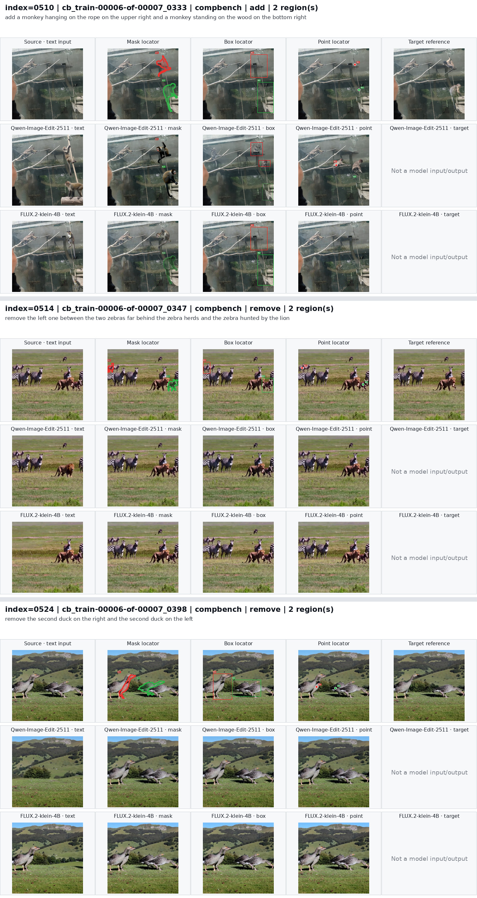
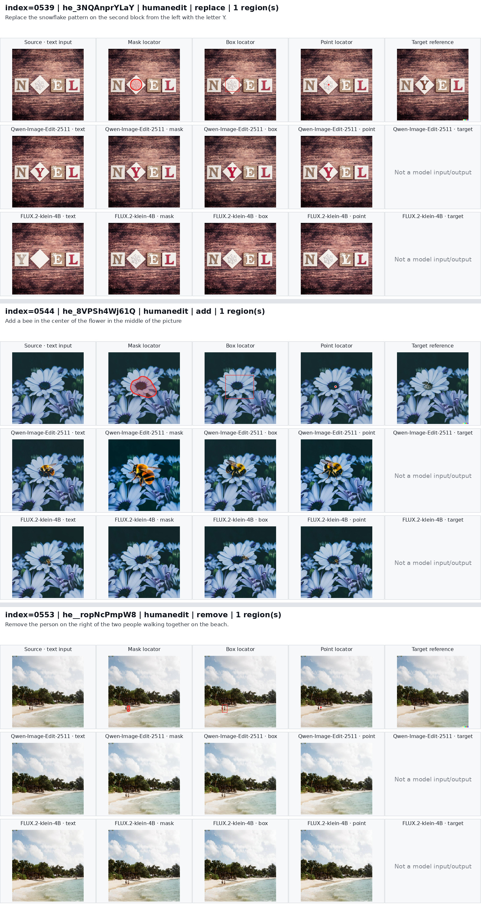
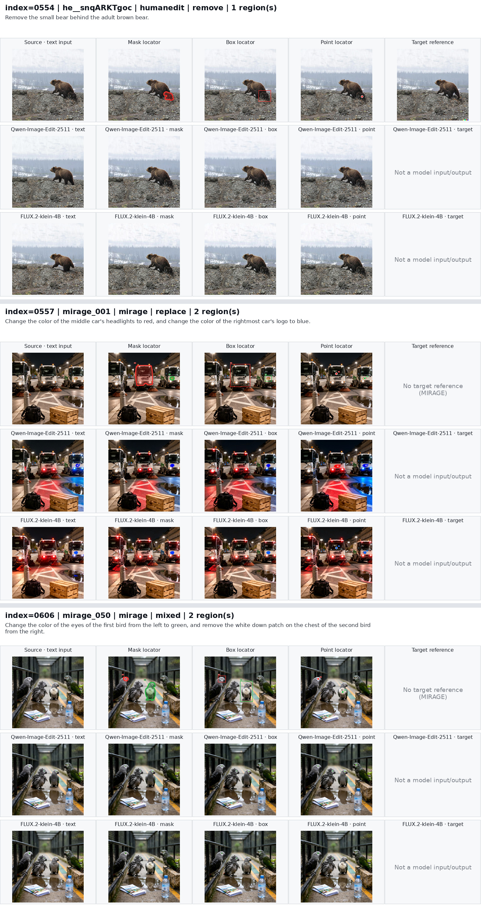
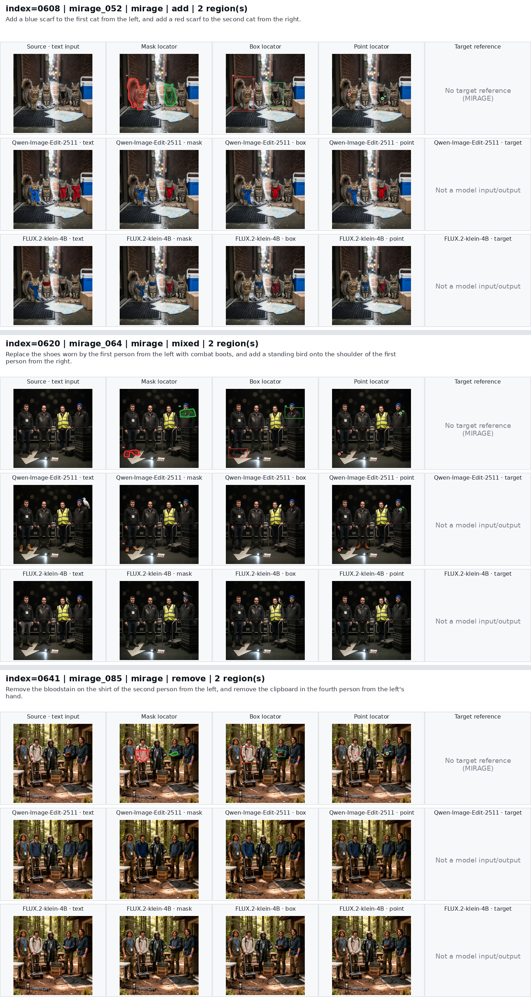
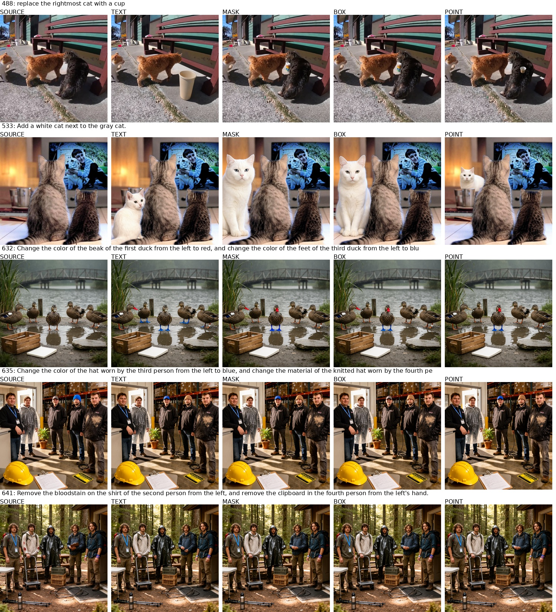
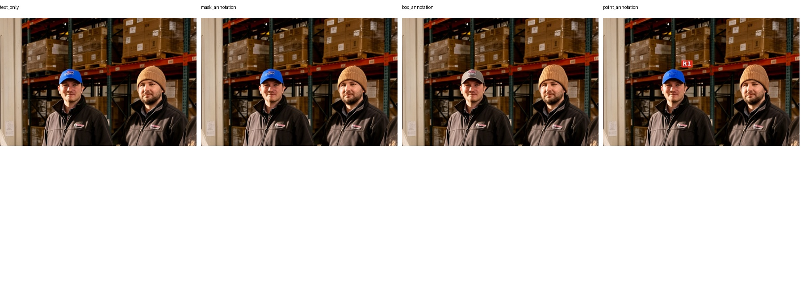

# SAMTok 细粒度交互式编辑 Benchmark：实验记录

评测范围为 656 个 case、text/mask/box/point 四种设置，三个基模及 RePlan 的两个 editor，共 13,120 张输出。数据构造、输入协议、官方模型调用、评分标准及运行命令见 [BENCHMARK.md](BENCHMARK.md)。本文记录运行、评分校准和案例观察；结构校验通过不等于编辑成功，抽样观察也不是全量成功率。

## 1. 运行状态

<!-- RUN_STATUS_BEGIN -->
进度快照：**2026-09-21 07:36:00 UTC**。总出图 10,550/13,120，judge 记录 0/13,120。

| 系统 | 完成出图 | 状态 |
| --- | ---: | --- |
| Qwen-Image-Edit-2511 | 2,618/2,624 | 8 卡正在生成 |
| FLUX.2-klein-4B | 60/2,624 | 等待前一模型结束 |
| Qwen-Image-2.1 | 2,624/2,624 | 出图已完成并通过结构校验 |
| RePlan + Qwen | 2,624/2,624 | 出图已完成并通过结构校验 |
| RePlan + FLUX | 2,624/2,624 | 出图已完成并通过结构校验 |

Qwen 的 text/mask/box 已完成，正在生成 point。随后执行 FLUX 和统一评分。原始分设置计数见 [进度快照](docs/data/full_models_progress_20260921.json)；实时状态以日志为准。
<!-- RUN_STATUS_END -->

### 1.1 运行与复现记录

所有系统使用同一冻结清单，SHA-256 为 `8a46bb7a2693984132ca203fcf7dc8f118b2563497dbea8c70497552865c56e2`。每个系统每种设置均应有 656 对 PNG/JSON；完整性验证检查输入来源、配置、尺寸和输出身份。未完成的系统不提前给出全量均分或排名。

| 系统 | 参数摘要 | 出图记录 |
| --- | --- | --- |
| Qwen-Image-Edit-2511 | seed=0，40 步，CFG=4，zero_cond_t | 8 卡，四设置按顺序运行 |
| FLUX.2-klein-4B | seed=0，4 步，CFG=1，embedded guidance=4 | 接续 Qwen-2511，8 卡 |
| Qwen-Image-2.1 | seed=0，40 步，CFG=1，KV cache | 2026-09-20 18:25:58–20:16:47 UTC，2,624 张验证通过，零错误 |
| RePlan + Qwen | seed=0，40 步，true CFG=4，bbox expansion=0 | 两种 RePlan 于 2026-09-19 18:38:17 UTC 全部完成，共 5,248 张验证通过 |
| RePlan + FLUX | seed=0，4 步，guidance=4，bbox expansion=0.15 | 同上 |

Qwen/FLUX 各复用 60 张同一冻结输入、相同生成参数的抽样输出，其余由全量任务生成。复用保留图片摘要和 `reused_from` 来源，不能把这 60 张的观察当成 656 例结论。

Qwen-Image-2.1 在独立 DiffSynth checkout 接入：commit `d2d684ad1f912949eae08453b9411ae40c5ec0ab`，模型 revision `b3179ad355be050328e483a9dfdd9e60cd62adfa`。正式出图前完成 32 张检查；原生 RGBA 另存，评分使用白底合成并恢复源尺寸的 RGB。环境记录见 [qwen21_environment_20260920.json](docs/data/qwen21_environment_20260920.json)。

本次 tmux 会话为 `benchmark_qwen21_full`，控制器 `evaluation/run_qwen21_and_judge.sh` 依次执行基模出图、验证、冻结 13,120 条任务、8 卡 judge、统计及文档写入。RePlan 成品直接参与评分。GPU 调度不停止其他占卡程序。

实验根目录：`/mnt/bn/strategy-mllm-train/user/tanyue/experiments/SAMTokEdit`。

| 产物 | 根目录下的相对路径 |
| --- | --- |
| Qwen/FLUX 图片与 sidecar | `referential_finegrained_edit_benchmark_656_two_image_locator/inference/{qwen,flux2}` |
| Qwen-2.1 图片与 sidecar | `qwen21_656/inference/qwen21` |
| RePlan 图片与 planner 原始回复 | `replan_656/inference/{qwen2511,flux2_klein4b}` |
| 全量 judge 原始记录与配置 | `metrics_qwen38_all_models_pair_v2/all` |
| 汇总、置信区间及案例页 | `metrics_qwen38_all_models_pair_v2/comparison` |
| RePlan 全量图库 | `replan_656/visualizations/replan_comparison/index.html` |

### 1.2 查看进度

```bash
cd /opt/tiger/tanyue/samtok_edit_benchmark
/opt/tiger/tanyue/RePlan/.venv/bin/python evaluation/report_full_progress.py
BENCH_RUNS=/mnt/bn/strategy-mllm-train/user/tanyue/experiments/SAMTokEdit
tail -f "$BENCH_RUNS/referential_finegrained_edit_benchmark_656_two_image_locator/logs/baseline_progress.log"
# 各 GPU 的 tqdm 输出
tail -f "$BENCH_RUNS/referential_finegrained_edit_benchmark_656_two_image_locator/logs/baseline_inference.log"
# 阶段切换与 judge
tail -f "$BENCH_RUNS/qwen21_656/logs/workflow.log"
tail -F "$BENCH_RUNS/metrics_qwen38_all_models_pair_v2/logs/controller.log"
```

## 2. 全量评分

<!-- SCORES_BEGIN -->
全量评分尚未完成。正式报告将分别展示编辑完成度 E、内容保持度 P、视觉质量 Q，以及 E=4 和 E=4 且 P/Q≥3 的比例，按设置、编辑类型、单/双目标拆分。0321 的文字与定位标注冲突单列 unknown；均分分母和覆盖率同时报告。

自动流程在五种系统各 2,624 条评分记录齐备、异常状态处理完毕后更新本节，并写入图表与案例页。以下案例观察和 judge 校准不替代这一结果。
<!-- SCORES_END -->

## 3. Judge 调试与校准

采用 Qwen3.8-27B，每条只输入带 mask 轮廓的编辑前后两张图和固定评分标准，一次调用同时评所有目标。评分细则、解码参数和故障处理见 [BENCHMARK.md 的评分方法](BENCHMARK.md#4-评分方法)。正式运行标识为 `pair_v2`，独立重复检查标识为 `pair_v2_r1`。

### 3.1 实际模型运行

2026-09-20 17:41:01 UTC 完成 8 卡开发样本校准，原始运行位于实验根目录下 `metrics_qwen38_two_image_v2/dev`。82 个样本涉及 30 个 case：51 个带二值检查标签的实际编辑输出、12 个原图直接作为结果的 identity 对照、19 个未标注输出。主运行和重复运行各 82 条，共 164 次真实模型调用，没有格式重试，全部正常结束。

| 检查 | 结果 | 解释 |
| --- | --- | --- |
| 与 51 条目视检查标签的完成/未完成一致 | 48/51 | 3 个假阳性，0 个假阴性 |
| identity 的 E=0 | 12/12 | P/Q 均为 4，能分开“未编辑”和“保持原图” |
| 两次 E/P/Q 三维完全一致 | 81/82 | 0533/RePlan+Qwen/text 的 E 从 1 到 0，P=2、Q=3 不变 |
| 两次全编辑成功、严格成功判断一致 | 82/82 | 重跑只检测稳定性，不作投票 |
| 平均生成 token | 主运行 659，重复 653 | 包含模型实际生成内容 |

结构化记录见 [judge_calibration.json](docs/data/judge_calibration.json)。这些例子已用于开发和调试，标签来自助手目视检查，**不是独立人工金标，也不是未见测试集**。48/51 不能解释为全量评分准确率；重复一致性不能排除系统性误判。

### 3.2 保留的误判与限制

| 案例 | 观察与 judge 结果 | 限制 |
| --- | --- | --- |
| 0150 / RePlan+Qwen / text | 新斑马主要露出头部，完整身体与方向不明确，judge 给 E=4 | 对遮挡和完整新增对象的判定偏宽；应独立人工复核 |
| 0632 / RePlan+Qwen / box | 第一只鸭嘴没有按要求变红，第三只嘴反而红了；judge 给 E/P/Q=4/2/4 | 小目标与实例绑定易误读；红轮廓干扰只是待验证假设 |
| 0641 / FLUX / box | clipboard 明显仍在，judge 给 4/4/4 | 删除是否实际完成会被误判 |
| 0641 / Qwen / box | 血迹与 clipboard 消失，但白衬衫变蓝；judge 给 4/2/4 | 该例能正确分开完成度与附带误改 |

0632 的实际轮廓输入拼图在 `metrics_qwen38_two_image_v2/0632_input_pair.jpg`。报告图库中的干净输出只供观察，不应误认为是 judge 的实际输入。全量分析需结合原图、结果和原始回答复核；置信区间只反映样本变动，不能修正 judge 偏差。

## 4. 基模与 RePlan 的同例观察

T/M/B/P 分别表示 text/mask/box/point。选例覆盖困难场景和不同操作，属于定向抽样；以下只描述具体输出，不据此估计失败率或给出总体排名。基础对照抽样的 15 个 case 为 0475、0487、0496、0510、0514、0524、0539、0544、0553、0554、0557、0606、0608、0620、0641。

### 4.1 Qwen-Image-Edit-2511 与 FLUX.2

- **Qwen 的成功例**：0539 的目标瓷砖加 Y、0544 的目标花朵加蜜蜂能完成；0608 部分设置的围巾目标绑定比 RePlan 更准确。
- **Qwen 的问题**：0496 出现红绿定位框或 R1/R2 标记泄漏；0510 的新增猴子数量、位置不稳定。0641 能删除血迹和 clipboard，但 box 输出额外改变衬衫颜色。
- **FLUX 的表现**：不少例子保持原场景较好，但删除、替换可能未执行或只完成部分；也有局部小物体和围巾修改成功，不能笼统判定为完全不编辑。0641/box 保留 clipboard 是明确反例。
- **与 RePlan 的差异**：0553 的 T/M、0641 等删除例中 RePlan+Qwen 有改善；0539 的 M/B 会把菱形瓷砖变成方形，0544/P 蜜蜂加错花，0608 的 M/P 出现围巾错绑或脸变绿，0620 的 T/P 出现大块黑背景。规划并不能保证整体优于基模。










### 4.2 Qwen-Image-2.1

完成全量出图后，已有检查主要集中于预先挑选的困难例；下表的观察不代表全量统计。

| Case / 任务 | 做得好的情况 | 做得不好的情况 |
| --- | --- | --- |
| 0488：最右黑猫换成杯子 | T 中猫消失、杯子出现 | M/B/P 保留猫并在附近或身体上加杯子，替换未完成 |
| 0533：灰猫旁新增白猫 | 四设置均产生独立白猫，原来的两只猫仍在 | 新猫大小与位置有变化 |
| 0632：第一只鸭红嘴、第三只鸭蓝脚 | 部分目标属性确有改变 | T 把其他鸭脚也改蓝；M/B 第三只嘴多变红；P 第三只嘴红而第一只没改 |
| 0635：第三顶帽子蓝色、第四顶木质 | T/M/P 第三顶变蓝 | B 第三顶未改；四设置第四顶虽棕色仍是针织纹理；P 还生成红色 R1 标记 |
| 0641：去除第二人的血迹和第四人的 clipboard | 四设置两项均完成，白衬衫保持 | 此抽样未见上述 Qwen/FLUX 的同类明显问题 |



0635 已检查原生尺寸细节：棕色帽子仍有针织结构，不能把色相变化算作木材质成功。



## 5. RePlan 扩展案例调查

合计观察 58 个不同 case：基础 15 例、0548，以及扩展的 42 例。扩展部分在看结果前确定选例，包含 18 个 CompBench、8 个 HumanEdit、16 个 MIRAGE，共检查两种 editor × 四设置 = 336 张输出。它有意覆盖困难类型，不能从其中的失败数量推断总体失败率。

选例和逐项观察保存在 [selection.json](evaluation/replan/reviews/20260920/selection.json) 与 [observations.json](evaluation/replan/reviews/20260920/observations.json)。可交互图库：实验根目录下 `replan_656/visualizations/qualitative_expanded_20260920/index.html`；主题图为同目录的 `failure_binding.jpg`、`failure_operations.jpg`、`failure_addition_material.jpg`。

### 5.1 主要失败情形

| 类型 | 代表例 | 具体观察 |
| --- | --- | --- |
| 同类多实例绑定错误 | 0632 M/B、0597 P、0651 P | 鸭嘴改到第三只；围巾与裤子的角色交换；清理泥污变成删除车辆 |
| 多目标只完成一部分 | 0586 B、0587、0497/0506/0507、0527 | Qwen 只删右猫，FLUX 只把中猫换狗；腰带/金属衣只做一项；双新增、双删除漏项 |
| 操作语义错误 | 0488 B、0533 T、0473 B | 原猫保留并加杯子；把旧猫涂白代替新增；熊保留只加牌子 |
| 小范围属性扩散 | 0611 B/P、0655 T、0538 | 熔岩从马头扩到身体或别的马；绿色从眼睛扩到脸；图案扩到整件衣服 |
| 新增对象位置、尺度或完整性不足 | 0150 T/B、0161、0181 P | 斑马挤在右边缘且不完整；羊藏在已有对象下面；新猫过小 |
| “删除其余、保留指定”执行不足 | 0549 T、0555 T | 该删除的人仍在；0555 未删掉所有站立者 |
| 材质退化为颜色 | 0635，两种 editor 四设置 | 帽子变棕但保持针织结构，没有木材质证据 |
| 设置敏感 | 0345、0488、0543 | 0345 T 删除象而 M/B/P 保留；0488 T 替换成功而 B 失败；0543 P 框到意面，其他设置把番茄变大 |

### 5.2 Planner 与 editor 分别出了什么问题

- **定位与分析矛盾**：0632/M 的 planner 文本能区分目标，两个 bbox 却相同，均为 `[442,430,588,686]`，后续区域控制无法绑定两个实例。
- **角色交换**：0597/P 的 bbox 和 hint 对调人物属性；0651/P 的错误也发生在对象和操作的绑定上。
- **全局指令漏掉删除**：0549/T 的最终规划偏向“保留”，没有完整表达删除其余对象。另需注意，0549/0555 的全局文字与单点/union mask 对目标集合的表达能力不同，失败归因需检查实际输入。
- **疑似复用示例坐标**：审计发现 45 个 case、71 个 case×setting 的规划包含模板坐标 `[10,150,150,210]` 或 `[150,50,200,150]`；两种 editor 合计 142 条记录不是 142 个独立输入。0575/P 还复现示例 point。计数说明规划输出的异常模式，不是最终图像失败率。
- **规划正确仍可能编辑失败**：0488/B 的 bbox 和“黑猫替换为杯子”hint 正确但猫保留；0345 的 T/M 框相同却结果不同；0611 的 hint 分开雪与熔岩但 editor 混淆。不能把所有错误都归到 planner。

坐标审计位于 `replan_656/reports/qualitative_expanded_20260920/template_coordinate_audit.json`；仓库提供 `evaluation/replan/audit_planner.py` 和 `render_failure_review.py` 复现审计与图库。

### 5.3 成功例与结论边界

- 0483：两种 editor 的四设置都能把指定车改黑。
- 0550：松果替换为红苹果有成功输出。
- 0650：左帽变紫、右围巾变蓝，两种 editor 四设置均完成。
- 0548：RePlan+Qwen 删除人群并保留运动员，属于较好的复杂删除例。
- RePlan+FLUX 在 0150 新增斑马完整性、0597 的 T/M/B 双目标绑定、0655 的 T/B/P 眼睛改色上有可用结果，但删除、替换和材质变化仍常见未完成。
- 0642 放大后确有大理石纹理，不能只看缩略图就归为“只改颜色”；0581 的删除翅膀与折叠翅膀外观存在歧义，应保留不确定性。0321 的文字与 locator 指向冲突作为标注问题处理。

这批调查显示，RePlan 的薄弱处集中在同类对象绑定、多操作完整执行、精细属性的范围控制、材质语义和新增对象位置。区域规划能帮助部分编辑，但也会引入错框、角色交换和指令遗漏；全量分数需要与这些可见失败和 judge 已知误判一并解释。
