# SAMTok 细粒度交互式编辑 Benchmark：实验记录

本文记录三个基模与 RePlan 两种 editor 在 656 个 case 上的最终实验。每个 case 包含 text、mask、box、point 四种输入，共 13,120 张输出。Benchmark 构造、输入协议、运行方式与评分规则见 [BENCHMARK.md](BENCHMARK.md)，机器可读汇总见 [full_models_pair_v2.json](docs/data/full_models_pair_v2.json)。

## 1. 实验范围与完成状态

<!-- RUN_STATUS_BEGIN -->
五种系统各 2,624 张出图均已通过结构校验，共 13,120 条评分记录齐备。13,100 条为有效评分；case 0321 的文字与标注冲突，相关 20 条记录单列为 `annotation_conflict`。
<!-- RUN_STATUS_END -->

所有方法使用同一冻结清单，SHA-256 为 `8a46bb7a2693984132ca203fcf7dc8f118b2563497dbea8c70497552865c56e2`。每种方法的四个设置均包含 656 对 PNG/JSON；完整性检查覆盖输入来源、配置、尺寸和输出身份。

| 方法 | 主要参数 | 输出数 | 状态 |
| --- | --- | ---: | --- |
| Qwen-Image-Edit-2511 | seed=0，40 steps，CFG=4，zero_cond_t | 2,624 | 完成 |
| FLUX.2-klein-4B | seed=0，4 steps，CFG=1，embedded guidance=4 | 2,624 | 完成 |
| Qwen-Image-2.1 | seed=0，40 steps，CFG=1，KV cache | 2,624 | 完成 |
| RePlan + Qwen | seed=0，40 steps，true CFG=4，bbox expansion=0 | 2,624 | 完成 |
| RePlan + FLUX | seed=0，4 steps，guidance=4，bbox expansion=0.15 | 2,624 | 完成 |

Qwen-Image-2.1 使用 DiffSynth-Studio commit `d2d684ad1f912949eae08453b9411ae40c5ec0ab`，模型 revision 为 `b3179ad355be050328e483a9dfdd9e60cd62adfa`。全流程于 2026-09-21 22:33:34 UTC 正常结束，workflow exit code 为 0。

## 2. 全量评分

<!-- SCORES_BEGIN -->
Qwen3.8-27B judge 对每个输出调用一次，同时给出编辑完成度 E、内容保持度 P、视觉质量 Q，取值均为 0–4。均值排除 case 0321 的冲突记录；E=4 表示全部编辑要求完成，严格成功表示 E=4 且 P、Q 均不低于 3。

| 方法 | Cases | Images | E | P | Q | E=4 | 严格成功 |
| --- | ---: | ---: | ---: | ---: | ---: | ---: | ---: |
| Qwen-Image-Edit-2511 | 656 | 2,624 | 2.448 | 3.553 | 3.610 | 54.2% | 42.4% |
| FLUX.2-klein-4B | 656 | 2,624 | 2.065 | 3.622 | 3.688 | 43.6% | 35.2% |
| **Qwen-Image-2.1** | 656 | 2,624 | **2.684** | **3.787** | 3.701 | **60.8%** | **55.3%** |
| RePlan + Qwen | 656 | 2,624 | 2.238 | 3.565 | 3.529 | 45.2% | 39.5% |
| RePlan + FLUX | 656 | 2,624 | 2.091 | 3.778 | **3.708** | 44.5% | 42.0% |

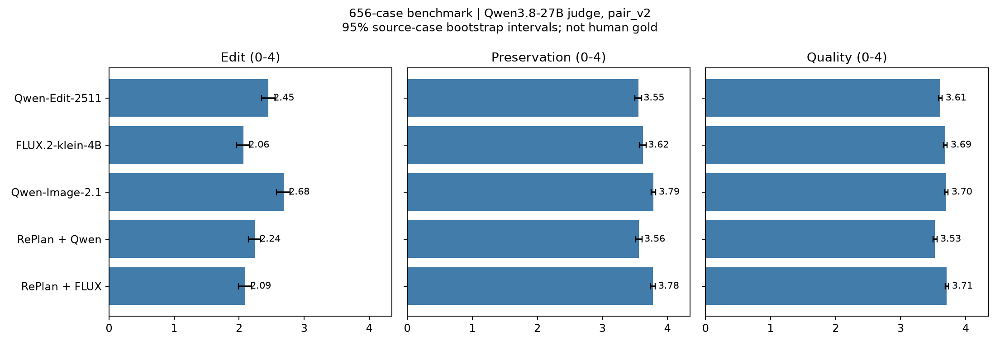

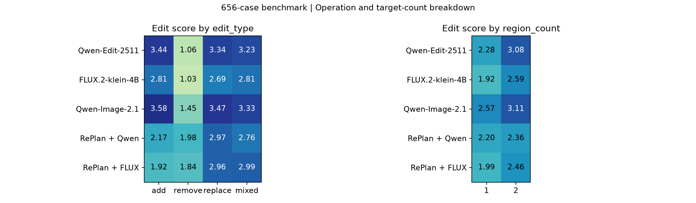

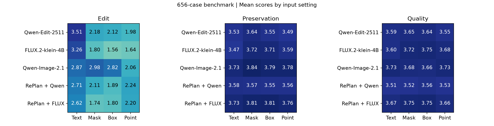
<!-- SCORES_END -->

### 2.1 总体结论

- Qwen-Image-2.1 的 E、P、E=4 和严格成功率均最高，是本次统一协议下综合表现最好的方法。
- RePlan 没有提高对应 editor 的总体 E：RePlan + Qwen 比 Qwen-2511 低 0.210，RePlan + FLUX 比 FLUX 高 0.026，后者差异很小。RePlan + FLUX 的 P/Q 较高，但大量 no-op 也会保留原图并抬高 P/Q，因此必须与 E 一起解读。
- Qwen-2511 的 E 高于两个 RePlan 版本和 FLUX，并在 text 输入上达到最高 E=3.507；Qwen-Image-2.1 在交互输入上更稳定。
- 五种方法最共同的短板是删除。Qwen-Image-2.1 的 remove E=1.448 已是三个基模中最高；RePlan 将删除提高到 1.982/1.837，但仍明显低于其他操作。

### 2.2 按编辑操作

| 操作 | Qwen-2511 | FLUX.2 | Qwen-2.1 | RePlan+Qwen | RePlan+FLUX |
| --- | ---: | ---: | ---: | ---: | ---: |
| Add | 3.443 | 2.810 | **3.583** | 2.168 | 1.921 |
| Remove | 1.065 | 1.025 | 1.448 | **1.982** | 1.837 |
| Replace | **3.340** | 2.689 | **3.473** | 2.965 | 2.957 |
| Mixed | 3.228 | 2.809 | **3.331** | 2.765 | 2.993 |

双目标任务进一步暴露绑定和完整执行问题。其 E/P/Q 分别为：Qwen-2511 3.077/2.741/3.500、FLUX 2.588/2.809/3.585、Qwen-2.1 3.108/3.322/3.683、RePlan+Qwen 2.360/3.027/3.531、RePlan+FLUX 2.464/3.629/3.797。Qwen-2.1 的完成度和保持度组合最好；RePlan+FLUX 的高 P/Q 没有转化为同等的 E。

### 2.3 按输入方式

| 方法 | Text E | Mask E | Box E | Point E |
| --- | ---: | ---: | ---: | ---: |
| Qwen-Image-Edit-2511 | **3.507** | 2.183 | 2.124 | 1.977 |
| FLUX.2-klein-4B | 3.264 | 1.797 | 1.562 | 1.637 |
| Qwen-Image-2.1 | 2.870 | **2.976** | **2.824** | 2.064 |
| RePlan + Qwen | 2.713 | 2.115 | 1.889 | **2.235** |
| RePlan + FLUX | 2.620 | 1.739 | 1.802 | 2.205 |

Qwen-2511 和 FLUX 在 text 上明显优于三种 locator 输入。Qwen-Image-2.1 是唯一 mask 高于 text 的基模，并在 mask、box 上领先。RePlan 两个版本的 point 高于自身 mask/box，但仍没有稳定解决实例绑定。交互设置的 P/Q 有时较高，常见原因是输出接近原图，不能据此认定编辑更成功。

## 3. 代表性 case study

以下 8 个 case 专门覆盖低分、设置敏感、双目标绑定和 judge 易误判的情形。每张矩阵的列为 Text/Mask/Box/Point；首行为实际输入或 locator，随后依次是 Qwen-2511、FLUX.2、Qwen-2.1、RePlan+Qwen、RePlan+FLUX。格内 E/P/Q 来自 judge，文字结论来自人工查看。该定向样本用于解释失败机制，不能用于估计总体失败率。

### 3.1 删除与多操作完整性

**Case 0528：删除两个目标。** 20 个输出的 judge E 全为 0，人工观察也没有任何方法完整删除两个目标；有的只处理一个目标，多数接近 no-op。这是所有方法共同失败的明确例子。

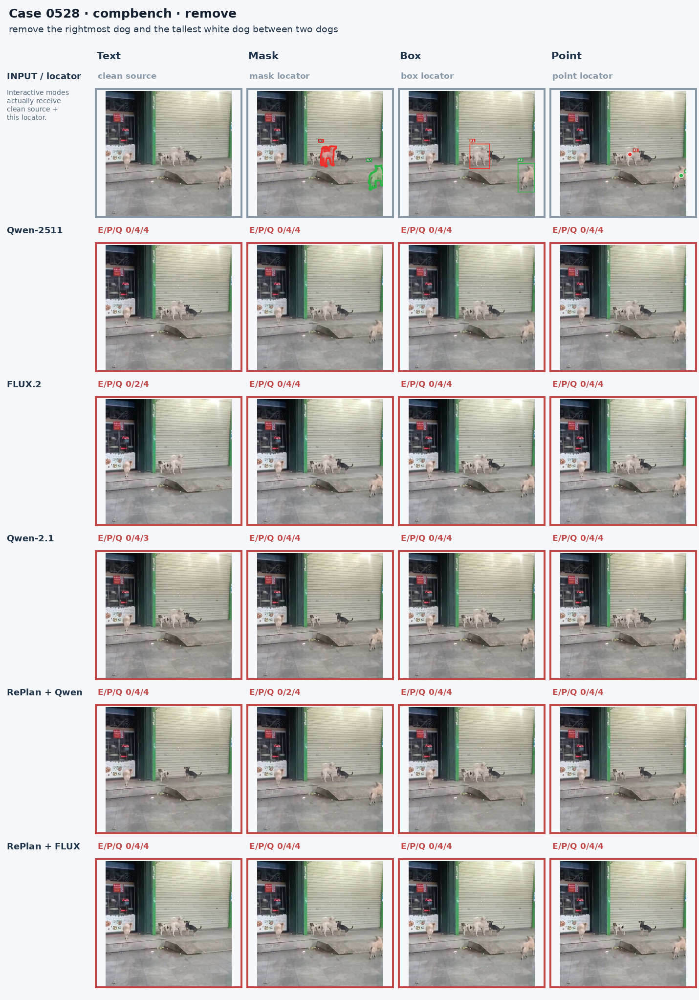

**Case 0345：删除右侧大象。** 五个方法的 text 都能清楚删除目标；15 个交互输出中 14 个 E=0，只有 RePlan+FLUX mask 得到 E=1，且仍未完成。locator 输入在这个例子中反而使模型保留目标。

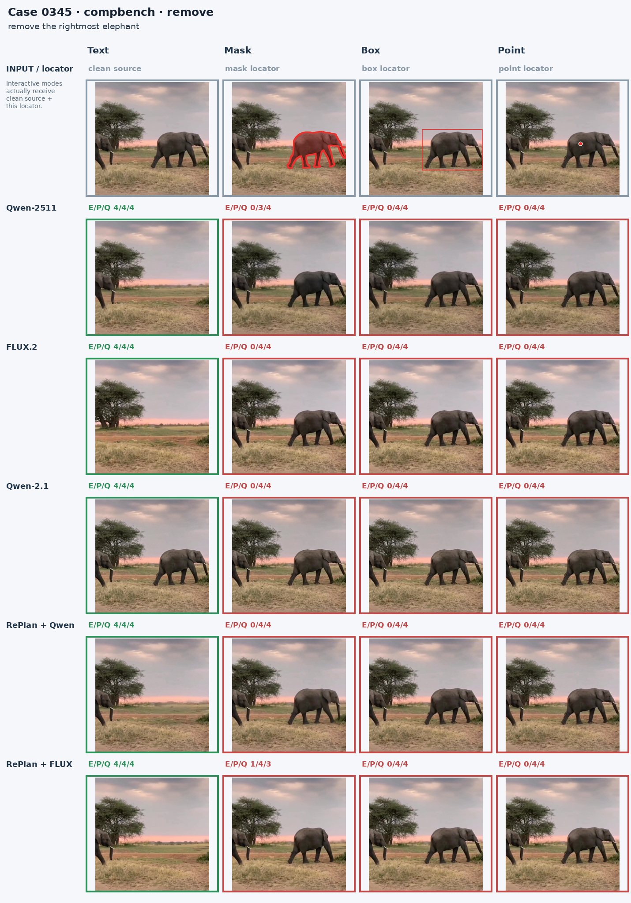

**Case 0586：删除右侧黑猫，同时把中间猫替换为狗。** 五个 text 输出均完成两项要求。交互输出多只完成替换而保留右猫；FLUX point 虽被判 E=4，却把多只猫都改成狗，人工上属于明显过编辑。

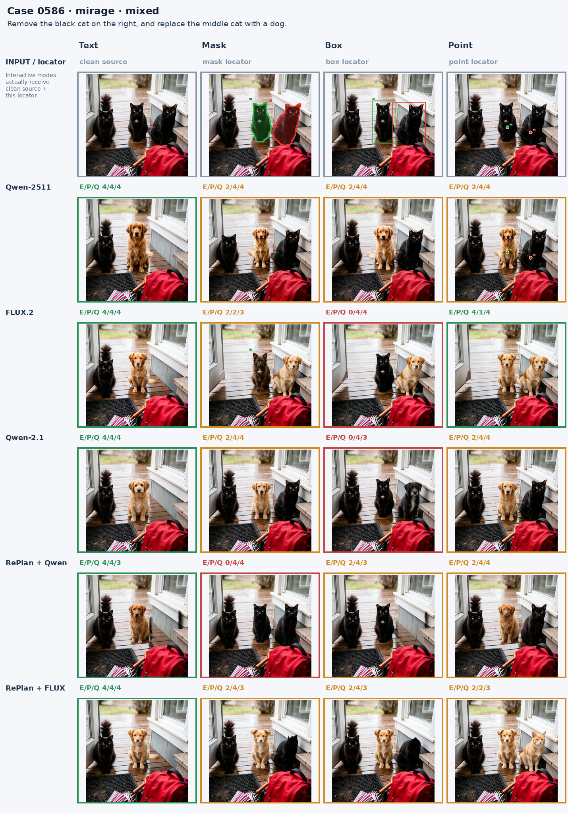

### 3.2 新增、替换与实例绑定

**Case 0181：在指定空白区域新增灰猫。** 三个裸基模在四种设置中大多成功；两个 RePlan 的 text 接近 no-op。交互提示能帮助 RePlan，RePlan+Qwen point 的猫则明显过小。

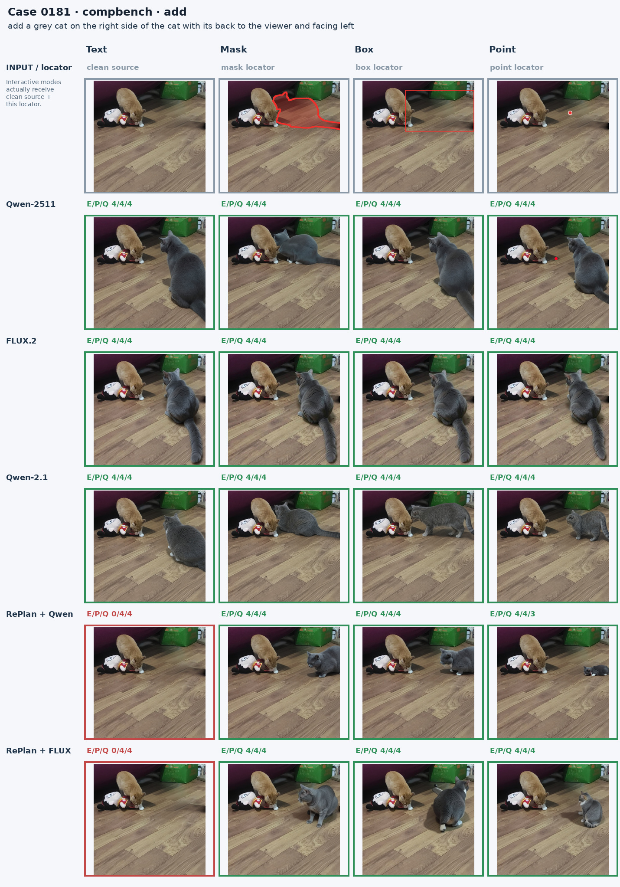

**Case 0488：把最右黑猫替换成杯子。** Qwen-2511 与 RePlan+Qwen 的 text 最清楚。多种交互输出保留黑猫后在旁边加杯子，或只给猫改色，执行成了 add/change 而不是 replace。

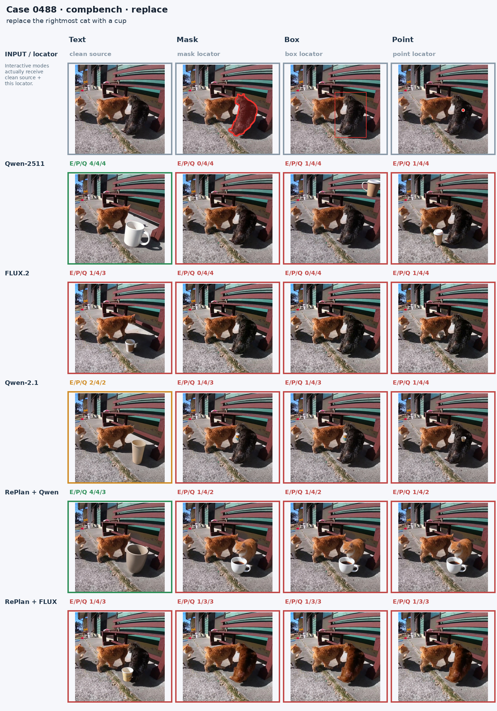

**Case 0608：给左右两只指定猫分别加蓝、红围巾。** Qwen-2511 的 mask/box/point 相对稳定；其余方法常改到相邻猫，point 最弱。失败集中在同类多实例与属性颜色的对应关系。

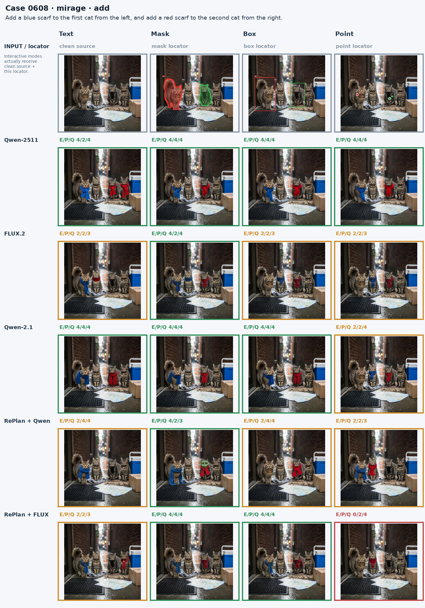

### 3.3 小目标属性、材质与 judge 偏差

**Case 0632：第一只鸭嘴变红，第三只鸭脚变蓝。** 许多输出被判 E=4，但人工可见红色或蓝色扩散到其他鸭；RePlan+FLUX mask/box 还把红嘴绑定到第三只鸭，point 漏改。FLUX mask 和 RePlan+FLUX text 相对接近要求。该例说明 judge 会高估小目标的精确绑定。

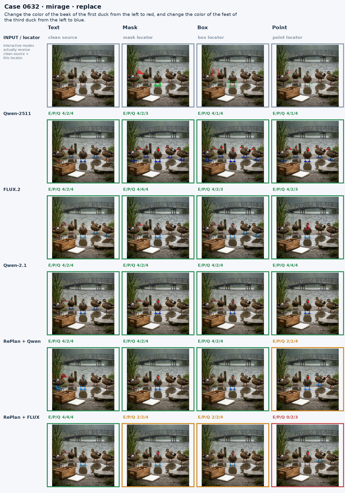

**Case 0635：第三顶帽子变蓝，第四顶针织帽变木质。** 大多数输出只把第四顶帽子变成棕色，仍保留针织纹理和柔软形态；部分输出还改错人物。多个 E=4 是材质判断偏宽的例子。

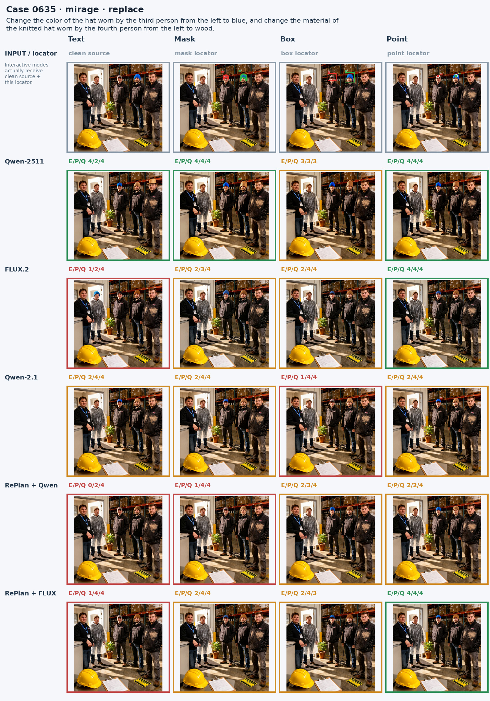

### 3.4 归纳出的失败模式

1. **删除不执行**：输出保持目标或只处理多个目标中的一个，case 0528、0345 最明确。
2. **操作类型漂移**：replace 变成保留原对象再 add，或材质变化退化成颜色变化。
3. **同类实例错绑**：多只猫、鸭或人物中，颜色、部位与操作落到相邻实例。
4. **多目标漏项与角色交换**：一句指令包含两个操作时，常只完成较显著的一项。
5. **locator 设置敏感**：text 成功不保证 mask/box/point 成功；某些模型把轮廓当作需要保留或重绘的内容。
6. **RePlan 规划损失**：规划可以改善部分删除和 point 输入，但也会引入错框、遗漏操作或将全局关系压缩成局部 hint；两个 RePlan 版本在全量 E 上没有形成稳定优势。

## 4. 评分解释与限制

- Judge 输入只有编辑前后两张图，两张图都绘制相同 mask 外轮廓，并附固定评分规则；每条只调用一次 Qwen3.8-27B。
- E/P/Q 分开报告，不合成总分。置信区间按 source case 重采样，保留四种设置间的相关性，但不能修正 judge 的系统误判。
- 0632 的细部绑定、0635 的材质以及 0586 的过编辑显示，自动分数仍需配合可视化复核。高 P/Q 也可能来自 no-op。
- case 0321 的文字指令与 locator 标注冲突，因此五种方法、四种设置共 20 条结果均不进入均值。

## 5. 保留的实验产物

实验根目录为 `/mnt/bn/strategy-mllm-train/user/tanyue/experiments/SAMTokEdit`。

| 内容 | 相对路径 |
| --- | --- |
| Qwen-2511 / FLUX 输出 | `referential_finegrained_edit_benchmark_656_two_image_locator/inference/{qwen,flux2}` |
| Qwen-2.1 输出 | `qwen21_656/inference/qwen21` |
| RePlan 输出与 planner 回复 | `replan_656/inference/{qwen2511,flux2_klein4b}` |
| Judge 清单、原始记录和覆盖报告 | `metrics_qwen38_all_models_pair_v2/{pilot.jsonl,all}` |
| 汇总、图表和本节 case study | `metrics_qwen38_all_models_pair_v2/comparison` |

仓库保留三张总体图、八张 case 矩阵及结构化汇总；大规模逐样本结果保存在上述实验目录。
