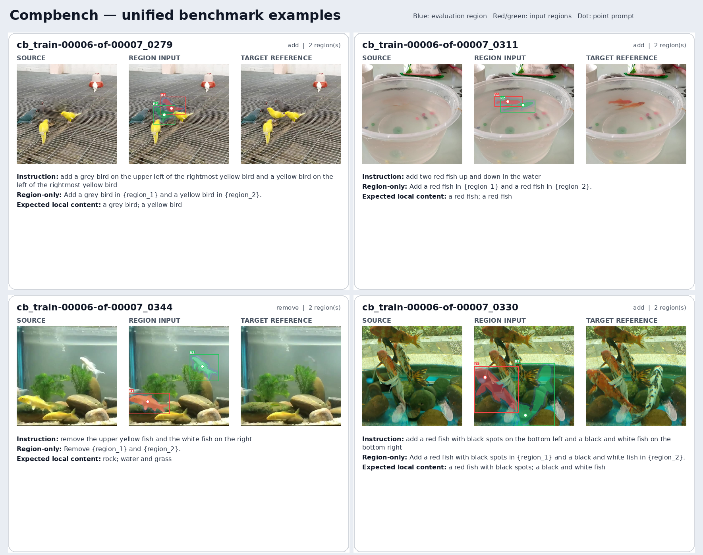
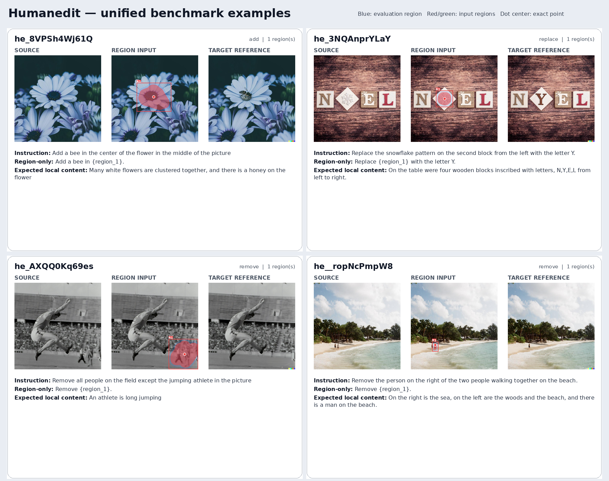
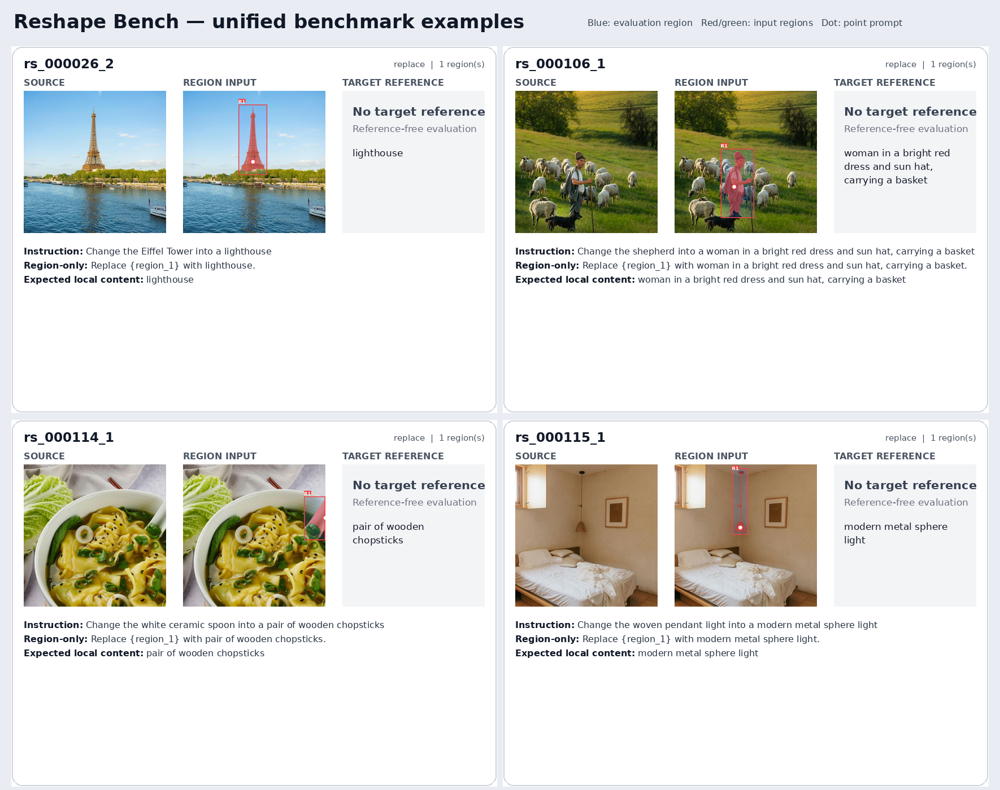

# SAMTok Fine-Grained Interactive Edit Benchmark

This repository contains the canonical 500-case benchmark manifest, selection
records, validation report, construction scripts, and representative
visualizations for fine-grained interactive image editing.

## Data locations

The three downloaded source datasets are:

```text
/mnt/bn/strategy-mllm-train/user/tanyue/datasets/CompBench/
/mnt/bn/strategy-mllm-train/user/tanyue/datasets/HumanEdit/
/mnt/bn/strategy-mllm-train/user/tanyue/datasets/ReShapeBench/
```

The materialized benchmark is:

```text
/mnt/bn/strategy-mllm-train/user/tanyue/datasets/samtok_edit_benchmark/
```

## Benchmark summary

| Property | Count |
| --- | ---: |
| Cases / unique source images | 500 |
| CompBench | 269 |
| HumanEdit | 154 |
| ReShapeBench | 77 |
| Add / remove / replace | 148 / 172 / 180 |
| Multi-instance cases | 116 |
| Small-target cases | 137 |
| Target reference images | 423 |
| Input region masks | 616 |
| Evaluation masks | 500 |

Every benchmark record uses the same compact top-level schema:

```text
id, source_dataset, edit_type, source_image, instruction,
regions, evaluation_mask, target, difficulty
```

All asset paths in `benchmark.jsonl` are relative to the materialized benchmark
root. `regions` contains one entry per requested instance, with a binary mask,
padded half-open `xyxy` box, and an interior point. The fields under `target`
describe the desired post-edit result and are evaluator-only; they are not model
inputs.

## Repository layout

```text
benchmark/
  benchmark.jsonl
  benchmark_meta.json
  validation_report.json
  visual_examples/
selection/
  selected_500.jsonl
  selected_500.csv
  selection_stats.json
build_unified_benchmark.py
render_unified_examples.py
BENCHMARK_PROGRESS.md
```

`benchmark/benchmark.jsonl` is the lightweight copy of the final unified data.
`selection/selected_500.jsonl` retains the source-facing construction fields
needed to reproduce the materialization step. Large PNG assets remain under the
external dataset root and are intentionally not committed to Git.

## Visual examples

Red/green overlays mark model input regions; blue tint marks the evaluation
region. The right panel is the target reference when available.







## Reproduction

The three source datasets and derived-model revisions are pinned in
`benchmark/benchmark_meta.json`. With those datasets available at the paths used
by the selection manifest, rebuild the canonical benchmark with:

```bash
python build_unified_benchmark.py
python render_unified_examples.py
python render_unified_examples.py --output benchmark/visual_examples
```

The builder validates all records before copying the lightweight manifest,
metadata, and validation report into `benchmark/`. See
`BENCHMARK_PROGRESS.md` for selection policy, field semantics, and current
verification results.
