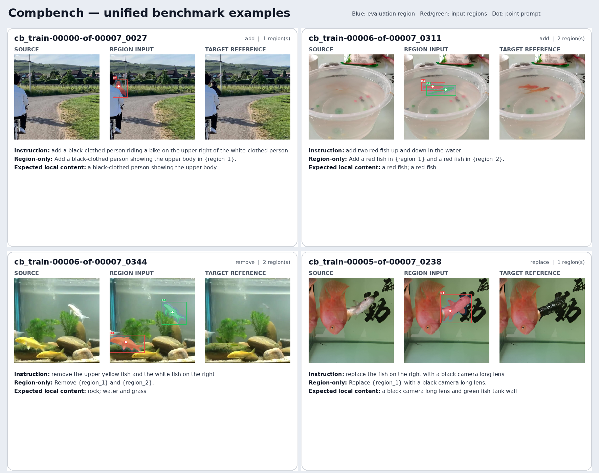
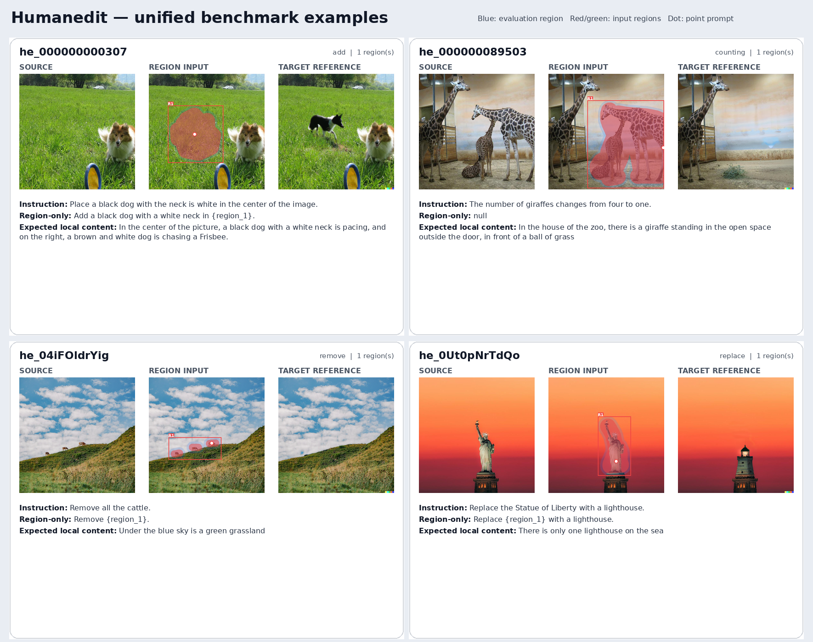

# SAMTok fine-grained interactive edit benchmark

The v0 unified benchmark has been materialized and validated. Construction details are recorded
in [`BENCHMARK_PROGRESS.md`](BENCHMARK_PROGRESS.md).

The complete 545 MB benchmark is stored outside Git at:

```text
/mnt/bn/strategy-mllm-train/user/tanyue/datasets/samtok_edit_benchmark_v0/
```

`benchmark_v0/` contains the lightweight `benchmark.jsonl`, global metadata,
and validation report. All paths in the manifest are relative to the complete
benchmark root above.

Rebuild the unified data from the pinned source datasets and selected candidate
manifest with:

```bash
python build_unified_benchmark.py
```

The builder writes portable PNG assets, normalizes the three source schemas,
constructs region masks/boxes/points and evaluation masks, and validates the
result before copying the lightweight files into `benchmark_v0/`.

## Visual examples

Each card shows the source image, region input overlay, target reference when
available, and both instruction variants. Blue denotes the evaluation region;
red/green denote input regions; the white dot is the point prompt.






Regenerate these sheets with:

```bash
python render_unified_examples.py
```

## Candidate selection

This directory contains the reproducible automatic pre-selection used to build the
human-review pool described in `细粒度交互式编辑 Benchmark 方案.md`.

Run:

```bash
python select_candidates.py
```

After a full feature scan, quota/ranking-only changes can be rerun quickly with:

```bash
python select_candidates.py --reuse-features
```

Outputs are written to `output/`:

- `selected_500.jsonl`: full, typed candidate manifest.
- `selected_500.csv`: compact review/index view.
- `selection_stats.json`: quotas, difficulty proxies, and review-flag counts.
- `all_preselection_features.jsonl`: all in-scope rows with QC measurements.
- `review_sheets/`: paginated review images plus a candidate-to-card CSV index.
- `human_review_template.csv`: the five Y/N checks from the benchmark plan plus
  final decision, reviewer, and notes columns.

Render and validate the full review package:

```bash
python render_review_sheets.py
python validate_selection.py
```

`output/selected_500.jsonl` remains the rich construction-time candidate manifest;
it is not the compact evaluation manifest.

Important implementation choices:

- CompBench: Add/Remove/Replace plus explicit multi-object Add/Remove only.
- CompBench diversity: candidates cover new MOSE video prefixes before selecting
  additional frames from an already represented video.
- HumanEdit: Add/Remove/Replace/Counting with `MASK=1`; masks are recovered from
  `MASK_IMG` alpha (`alpha < 128`) rather than black RGB content.
- GT locality: at least 80% of changed pixels must fall within a 2%-dilated region;
  changed pixels use mean absolute RGB difference >= 12/255. A secondary requirement
  keeps at least 40% of total RGB difference mass inside the same region.
- ReShapeBench: 30 single-object and 70 multi-object cases; no GT image is assumed.
  Released box masks are weak locators; Grounding DINO plus SAM2 supplies the final
  semantic instance masks because some released locators are coarse or misplaced.
- All Parquet `source_row` values are zero-based.
