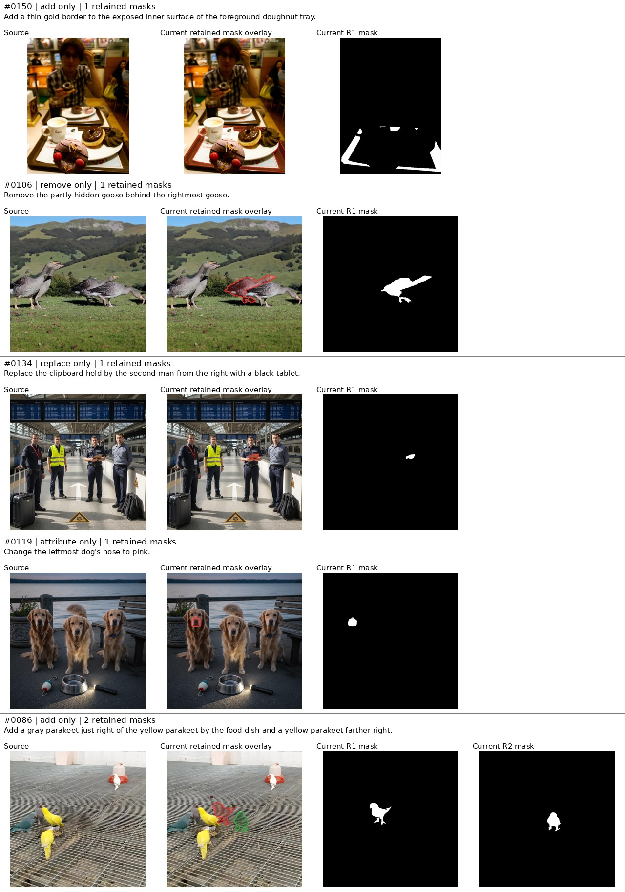

# SAMTok Edit Benchmark v1

A 450-case benchmark for fine-grained, region-directed image editing: selecting the correct instance or part, respecting occlusion and irregular boundaries, completing the requested edit, and preserving nearby content.

**Current release:** v1 / `mask_grounded_single_ops_v4`. It combines 150 difficult cases filtered from the previous benchmark with 300 external-source cases. All 450 cases were individually inspected against clean source images and original region masks. The instructions use short, capitalized English imperatives: add 113, remove 112, replace 113, attribute 112. There are no mixed/composite tasks. The 47 former mixed cases each retain one original mask chosen by paired visual difficulty review; the other 403 cases are unchanged. The remaining 16 two-mask cases apply one operation type to both regions. Independent human approval and model evaluation with these revised instructions remain pending. Historical model scores are selection evidence, not v1 results.



## Documentation

| Document | Content |
|---|---|
| [Dataset](docs/DATASET.md) | Evaluation goals, statistics, paths, schema, visual examples |
| [Sources and construction](docs/CONSTRUCTION.md) | Source splits, filtering, mask provenance, instruction writing, human approval |
| [Source selection priorities](docs/SOURCE_PRIORITY_RECOMMENDATIONS.md) | Dataset suitability, investigation priorities, exclusions and audit limits |
| [Evaluation](docs/EVALUATION.md) | Model input/output protocol, VLM rubric, success definitions, human output assessment |
| [Development](CONTRIBUTING.md) | Installation, checks, repository conventions, commit format |

## Install and validate

Python 3.10+. Run commands from the repository root; provide your image-asset root explicitly.

```bash
python -m pip install -e .
# On the project machine:
DATA_ROOT=/mnt/bn/strategy-mllm-train/user/tanyue/datasets/samtok_edit_benchmark_v1
samtok-benchmark validate --dataset-root "$DATA_ROOT" --output outputs/validation.json
```

Git contains the 450-case manifest and provenance, not all source images. The existing project asset directory and the self-contained review archive contain the required images; access and source-dataset terms are described in [Dataset](docs/DATASET.md). There is no public hosted asset release yet.

To copy the exact frozen release to another directory:

```bash
samtok-benchmark build --assets-root "$DATA_ROOT" --output local_data/v1
```

The build verifies all image/mask checksums. It refuses to overwrite an existing directory. On a different machine, `DATA_ROOT` can point to an extracted review package: its `assets/` paths match the release.

## Browse and approve cases

```bash
samtok-benchmark review --dataset-root "$DATA_ROOT" --output outputs/data_review
python outputs/data_review/run_review.py
```

Open `http://127.0.0.1:8765/index.html`. The case list loads first; images load after selection. Inspect the source, original region overlay and binary mask; no evaluation mask is displayed. Pass/discard, instruction overrides and notes persist to `review_results.json`.

```bash
samtok-benchmark export-reviewed \
  --results outputs/data_review/review_results.json --reviewer YOUR_NAME \
  --output outputs/approved_cases.jsonl
```

This creates a separate, passed-only manifest and audit. Instruction revisions require re-approval. The frozen 450-case release is unchanged.

## Prepare model inputs and evaluate

```bash
samtok-benchmark prepare --dataset-root "$DATA_ROOT" --output outputs/inputs
```

This freezes 1,800 jobs (450 cases × text/mask/box/point). Baseline visual inputs are `[clean source, locator]`; text-only uses the clean source. Native region methods can instead prepare with `--protocol native_regions_v1`. No reference target or legacy evaluation mask enters model inputs.

Implement the callback in [examples/editor_adapter.py](examples/editor_adapter.py), then run your editor or register equivalent external outputs using the [documented contract](docs/EVALUATION.md#2-模型执行与输出登记):

```bash
samtok-benchmark run-editor --inputs outputs/inputs/inputs.jsonl \
  --adapter YOUR_MODULE:edit --method YOUR_MODEL --seed 0 \
  --adapter-config examples/editor_config.json --output outputs/editor
samtok-benchmark prepare-judge --dataset-root "$DATA_ROOT" \
  --inputs outputs/inputs/inputs.jsonl --outputs outputs/editor/outputs.jsonl \
  --method YOUR_MODEL --output outputs/judge_inputs.jsonl
samtok-benchmark judge --manifest outputs/judge_inputs.jsonl \
  --output outputs/judge_dry_run --dry-run
```

For actual scoring, install the optional judge environment separately and specify a compatible local VLM checkpoint. The established Qwen-based judge path uses vLLM; dry-run needs no VLM or GPU.

```bash
python -m pip install -e '.[judge]'
samtok-benchmark judge --manifest outputs/judge_inputs.jsonl \
  --model /path/to/judge_checkpoint --output outputs/judge
samtok-benchmark report --manifest outputs/judge_inputs.jsonl \
  --run outputs/judge --output outputs/report
```

The judge sees two images with identical evaluator-added original-mask contours and scores **edit completion**, **content preservation**, and **visual quality**, each 0–4. Strict success requires completion = 4, preservation ≥ 3, quality ≥ 3. Reports include missing outputs, unknown judgments and coverage. See the full rubric and independently recorded human-review workflow in [Evaluation](docs/EVALUATION.md).

## Repository layout

```text
data/v1/                       frozen 450-case release, hashes and provenance
  cases.jsonl                  sole current task manifest
  asset_manifest.jsonl         1,366 active source/region/legacy-evaluation asset records
  provenance.jsonl             450 source and selection records
  instruction_revisions.jsonl  ordered instruction history (300 + 450 + 47 records)
  instruction_revisions_single_ops_v4.jsonl  current 450-case instruction/region audit
  instruction_revisions_balanced_v3.jsonl   historical pre-reduction instruction audit
  selection/                   filtering and expansion evidence
  audits/                      split, overlap, instruction and asset verification
src/samtok_benchmark/           installable package and CLI
  dataset.py, build.py          validation and exact materialization
  inputs.py, editor.py          frozen inputs and model-independent adapter runner
  review/                      standalone lazy-loading data review tool
  judge/                       VLM rubric/runner, report and blind human output review
examples/                      editor integration contract
docs/                          dataset, construction, evaluation and sample figure
tests/                         dataset/protocol/review/scoring invariants
```

Model weights, generated results, reviewer decisions and temporary files stay outside Git. The historical v0 dataset and remote `dev` branch remain separate; this branch contains only the current v1 implementation and the evidence needed to trace its construction.
