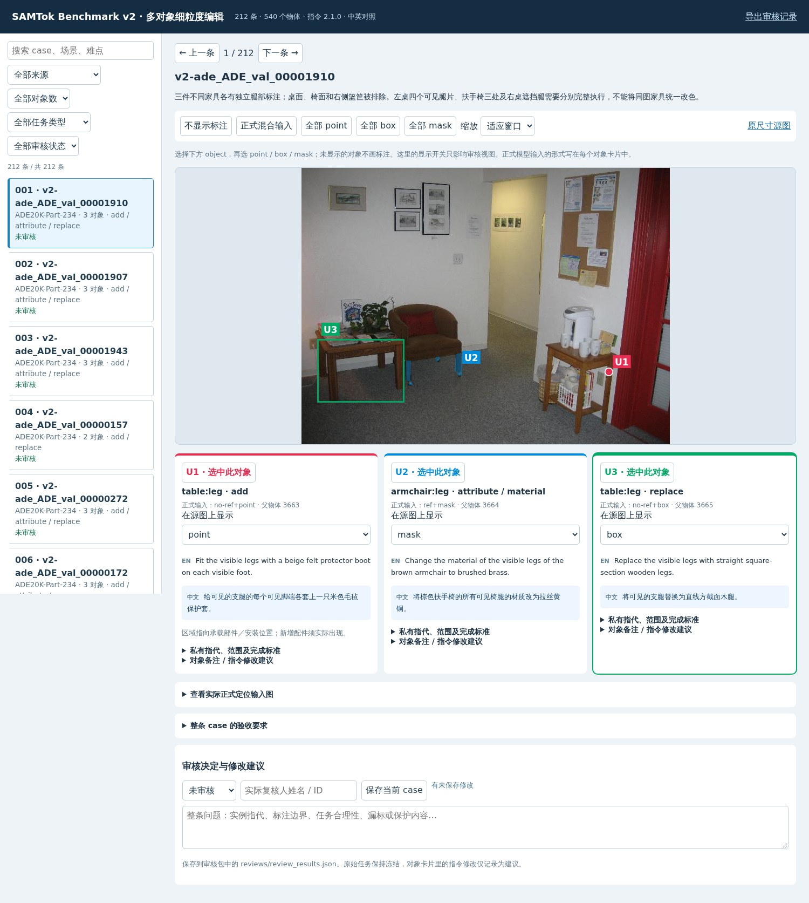

# SAMTok Benchmark v2

当前指令发布版本 **2.1.0**，更新于 2026-10-10。主集包含 **212 张独立源图、212 条多对象任务、540 个编辑单元**；add、replace、remove、attribute 各 135 个，占比各 25%。每个单元有英文指令与中文翻译。本文是 v2 唯一维护的 benchmark 主文档，统一记录评测目标、构造方法、数据协议、结果和使用方法。

## 1. 要评测的目标与能力

评测模型能否在细粒度、复杂场景中，理解用户为**多个不同物体**分别给出的操作和交互信息，准确执行全部编辑，并保持非目标内容和整体图像质量。

| 能力 | 要求 | 典型失败 |
|---|---|---|
| E：目标选择与完整执行 | 选对相似实例；理解部件范围；覆盖遮挡后分离的可见部分；正确绑定每个对象的操作 | 改错椅子；漏掉一条桌腿；新增配件放错物体；原部件没改而另造一个 |
| P：非目标保持 | 控制部件边界；保护同一物体其他部件、相邻对象、人和背景 | 改扶手连座面一起改；移除扇叶时删掉电机；删除袖子时删掉手臂 |
| Q：编辑质量 | 形状、材质、连接、遮挡、光照与局部重建自然 | 套子像涂色；替换部件接不上；移除后出现破洞；边缘融合或结构不合理 |

一张图中有 2–4 个编辑单元，每个属于不同的物理父对象。同一张椅子的多条腿、同一个人的两只袖子、同一物体被遮挡后分开的 mask 块，仍然只算一个单元。一个单元可添加多个明确要求的配件，例如每个可见脚端各加一个保护套；这些新增配件不增加源物体单元数。

重点覆盖同类多实例、局部部件、细长区域、多个可见碎片、遮挡、相邻内容保护，以及不同对象的不同操作与不同输入形式同时出现。这里的“交互式”指逐对象输入指定，当前是一次性完成一张图的全部指令，尚未包含多轮纠错。

### 严格成功标准

对每个单元分别判断 E、P、Q，并提供具体视觉证据；全图还需通过 global_P、global_Q。

`case_pass = global_P ∧ global_Q ∧ AND_over_units(E ∧ P ∧ Q)`

任意一个对象漏改、错改、越界或质量不合格，整条 case 失败。主指标是 212 条 mixed 主任务的整条通过率；单元成功率及来源、操作、对象数、交互形式的切片用于诊断，不能用平均分掩盖某个对象失败。同一图其他单元明确授权的变化，不计入本单元的保持失败。

## 2. 源数据是什么，为什么选它们

| 来源 | 最终源图 | 使用的原始数据与标注 | 适用原因 |
|---|---:|---|---|
| PACO-LVIS | 119 | `paco_lvis_v1_test.json` 中对应 COCO val2017 的图片、官方分割及 `obj_ann_id` | 同时关联部件与父实例，适合工具、器皿、服装、包带、小部件和多实例选择 |
| ADE20K-Part-234 | 93 | validation 图片、官方部件类别 PNG、`ade20k_instance_val.json` 的父实例 RLE | 室内相邻家具、密集桌椅、抽屉、扶手、灯具和多段结构较丰富 |

原始位置：

- PACO 标注：`/mnt/bn/strategy-mllm-train/user/tanyue/datasets/PACO_benchmark_candidates/annotations/paco_lvis_v1_test.json`。
- PACO 图片：`/mnt/bn/strategy-mllm-train/intern/common_datasets/coco/val2017/`。
- ADE 官方数据根：`/mnt/bn/strategy-mllm-train/user/tanyue/datasets/PACO_benchmark_candidates/goal_1k/ade20k_part234/official/ADE20KPart234/`。

逐图来源、原始路径、标注文件 SHA256、选中 annotation ID 和提取方法记录在 `data/v2/provenance.jsonl`。PACO 标注 SHA256 为 `8d061428b86dc9a0e5c206f330ed579c61319c7d6884402e540ac33faed3d2a6`；ADE 实例标注 SHA256 为 `0ee5468cdff35ed1b7e2f7b145f5a24add74950f5c1ee5c4375d7a35b15672a4`。

这一版选择能直接核对“部件—物理父对象”关系的两类来源。没有把 SA-1B 的 proposal 数当作物体数，也没有从旧 benchmark 的已有任务改写出这 212 张源图。其他来源可以用于后续训练构造，但不属于当前 benchmark。

## 3. 当前如何构建

### 3.1 候选检索与逐图筛选

1. **排除旧源图。** 排除旧 benchmark 正式 450 条、扩充 433 条的源图 ID，以及此前 15 条 PACO 原型源图。
2. **建立候选池。** 得到 911 张候选，PACO 554、ADE 357。要求至少两个独立物理父对象；部件非空、可见性足够、内部点可用且不同目标不过度重叠。几何筛选只安排查看顺序。
3. **实际视觉审查。** 查看 288 张：先查看 48 张，再按来源和对象类别组合分散取样查看 240 张。查看原图、候选 mask overlay、干净局部和 mask 局部；一张图中只保留合格的若干物体。
4. **二次核查并冻结。** 初审保留 214 张，复核再剔除 2 张，最终 212 张、拒绝 76 张。其余 623 张候选没有被标记为已审核。
5. **指令重新设计。** 本次逐张重新查看全部 212 张源图，为 540 个单元分别选择操作并编写中英文内容；对瓶颈包纸、包底、标签等容易混淆的部位再查看 mask 局部卡。保留相同的源图、父实例、mask、point、box 和交互分配。

剔除原因包括：不同 annotation 实为同一物体；父对象与部件重复计数；反射像；部件漏标；孔洞被填满；高光被当成独立部件；相邻物体粘连；缺少实例选择难度；遮挡严重到无法可靠指代。二次剔除的两个案例分别是洗衣机门 mask 包含玻璃但任务只指不透明门框，以及手机外框 mask 覆盖显示屏/按键。没有修改原 mask 来放宽准入。

审阅记录的实际身份为 assistant / `ai_direct_visual`。独立人工审核数为 0；当前没有正式模型编辑结果。候选筛选、指令设计、模型输出评分是不同阶段，不能互相替代。

### 3.2 区域标注如何构造

- **mask：** PACO 直接解码官方 segmentation；ADE 取官方部件类别 PNG 与对应父实例 mask 的交集。不得直接把整张图同类部件像素合并为一个实例。保留原始可见区域，不做生成式补画、填洞或跨父对象合并。
- **box：** 包含目标所有可见 mask 像素的轴对齐紧致框，整数像素坐标，格式为 `[x1,y1,x2,y2)`。
- **point：** 从 mask 内部按距离边界的内点规则稳定选取，必须位于目标内。一个点选择该实例的语义部件，不意味着只编辑点附近的一小块。
- **多个碎片：** 多段腿、遮挡后的袖子等保留在同一物体单元内；文本说明“所有可见腿”“两只袖子”等完整范围。
- **ref：** 文本 referring expression，不是参考图。使用位置、外观或场景关系消歧；应能脱离其他单元独立理解。

### 3.3 四类任务如何设计

比例按**编辑单元**统计。先判断目标在场景中适合什么操作，再调整全局分配，最终四类各 135 个。不同 case 可有不同操作组合，不要求每张图同时出现四类。

| 类型 | 统一表达方式 | 定义与设计约束 |
|---|---|---|
| add | `Add <新物> to/on/around <承载部件>.`；套装结构可用 `Fit ... with ...` | 增加真实配件或物品，交代数量及位置；不能把改色、改材质冒充新增 |
| replace | `Replace <目标> with <新部件>.` | 在原位置替换为形态或构造明确不同的部件，例如链条带替代布带、网布椅背替代实心椅背；仅材质变化归 attribute |
| remove | `Remove <目标>.` | 移除指定的完整部件或物体；优先柜门、抽屉面板、灯罩、盖子、靠垫、围巾等；不安排删除承重桌腿造成悬空结构 |
| attribute | `Recolor <目标> <颜色>.` / `Change the material of <目标> to <材质>.` | 保持结构，改变表面属性；透明玻璃用 `Apply a transparent ... tint to ...` 明确透明着色 |

任务需符合场景：餐具握柄可加防滑套；家具脚端可加保护套；箱体可加标签；衣服袖口可加护腕套；灯罩可拆除或更换；桌面可加杯垫。删除袖子需自然露出手臂，删除柜门或抽屉面板需合理呈现内部，替换部件需适配原连接位置。

**当前 add 的范围是依附已有物体或表面的添加。** 135 个 add 都以官方标注部件为承载区域/安装部位，例如给所选扶手加布套、在所选鞋侧加反光贴、在指定桌面空处加杯垫。区域不是“原图中本来存在的待新增对象”，也不是新增物体的输出 mask。此版尚未覆盖自由指定空白位置、任意新对象插入等 add 子类型。没有为了制造 add 而预先删除源图内容或生成新的 source。

对于 add，要求新配件有可辨认的实体层、边缘或安装关系，承载物仍在；对于重复添加，数量按指令覆盖每个指定可见安装点。仅把扶手染成奶油色不能算添加布套。

英文正式输入按交互形式选择：有 ref 使用 `instruction_ref`；无 ref 使用 `instruction_noref`，只保留部件类型/数量/操作，由 point、box、mask 选择实例。中文对应 `instruction_ref_zh`、`instruction_noref_zh`，审核包显示实际选用版本，中文翻译不自动追加到英文模型输入。

公开指令只讲操作，去掉逐条重复的“保持其余内容不变”、保留姿态、背景等套话。非目标保持属于默认评测规则。当前实际英文单元指令长度为 **3–27 个空格分词，平均 12.39 个**，包含实例指代。必要的数量、左右关系和“可见”范围不会为压缩长度而省略。

逐对象设计在 `construction/instructions/design.tsv`；双语句式与部件词汇在同目录 Python 文件；冻结结果和原始任务绑定在 `data/v2/instruction_design_revisions.jsonl`、`instruction_revision.json`。重建脚本只接受固定的基线清单 SHA256，避免对已经修改的任务重复套用变更。

### 3.4 混合交互分配

| 形式 | 编辑单元数 |
|---|---:|
| no-ref + point | 78 |
| no-ref + box | 79 |
| no-ref + mask | 74 |
| ref-only | 79 |
| ref + point | 79 |
| ref + box | 72 |
| ref + mask | 79 |

无 ref 必须有区域；有 ref 可有区域或无区域。每条主 case 至少两种形式；148 条同时有 ref 和无 ref，79 条包含纯 ref。采用固定种子的单元顺序与七模式循环分配，本轮指令优化没有按任务或模型效果重新分配交互。

`visual_locator_v2` 提供干净源图与仅绘制实际所给定位的辅助图；`native_regions_v2` 提供干净源图和结构化区域。纯 ref 不得获得任何几何；point 不得附带私有 mask；box 不得附带 point/mask。两种协议分别报告结果。`all_ref`、`all_mask_noref`、`single` 是诊断变体，不增加主集源图数。

## 4. 当前构建结果

| 项目 | 数量 |
|---|---:|
| 主 case / 独立源图 / 编辑单元 | 212 / 212 / 540 |
| PACO / ADE | 119 / 93 条 |
| 每图 2 / 3 / 4 个物理对象 | 115 / 78 / 19 条 |
| add / replace / remove / attribute | 135 / 135 / 135 / 135 单元，各 25% |
| 含 add / replace / remove / attribute 的 case | 128 / 130 / 127 / 122 条，可重叠 |
| attribute 内颜色 / 材质 / 透明着色 | 117 / 16 / 2 单元 |
| 至少两个入选对象具有同一原始类别 | 116 条 |
| 包含面积不超过整图 1% 的目标 | 185 条，367 个目标 |
| 包含一个目标有多个有效连通块 | 132 条，205 个目标 |
| 单目标 mask 面积占比中位数 | 0.5484% |
| 双语单元 / 本轮重新查看源图 | 540 / 212 |

有效连通块使用 8 邻域，面积门槛 `max(12px, 目标面积×0.005)`。上述面积与连通块统计描述原图部件/承载区域，尤其 add 时不能解读为新增物体面积。物体数由父实例与视觉核对决定。更完整分布见 `data/v2/statistics.json`。

### 代表性可视化与实际指令

**相似台灯分别移除、更换、改色。** `v2-paco_000000492758`：

| 单元 / 形式 | 实际英文指令 | 中文翻译 |
|---|---|---|
| U1 / ref+point | Remove the shade of the lamp beside the seated person. | 移除坐着的人旁边台灯的灯罩。 |
| U2 / no-ref+point | Replace the shade with a cylindrical pleated fabric shade. | 将灯罩替换为圆筒形褶皱布灯罩。 |
| U3 / ref+mask | Recolor the shade of the lamp on the far left cream. | 将最左侧台灯的灯罩改为奶油色。 |


**密集教室中的细腿与分离区域。** `v2-ade_ADE_val_00001943`：U1 使用 ref+mask 给指定课桌每个可见脚端加毛毡保护套；U2 使用 no-ref+box 将所选桌腿改为藏蓝色；U3 使用 no-ref+mask 将所选桌腿替换为直线方截面木腿。框内相邻椅子、桌面及其他桌子的腿均需保护。


**四物体、四种交互与不同操作。** `v2-paco_000000223182`：U1 纯 ref 给鞋侧面加银色反光贴；U2 ref+point 将遮挡脸部且垂到腿上的大毛巾替换为更窄、带流苏的条纹毛巾；U3 no-ref+point 移除后方绿色桶盖；U4 ref+mask 移除桶上的折叠毛巾。两处移除需要联合恢复桶周围内容；替换毛巾需要处理手、脸和身体的遮挡边界。


这些插图是含全部私有目标的审阅图，不能整体作为模型公开输入。正式图仅显示该单元实际提供的区域。

## 5. 数据协议、评审与版本绑定

`cases.jsonl` 是 evaluator 侧冻结标注：每条含 `source`、`units`、`difficulty`、源图准入 `review` 和本轮 `instruction_review`。每个单元含操作、四个双语指令字段、交互、私有完成标准、保持规则、`edit_contract` 和 `target`。`target` 含父实例、annotation ID、mask 路径/哈希、整数 point/box、几何、完整 ref 和部件范围。`attribute_kind` 仅对 attribute 非空。

add 的 `edit_contract.locator_semantics` 必须是 `addition_support`；其他操作为 `existing_edit_target`。源 mask 是定位依据，**不是编辑后的像素差真值**。新增配件、替换几何、删除后的暴露背景，以及必要局部阴影/反射可超出原可见 mask；不能将 mask 外像素变化一律判错。也不能把整个框或整个父对象都视为可任意编辑。

公开 editor job 通过白名单投影生成。单元只有 `id`、`operation`、`has_ref`、`locator`、选中的英文 `instruction`，原生协议另带实际所给的 `region`。中文、完整私有目标、隐藏 mask、验收标准和未选定位都不进入公开 job。公开顶层含任务 ID、variant、protocol、prompt、images、source_size、输入资产清单、manifest SHA256 和 input digest。

模型适配器接口：`edit(*, job, seed, config)` 返回与源图同尺寸的 RGB PIL.Image。示例见 `examples/v2_editor_adapter.py`。这是一项数据接口约定，不是操作系统权限沙箱；适配器不能自行读取 evaluator 文件补充提示。

评审同时查看全图及固定源坐标的前后局部。完成标准依操作解释：add 检查新配件的实际存在与安装；replace 检查原位形态替换；remove 检查全范围消失与局部重建；attribute 检查完整表面变化与结构保持。评分必须含实际 judge_kind / judge_name、每个单元的 E/P/Q 布尔值及证据、全图 P/Q。当前 judge protocol 为 `v2_epq_all_units_2`。

模型输入、运行配置、输出和评分以 manifest/input/output SHA256、run key、judge protocol 绑定。此次修改指令后重新生成输入，旧分数不兼容。报告不混合不同方法、配置、种子或协议；部分运行显式报告覆盖率，不能冒充完整 benchmark 结果。空评分模板和 identity 冒烟输出均不是模型成绩。

## 6. 来源去重和训练隔离

入选图与已知训练 source/target 缓存 **175,101 张**、旧 benchmark **883 张**及本版内部比较：字节哈希、标准 RGB 像素哈希、原图及水平翻转 pHash 均未命中。pHash 距离阈值为训练 ≤8、旧版及内部 ≤10。旧版转码图还追溯原图 ID 与路径。

本轮源图及 mask 没有变化，因此保留同一来源审计，记录在 `data/v2/audit/source_audit.json` 与相关指纹文件。此结论只覆盖已知任务训练清单，不证明基础模型或未知训练数据从未见过源图；pHash 无命中也不保证不存在同场景不同视角。

后续训练构造使用 `holdout_source_ids.jsonl` 排除这批源图及派生任务，再检查像素、近重复和可识别场景家族。可匹配本版的对象数、大小、遮挡、邻接保护、交互和操作分布，但不能复用 benchmark 源图。

## 7. 当前路径与审核包

唯一 Git 工作仓库：`/opt/tiger/samtok_edit_benchmark_v2branch`，分支 `v2branch`。

数据根目录：`/mnt/bn/strategy-mllm-train/user/tanyue/datasets/samtok_edit_benchmark_v2/`。

| 位置 | 内容 |
|---|---|
| 仓库 `data/v2/` | 当前冻结标注、来源、统计和检查摘要 |
| 数据根 `assets/<case_id>/source.jpg`、`U*.png` | 212 张源图、540 个官方原始 mask |
| 数据根 `assets/<case_id>/final_review.jpg` | 本轮操作更新后的审阅图；`review.jpg` 为最初源图准入证据卡 |
| 数据根 `benchmark/` | 与仓库一致的正式标注及完整审计 |
| 数据根 `construction/` | 911 候选、288 次筛选、二次覆盖决定、源审计与构建日志 |
| 数据根 `construction/instruction_revision_2.1.0/` | 本轮逐图查看图页、540 个双语任务设计和修订统计 |
| 数据根 `evaluation/inputs_visual/`、`inputs_native/` | 按新指令重新生成的两套正式任务 |
| 数据根 `archive/` | 旧清单、旧审核包和历史输入的复现归档，不作为当前入口 |
| `/opt/tiger/samtok_edit_benchmark_v2_review/` | 当前独立审核工具 |
| `/opt/tiger/samtok_edit_benchmark_v2_review_20261010.zip` | 当前可下载审核压缩包，远端同名文件更新 |

正式 case 的路径相对于数据根目录；原始候选 `review_card` 相对于 construction。完整历史日志可能保留旧机器路径，仅作为溯源记录。仓库不存储正式图片库、审核 ZIP 或开发依赖。旧版 benchmark 文档已从当前仓库移除，可通过 Git 历史追溯；当前仅维护本文。

审核包下载：[Hugging Face 当前文件](https://huggingface.co/datasets/TTangenty/samtok_edit/resolve/main/samtok_edit_benchmark_v2_review_20261010.zip)。精确发布 revision、大小和 SHA256 见 `data/v2/review_package.json`。

解压后：

```bash
cd samtok_edit_benchmark_v2_review
python run_review.py
```

仅需 Python 3.10+ 标准库和现代浏览器，自动打开 `http://127.0.0.1:8766/`，也可 `python run_review.py --port 8766 --no-browser`。不需要 VS Code 的 HTML 预览命令。

左侧选择 case 后按需加载；可按来源、对象数、操作类型和审核状态筛选。每个对象显示英文正式指令和中文翻译，可分别选择不显示、point、box、mask；支持缩放与恢复正式混合输入。审核时显示私有 mask 不改变正式输入分配。

用户复核备注和指令建议保存于包内 `reviews/review_results.json`，可刷新恢复及导出；不改写冻结任务。旧包审核记录绑定旧 manifest，应作为历史记录保留，不能直接伪装成对新指令的确认。



## 8. 复现与验证

安装 `python -m pip install -e '.[dev]'`；构建依赖为 `.[construction]`。本机依赖放在仓库外，可使用 `PYTHONPATH=/opt/tiger/.samtok_v2_tools/python:src python ...`。

```bash
BENCH_DATA=/mnt/bn/strategy-mllm-train/user/tanyue/datasets/samtok_edit_benchmark_v2
samtok-benchmark-v2 validate --manifest data/v2/cases.jsonl \
  --dataset-root "$BENCH_DATA" --minimum-cases 200 --output "$BENCH_DATA/benchmark/validation.json"
samtok-benchmark-v2 prepare --manifest data/v2/cases.jsonl \
  --dataset-root "$BENCH_DATA" --protocol visual_locator_v2 \
  --variants mixed --output "$BENCH_DATA/evaluation/inputs_visual"
samtok-benchmark-v2 review --manifest data/v2/cases.jsonl \
  --dataset-root "$BENCH_DATA" --output /path/to/new_empty_review_folder
samtok-benchmark-v2 run-editor --inputs "$BENCH_DATA/evaluation/inputs_visual/jobs.jsonl" \
  --adapter your_adapter:edit --method your_model --seed 0 --output "$BENCH_DATA/evaluation/your_model"
samtok-benchmark-v2 prepare-judge --manifest data/v2/cases.jsonl \
  --dataset-root "$BENCH_DATA" --inputs "$BENCH_DATA/evaluation/inputs_visual/jobs.jsonl" \
  --outputs "$BENCH_DATA/evaluation/your_model/outputs.jsonl" --output "$BENCH_DATA/evaluation/your_judge"
samtok-benchmark-v2 report --manifest data/v2/cases.jsonl \
  --inputs "$BENCH_DATA/evaluation/inputs_visual/jobs.jsonl" \
  --outputs "$BENCH_DATA/evaluation/your_model/outputs.jsonl" \
  --scores "$BENCH_DATA/evaluation/your_judge/scores_completed.jsonl" \
  --output "$BENCH_DATA/evaluation/your_report.json"
```

迁移目录后重新 prepare，因为运行 job 会绑定本机绝对路径。

源图构建链：`build_candidate_pool.py` → `render_review.py` → 实际查看并记录决定 → `review_state.py` 应用二次覆盖 → `audit_sources.py` → `freeze_v2.py`。最后一步复现初始 2.0.0 基线；**当前指令版还必须执行**：

```bash
python construction/revise_v2_instructions.py \
  --baseline "$BENCH_DATA/archive/release_2.0.0_before_instruction_revision/metadata/cases.jsonl" \
  --output /path/to/isolated_revised_metadata
```

任务清单 SHA256：`a07c19c0b42ffb0c864f1470669366982e1aecc5b5b757482f994e44aca49028`。原始源图、mask、父对象和交互分配不变，指令、操作、私有完成标准与评审协议已更新。数据版本为 2.1.0，结构 schema 仍为向后兼容的 2.0。

代码验证包含 79 项测试、Ruff 检查；资产校验覆盖 964 个冻结文件。审核界面使用真实 Chromium 遍历 212 条，检查 540 个对象的 point/box/mask、实际中文翻译、任务筛选、保存与导出；浏览器测试运行在隔离副本，不写入交付包的人工复核记录。检查产物位于 `data/v2/audit/`。压缩包发布时验证本地 CRC/引用和远端文件大小、SHA256。

当前难点分布仍偏室内家具与部件级操作，add 偏依附式配件添加。是否能体现 SAMTok 相对 Qwen-Image-2.1 的优势，需要在冻结的新指令协议上运行正式对比实验，尚未产生此类成绩。
