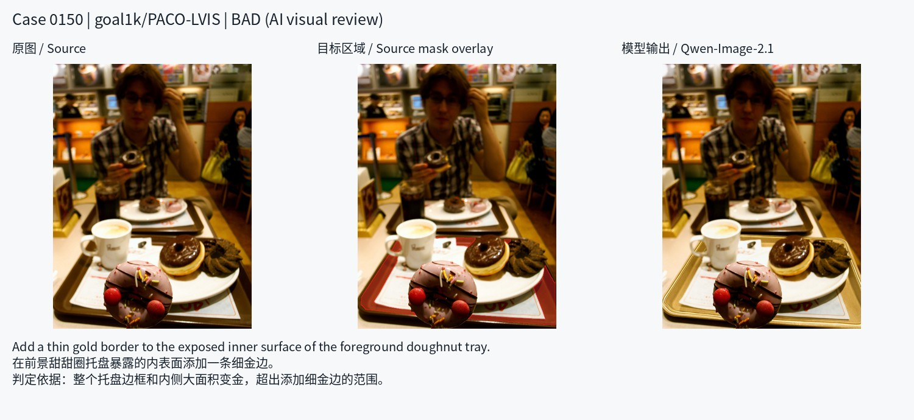
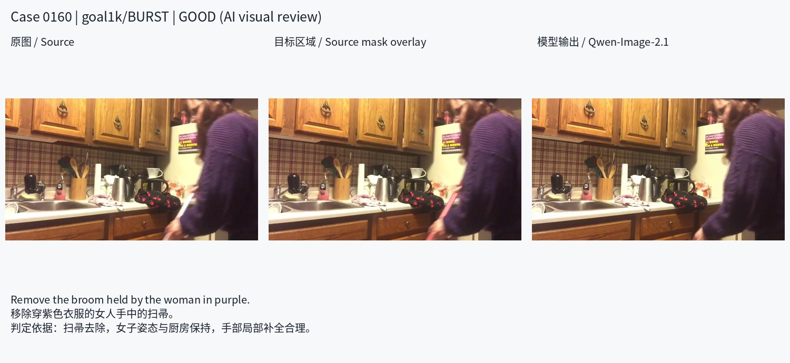
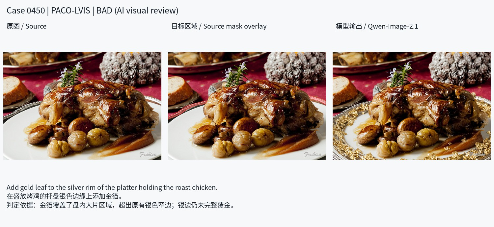
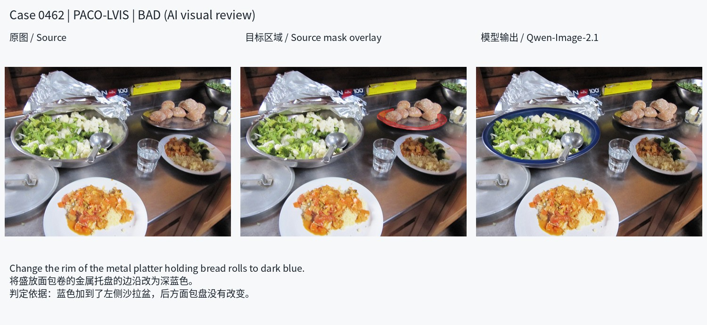
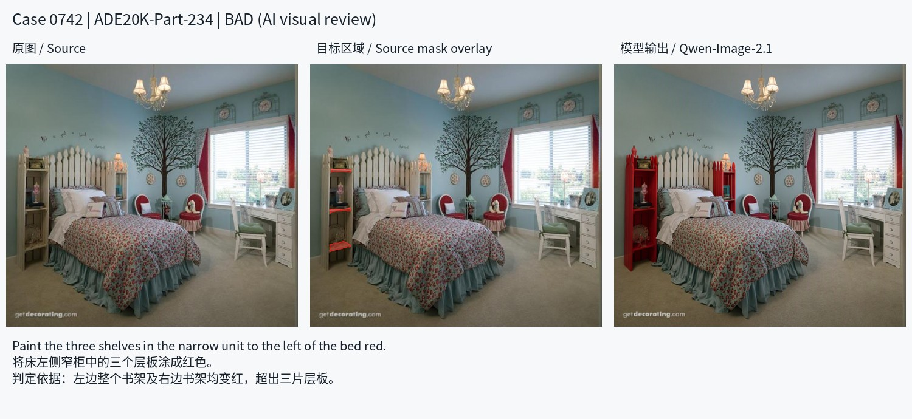
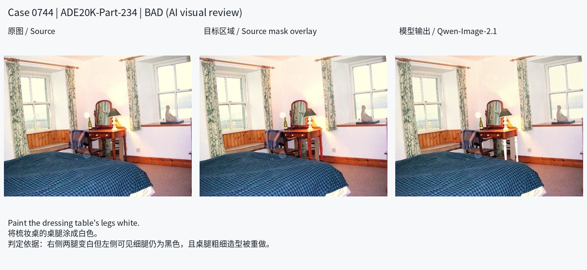
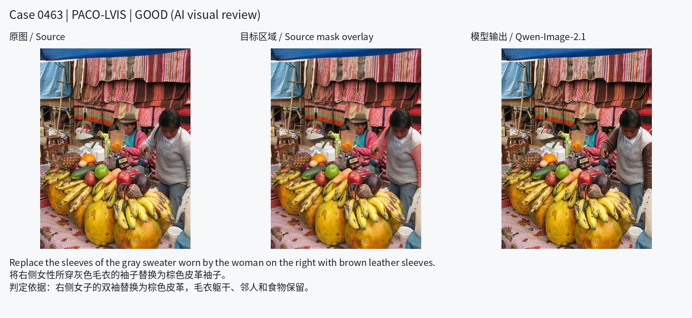
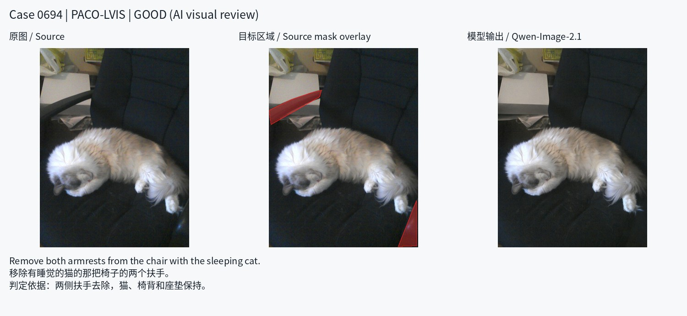

# SAMTok Edit Benchmark v1：目标、构建与 Qwen-Image-2.1 结果

更新日期：2026-10-09。本文区分**正式 v1 的 450 条任务**与**后续困难候选扩充**，汇总当前有记录可核验的结果。统计快照见 [summary.json](results/qwen21_text_only_20261009/summary.json)，883 条逐例结论、指令、证据与输入/输出身份见 [case_reviews.jsonl](results/qwen21_text_only_20261009/case_reviews.jsonl)。

## 1. Benchmark 要评测什么

**在细粒度、容易混淆的场景中，准确且完整地编辑指定对象或局部区域，同时保持其余内容不变。** 难度主要来自目标识别、部件范围和空间控制；不依靠不自然的任务、罕见知识或多步混合操作制造困难。

| 核心能力 | 可观察的通过条件 | 典型失败 |
|---|---|---|
| 目标编辑完整性：没有少编辑 | 选对实例和部件，完成指令要求，覆盖目标所有应编辑的可见片段 | 改错实例；目标未变但旁边新增替代物；只改一部分；遗漏遮挡后露出的片段 |
| 非目标保持性：没有多编辑 | 未指定的部件、相邻对象及背景保持，允许任务必需的合理局部融合 | 改扶手却重做整把椅子；改一个盘沿却改了另一只盘；删除部件时连带删除主体 |
| 编辑质量：结果自然合理 | 形状、材质、边界、光照和遮挡关系自洽，无显著新增缺陷 | 结构断裂、边缘接缝、异常变形、删除后填补不自然 |

重点场景为：同类多实例中的单个目标；物体内部的小部件；细长、带孔或不连续的可见区域；遮挡、拥挤及紧邻其他对象的区域。三维分别评估，不能用大面积未变化背景或整体画面美观抵消局部错误。

源 mask 确定目标身份与原始可见范围，不意味着 mask 内任何内容都能随意更改，也不要求编辑后对象逐像素保持原轮廓。替换、删除、添加所必需的合理局部形变、接触或背景补全，应按指令和场景判断。

SAMTokEdit 的待验证假设是：显式区域表示能改善实例绑定、部件范围、完整覆盖和边界控制。当前失败样本说明存在相关挑战，**尚不能证明 SAMTokEdit 已解决这些问题**。比较时应固定 case、任务和设置，分别报告纯文本、mask、box、point；视觉 locator 与模型原生区域输入的接口差异要披露，详见 [评测协议](EVALUATION.md)。

## 2. 当前版本与数量口径

| 集合 | 数量 | 状态与用途 |
|---|---:|---|
| 正式 v1 / `mask_grounded_single_ops_v4` | 450 | 仓库默认 manifest；150 条旧集筛选 + 300 条外部新增 |
| 本轮扩充并完成测试的候选 | 433 | 从另外 642 个源候选中选出；未并入正式 manifest |
| 完整审核池 | 883 | 450 + 433，保留成功、失败、待定的全部对照 |
| 建议保留的困难候选 | 504 | 正式 v1 中 232 + 新增 272；均为本次 Qwen-Image-2.1 明确失败 |
| 建议丢弃 / 待定 | 350 / 29 | 初评建议，最终以用户审核导出结果为准 |

正式 v1 有 450 张唯一源图、466 个 region mask：434 条单区域，16 条双区域但只执行同一种操作。四类单项任务为 add 113、remove 112、replace 113、attribute 112，没有 mix。此前 47 条混合任务各保留一块更符合定位/边界难点的原 mask，改写为单操作。

本轮新增 433 条为 add 104、remove 95、replace 105、attribute 129；最终 504 条困难候选为 add 91、remove 133、replace 110、attribute 170。困难子集受真实失败分布影响，不严格均衡，没有为凑配额把成功或待定改标为失败。

**审核状态：**源图筛选和输出逐图复核由 assistant 完成，属于 AI 视觉复核。独立人工准入、最终保留清单及新指令审批尚未完成；审核器初始建议不等于用户确认。当前文档更新不改变正式 450 条任务及其资产。

## 3. 源数据与构造流程

### 3.1 正式 450 条的来源

| 来源 | 数量 | 图像与标注来源 |
|---|---:|---|
| CompBench / HumanEdit / MIRAGE | 114 / 1 / 35 | 从旧 656 条 benchmark 中筛选，继承原图与区域标注 |
| PACO/LVIS | 153 | COCO val2017 图像及发布的对象/部件可见分割 |
| BURST | 58 | val/test 可见实例，并核实原始视频 held-out 来源 |
| ADE20K-Part | 43 | validation 图像及对象部件标注 |
| MeViS | 26 | valid_u 的指代目标及可见 mask |
| SA-V | 14 | 官方 val/test 帧及 masklet |
| MOSEv2 | 6 | valid 帧及实例 mask |

旧集先用既有五系统、四种输入设置的结果排定复核优先级，再直接查看 243 个候选的原图和 mask，保留 150。主要门槛包括：排除两条已知标注冲突；最大单目标面积占比小于 8%；有小目标、实例选择或部件范围等难点；指代明确且标注有效；排除主要依赖复杂纹理/材质生成而缺乏区域控制难点的任务。该阶段历史指令下的得分仅作为选集证据，不能充当当前指令的成绩。

外部 300 条从本地 held-out 来源检索，检查源 split、已知训练重叠、同图/同场景/同视频重复，再逐例查看源图、原 mask、带上下文的局部放大。最初 shortlist 中 80 条因来源 split 未确认被撤出，用通过来源检查的 80 条补齐。随后按目标 mask 逐条编写/修订编辑任务。完整历史、例外与证据见 [构建说明](CONSTRUCTION.md)。

### 3.2 后续困难候选扩充

按已有数据源优先级，先 PACO/LVIS，再 SA-V held-out，再 ADE20K-Part-234 validation。本轮这三者已提供足够候选，未继续扩展后备来源。

| 新增来源 | 入选测试 | 源图与 mask 的得到方式 | 主要场景 |
|---|---:|---|---|
| PACO-LVIS | 241 | PACO test 标注中的 COCO val2017 图像；直接解码官方 segmentation | 盘沿、帽檐、袖子、桌腿、面板等部件及相邻实例 |
| SA-V | 48 | 官方 test/val 视频帧；复制对应官方可见 mask | 遮挡、分离可见区域、复杂轮廓、拥挤实例 |
| ADE20K-Part-234 | 144 | validation；官方部件类别 PNG 与对应物体实例 RLE 取交集 | 层板、抽屉、柜门、家具腿等结构部件 |

流程如下：

1. **源与标注检查。** 只从本地存在且有可用 mask 的候选检索。本轮新增不从训练 split 或 SAMTok 训练数据目录取样。PACO 的 test 标签本身不足以保证源图非训练，因此额外限制 COCO val2017。
2. **去重与训练排查。** 排除旧集、同源图、已知同场景/同视频组；检查已知 SAMTok COCO/ADE 训练 ID、SA-V 的 50,583 个训练视频 ID、项目 175,101 张训练图像指纹。新 433 与旧 450 的 RGB 精确、64-bit pHash 及水平翻转近重复检查（Hamming ≤ 10）未发现命中。检查范围不覆盖未知基础模型预训练或未取得的全部 tokenizer 实际训练清单。
3. **逐候选视觉筛选。** 共看 642 个原图/目标 mask 候选，保留 433，拒绝 209。目标应可辨认，难点需来自细部、实例、遮挡、邻接或复杂边界。拒绝含大块无关背景、缺失关键可见部位、严重模糊/出框、无法消歧及缺乏相关难点的标注；不为凑数补画 mask。
4. **逐条编写单项指令。** 根据原图和 mask 指定的对象/部件设计自然合理的 add/remove/replace/attribute。英文句首大写、尽量简短；对象名加必要的位置/外观限定，目标不得转移到 mask 外其他对象。同一目标的分离片段属于同一任务。中文翻译供审核，不用于本轮模型推理。
5. **冻结后出图。** 在看到输出前冻结指令、图像、目标区域和输入身份；每条一次固定 seed 生成，不用多次采样挑最差图，也不按输出事后改指令再沿用旧分数。
6. **输出复核及人工审核。** 查看干净原图、原始目标、输出和必要的局部放大，逐条给出 good/bad/uncertain 及可见证据。未收到用户最终审核文件前，保留全部 883 条和默认建议。新增 N0170、N0173、N0176 有目标/指令边界疑义，暂缓准入，且未计入 504。

源数据提供“原图和分割目标”，编辑任务由 benchmark 另行定义。PACO/SA-V/ADE 的新增 mask 均来自官方几何，不使用编辑输出反推目标。正式旧集存在一条从上游双鸟 union 派生实例分区的历史例外，详见 [mask 来源](CONSTRUCTION.md#5-maskbox-与-point-来源)，不应把全部旧 mask 一概称为官方单实例原标注。

## 4. Qwen-Image-2.1 的测试与当前表现

### 4.1 设置与判断方式

全部 883 条均为 **text-only：干净原图 + 冻结英文编辑指令，无 mask/box/point 输入**。模型以 8 卡分摊 case 并行推理；40 steps、seed 0、BF16、CFG 1.0、KV cache，不重写 prompt。原生生成尺寸保持源图比例、约 1024² 像素并对齐到 32，另导出回源图尺寸的 PNG。旧 450 条包含 48 条此前同输入/配置且校验通过的复用输出和 402 条补生成，新增 433 条全部生成。

本轮结果是 **AI 直接逐图复核的类别判定，不是自动 VLM-as-judge 的 0–4 分，也不是独立人类金标准**：

- **good**：目标编辑正确且完整、非目标保持、视觉质量三项均过关。
- **bad**：至少一项存在清楚可见的实质性失败，记录具体部位与变化。
- **uncertain**：目标归属、低分辨率细节或指令有合理多解，无法稳定作结论；不作为明确失败。

三维 VLM rubric 与独立人工复核流程见 [评测协议](EVALUATION.md)。这里没有把类别标签反推成数值分，也没有用这些结果宣称 judge 已通过独立人工准确性校准。

### 4.2 总体结果

| 集合 | 做得好 | 明确失败 | 待定 | 做得好 / 全量 | 做得好 / 可判断 | 可判断覆盖率 |
|---|---:|---:|---:|---:|---:|---:|
| 正式 v1（450） | 202 | 232 | 16 | 44.9% | 46.5% | 96.4% |
| 新增候选（433） | 148 | 272 | 13 | 34.2% | 35.2% | 97.0% |
| 完整审核池（883） | 350 | 504 | 29 | 39.6% | 41.0% | 96.7% |

“可判断”分母仅包含 good + bad；待定单列。若待定最终全部不通过或全部通过，正式 v1 的通过占比范围为 44.9%–48.4%，完整审核池为 39.6%–42.9%。这些是未知项处理上下界，不是统计置信区间。

正式 v1 按操作分解：

| 操作 | 总数 | 做得好 | 明确失败 | 待定 | 做得好 / 全量 |
|---|---:|---:|---:|---:|---:|
| add | 113 | 65 | 41 | 7 | 57.5% |
| remove | 112 | 41 | 69 | 2 | 36.6% |
| replace | 113 | 56 | 51 | 6 | 49.6% |
| attribute | 112 | 40 | 71 | 1 | 35.7% |

新增候选按来源分解：

| 来源 | 总数 | 做得好 | 明确失败 | 待定 | 明确失败 / 全量 |
|---|---:|---:|---:|---:|---:|
| PACO-LVIS | 241 | 97 | 135 | 9 | 56.0% |
| SA-V | 48 | 21 | 26 | 1 | 54.2% |
| ADE20K-Part-234 | 144 | 30 | 111 | 3 | 77.1% |

上述差异是所选任务上的观察，不能解释为控制了任务分布的来源因果差异。全部来源/类型交叉口径可从随文逐条记录复算。

### 4.3 能做好的地方与主要不足

成功案例表明，模型可以完成部分清楚指代的局部移除、袖子材质替换和装饰添加，并保持邻近内容。当前挑战不是所有局部任务都失败，而是遇到实例混淆、部件范围和细碎区域时，精确控制仍不稳定。

新增 272 条明确失败中，标签允许多选：

| 问题 | 命中数 | 占新增明确失败 | 含义 |
|---|---:|---:|---|
| 过量编辑 | 223 | 82.0% | 改动扩散到非目标部件、邻近实例或背景 |
| 漏编辑 | 63 | 23.2% | 目标完全/部分未完成，包含遗漏可见片段 |
| 错误目标 | 44 | 16.2% | 修改了错误实例或错误部件 |
| 质量问题 | 12 | 4.4% | 结构、边界等出现显著缺陷 |
| 其他指令不符 | 1 | 0.4% | 其他明确违背指令的情况 |

**最突出的观察是非目标保持不足，尤其是“部件改动扩散到整个物体或邻居”。** 错实例和漏片段也直接对应实例绑定与区域覆盖能力。这些标签仅统计新增 272 条，不能外推为全部 504 条的标签分布。

504 条困难候选是利用该模型的这些输出选出来的，因而它在这个子集上全部被标为 bad 是筛选定义，不能当成独立测试的泛化失败率。正式 450 也包含利用历史基线结果选出的旧集，整体是挑战集而非自然分布随机样本。当前未在新增集上验证 SAMTokEdit，也不能据此断言所有其他模型都会失败。

## 5. 可视化结果

每张图从左到右为**干净原图、原始目标 mask 叠加、模型输出**。中间图只给读者定位，未输入本轮模型；没有展示 evaluation mask。英文为实际冻结指令，中文为审核翻译。图中 good/bad 是 AI 视觉复核标签，非数值评分。示例有意选取不同机制及成功对照，不是随机抽样；缩略图不足时应在完整审核包查看原尺寸。

### 5.1 正式 v1：细边装饰扩散 / 细长物体删除成功

Case 150：要求在前景托盘内表面增加细金边，输出改了大面积边框与内侧，暴露了编辑范围控制问题。

Case 160：扫帚被移除，人物与厨房保持；这是细长目标也能成功的对照。

### 5.2 新增 PACO：窄边漏改与多改 / 选错盘子

Case 450：要求为银色盘沿添加金箔；输出金箔进入盘内，同时银色窄边没有完整覆盖。

Case 462：指定面包盘边沿改蓝，实际修改了邻近沙拉盆；颜色生成正确仍不代表目标编辑正确。

### 5.3 新增 ADE：层板扩散到柜体 / 可见桌腿漏改

Case 742：只需改左侧三片层板，输出连左右书架框架一起改红。

Case 744：右侧腿改白，左侧可见细腿仍黑，桌腿结构还被重做，说明应检查全部可见片段。

### 5.4 新增成功对照：袖子替换 / 扶手移除

Case 463：两侧袖子换成棕色皮革，毛衣躯干、邻人和食物保持。

Case 694：两侧可见扶手移除，猫、椅背与座垫保持。复杂部件任务存在成功样本，应保留这些对照供人工复核。

所有示例的稳定 case ID、原指令、来源、源图/目标 mask/输出哈希及冻结 input digest 均保存在 [结果快照](results/qwen21_text_only_20261009/summary.json)。页面数字为审核池 index，跨实验匹配应使用稳定 case ID。

## 6. 获取、复现与后续人工确认

| 内容 | 位置 |
|---|---|
| 正式任务 manifest | 仓库 `data/v1/cases.jsonl` |
| 正式资产 | `/mnt/bn/strategy-mllm-train/user/tanyue/datasets/samtok_edit_benchmark_v1/` |
| 正式 450 全量纯文本实验 | `/tmp/samtok_text_only_full450_20261007/` |
| 433 扩充候选、源筛选记录、冻结输入、原生输出 | `/tmp/samtok_expand_hard500_20261008/` |
| 当前 883 条离线审核器展开目录 | `/tmp/samtok_review_editable_instruction_20261009/package/qwen21_hard500_review/` |
| 本地完整审核压缩包 | `/opt/tiger/tanyue/qwen21_hard504_case_review_editable_instruction_20261009.zip` |
| 持久化的完整审核包 | 私有 HF dataset [TTangenty/samtok_edit](https://huggingface.co/datasets/TTangenty/samtok_edit)，需仓库访问权限 |

[固定版本审核包下载](https://huggingface.co/datasets/TTangenty/samtok_edit/resolve/b60dd632eb2d9c0af0f5f36b096bccee1b0a289c/qwen21_hard504_case_review_editable_instruction_20261009.zip)。SHA256：`2bbd3c79f20ad79396b4d84e254c16c2b41a2e7b1fca788e57f37048794edf99`。完整解压后用浏览器打开 `qwen21_hard500_review/index.html`；若浏览器限制本地文件，可在该目录运行 `python -m http.server 8000` 后打开 `http://localhost:8000/`。

审核包包含全部 883 张原图及 Qwen-Image-2.1 输出、899 个原始 region mask、逐条生成记录、源筛选/重叠审计和困难候选 manifest。仓库随文保存逐例结论与哈希，完整图像仍在上述包中；临时实验目录可能被清理，不应作为唯一长期获取入口。源数据的使用条件沿用各自上游条款。

查看器按需加载单条图片，可开关源图目标 overlay、查看原始英文及中文翻译、修改两种文字、修改好/不好/待定、独立选择最终保留/丢弃/待定并导出名单。数据默认保存在浏览器 localStorage，需导出 JSON 备份；CSV、指令 JSONL 与名单用于后续整理。编辑 instruction 不会重生成图或重判既有结果，现有输出始终对应原英文；采纳修改后必须以新任务身份重新评测。

审核完成后才依据确认记录导出下一版正式 manifest，冻结新的 case/指令/mask 身份，再统一比较 SAMTokEdit 和 baseline。新增 504 困难候选目前仍是建议集。
