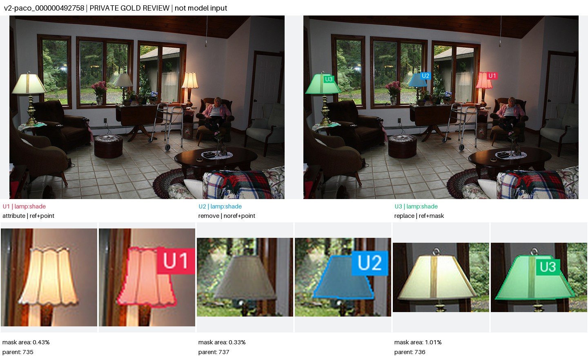
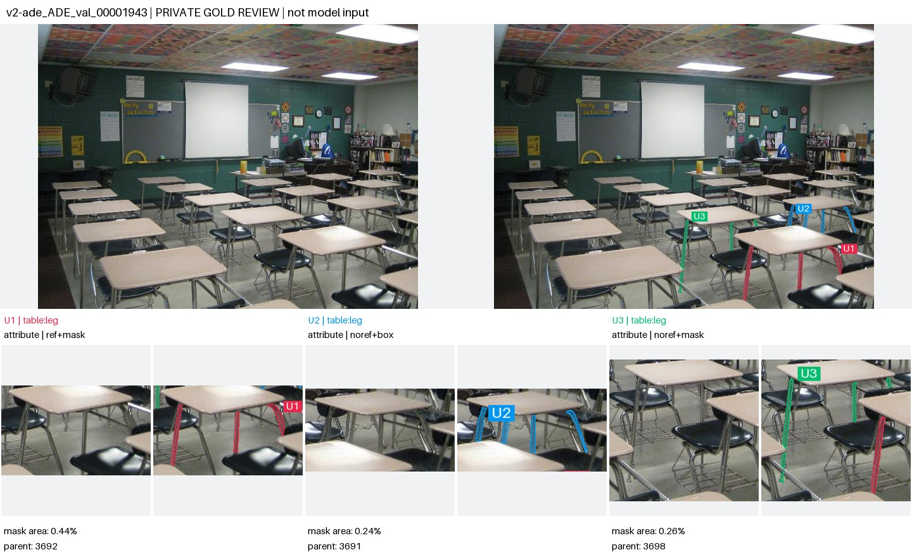
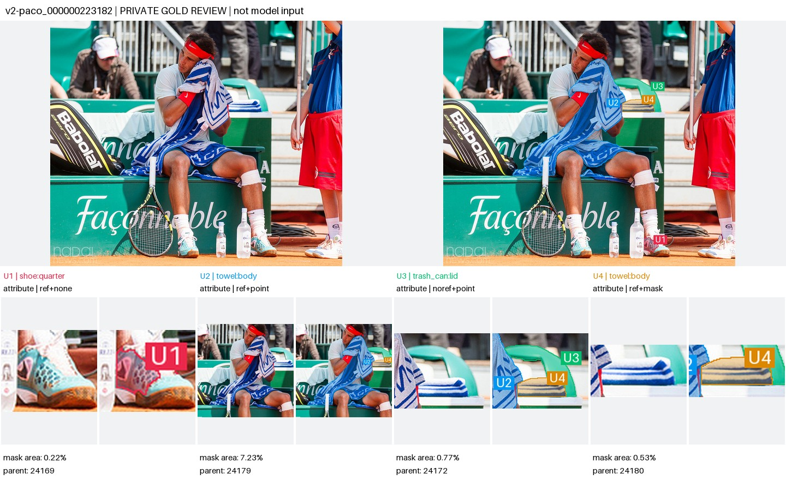

# SAMTok Benchmark v2：构建结果与使用说明

本轮从新的源图重新构建，得到 **212 条主评测 case、212 张独立源图、540 个不同物体上的编辑目标**。每条含 2–4 个物体，每个物体只作为一个编辑单元；一个单元可以覆盖该物体上被遮挡后分开的区域或多个同名部件。所有主 case 混合至少两种交互形式。

这里的完成状态是：源图及原始 mask 已逐图查看，任务、交互分配、验收条件和来源记录已冻结；代码具备输入生成、模型适配器入口、评审任务生成和严格计分功能。本轮没有运行 Qwen-Image-2.1 / SAMTok 的正式对比实验，也没有生成或伪造人工审核结果。数据审阅者为 assistant，记录为 `ai_direct_visual`。

## 数据与实际难点

| 项目 | 最终数量 |
|---|---:|
| PACO-LVIS，源图限定 COCO val2017 | 119 条 |
| ADE20K-Part-234，validation | 93 条 |
| 2 / 3 / 4 个不同物体 | 115 / 78 / 19 条 |
| 颜色 / 材质修改 | 420 / 40 个编辑单元 |
| 部件移除 / 部件替换 | 40 / 40 个编辑单元 |
| 至少两个入选目标属于同一对象类别 | 116 条 |
| 包含面积不超过整图 1% 的目标 | 185 条，367 个目标 |
| 包含同一目标的多个有效连通块 | 132 条，205 个目标 |
| 单目标 mask 面积占比中位数 | 0.5484% |

有效连通块按 8 邻域计算，面积至少为 `max(12 px, 目标面积 × 0.005)`。这些统计描述的是**可见部件几何**，不是“多物体数量”的替代统计。多物体数量来自物理父对象 ID 与逐图语义复核。116 条同类对象统计采用原数据集类别名，未把不同数据集同义类别强行合并。

主要场景包括：密集教室中指定几张桌子的多段细腿；相邻台灯执行不同操作；刀柄与杯把等细部件分别替换或移除；多个相似玻璃杯的杯沿与其他餐具；多人服装上的袖子、腰带与包带；窄书脊和被书架约束的边界；体育场景中被手和身体遮挡的毛巾、鞋侧面、后方折叠毛巾及容器盖；家具扶手、抽屉、床头结构和邻接背景。

每条的具体难点和保护内容保存在 `cases.jsonl` 的 `difficulty` 字段。标签仅用于检索和切片统计，实际准入依据是原图、mask、局部细节及记录的具体理由。

## 为什么选这两类新源数据

PACO 同时提供对象与部件标注，并可沿 `obj_ann_id` 关联物理父对象；较适合检查“选对哪个物体、只改哪个部件”。本轮仅用 `paco_lvis_v1_test.json` 中对应 COCO val2017 的源图，避免混入 COCO train2017。

ADE 的室内场景提供密集家具、相邻器具和多段部件。mask 的提取为官方部件类别 PNG 与官方父实例 mask 的交集，保留原始可见区域，不做生成式补画、自动填洞或人为合并多个父对象。由于部件 PNG 按语义类别编码，**必须与父实例相交，不能把全图同类别像素当成一个物体**。

这次优先使用可直接建立“部件—物理对象”关系、且能核对原始标注的数据。没有把 SA-1B 的 proposal 数直接当作物体数，也没有从 v1 已选任务改写指令凑成 v2。此前审查发现的已知训练曝光，使 SA-1B 更适合作为后续训练来源候选；视频分割来源的整物体 mask 则仍需额外核实部件语义、帧组与遮挡范围。本版未纳入它们，不代表这些数据集完全不能用于后续版本。

## 实际挑选过程与剔除依据

先排除 v1 正式 450 条、后续 433 条的源图 ID，以及此前 15 条 PACO 原型源图。几何检索得到 911 张候选：PACO 554、ADE 357。检索门槛包括至少两个独立父对象、非空且足够可见的部件、可用的内部点及不过度重叠的 mask。数值排序只是安排查看顺序。

实际逐图查看 **288 张**：先查看前 48 张，再按来源及对象类别组合分散取样查看 240 张；最终保留 212 张、拒绝 76 张。未把另外 623 张标为“已审核”。查看内容包括干净原图、全部候选 overlay、每个候选的干净局部和 mask 局部；必要时只保留一张图里合格的若干物体，剔除其他候选部件。

具体剔除包括：不同 annotation ID 实为同一张长凳/同一物体；父对象与其部件重复计数；反射像；细部件漏标；孔洞被填满；把高光误当作独立部件；人或家具互相粘连；区域过于简单且缺少指定实例难点；遮挡导致目标无法可靠消歧。

二次核查又剔除了两条已初步保留的图：洗衣机门 mask 包含玻璃，而指令只改不透明门框；手机 bezel mask 覆盖显示屏和按键，而指令要求保护这些内容。没有靠放宽定义或修改原 mask 将它们留在主集。原始审核、最终覆盖决定分别保存在 `first_pass_visual_decisions.jsonl`、`final_review_overrides.jsonl`，最终状态在 `visual_decisions.jsonl`。

对入选源图进一步设计操作：移除可独立去掉的把手、灯罩或扇叶，不移除承重腿制造悬空物体；替换椅背、灯罩及工具握柄时限制安装关系与近似占地；材质修改要求几何保持；颜色任务补充了原色接近目标色时的检查。独立放在桌上的灯罩使用专门指令，移除后保留玻璃桌面，不要求凭空生成灯座。

文本指代也做了独立性修正，例如将 “that bedside table” 改为完整的“左侧承托灯具的床头柜”，确保打乱 U 编号、移除其他单元的 ref 或做单单元诊断时，指代仍可成立。这些变化保存在 `language_scope_revisions.jsonl`、`instruction_design_revisions.jsonl` 和 `color_contrast_revisions.jsonl`。

## 三个实际入选例子

**三盏相似台灯，分别执行不同操作。** `v2-paco_000000492758`：U1 使用 ref+point 修改靠近坐着的人的灯罩颜色；U2 使用无 ref 的 point 移除中间窗口前灯罩；U3 使用 ref+mask 替换最左侧灯罩。灯柱、桌面、人物和未授权区域均需保持。



**密集教室，分别改三张桌子的细腿。** `v2-ade_ADE_val_00001943`：ref+mask、无 ref 的 box、无 ref 的 mask 混用。框内存在相邻椅子与桌子的其他部件；一个目标包含多段可见桌腿，不能只改定位附近一根。



**体育场景，四个对象和四种输入。** `v2-paco_000000223182`：鞋侧面使用纯 ref，大毛巾使用 ref+point，后方箱盖使用无 ref 的 point，折叠毛巾使用 ref+mask。需覆盖毛巾被手和身体分开的可见区域，同时保护人物、文字图案、瓶子与其他衣物。



以上图片是**审阅用私有标注图**，不是完整发送给模型的提示图。查看实际公开输入请使用离线页面右侧的“实际混合交互图”。

## 七种交互如何分配

这里 **ref 是文本 referring expression，不是参考图**。

| 单元形式 | 数量 | 模型获得的信息 |
|---|---:|---|
| no-ref + point | 78 | 通用部件/操作文本与点 |
| no-ref + box | 79 | 通用部件/操作文本与框 |
| no-ref + mask | 74 | 通用部件/操作文本与用户 mask |
| ref-only | 79 | 完整实例指代与操作文本 |
| ref + point | 79 | 完整实例指代、操作文本与点 |
| ref + box | 72 | 完整实例指代、操作文本与框 |
| ref + mask | 79 | 完整实例指代、操作文本与用户 mask |

每条至少两种形式，148 条同时含有 ref 和无 ref 单元，79 条含纯 ref 单元。其他条目也混合不同定位形式；没有要求每一张图必须同时用遍七种形式。每图先按固定种子打乱单元顺序，再按固定七模式调度分配，冻结后不能为了某个模型的结果另行挑输入。

no-ref 文本可以说明“所有可见桌腿”“两侧扶手”等编辑粒度，但不提供完整唯一实例描述。点/框负责指定所属实例，文本负责定义部件范围；模型不能只涂点附近，也不能把整个框内的其他东西一起改掉。

支持两种独立协议：

- `visual_locator_v2`：第一张是干净源图，第二张是仅绘制用户实际提供的点/框/mask 的辅助图。编号绑定操作。ref-only 单元在辅助图上没有提示。
- `native_regions_v2`：干净源图与结构化的逐单元点/框/mask。适配器负责转换为模型支持的区域接口。point 单元不暴露 mask；box 单元不暴露 point/mask；纯 ref 单元不暴露任何几何。

同一协议内可以比较方法；不能把原生区域接口的结果与视觉标记接口的结果混成一张不注明条件的排行榜。图形标记及 U 编号是定位辅助，不能保留在输出图片中。

`all_ref`、`all_mask_noref`、`single` 为可生成的诊断变体。它们共用同一源图 family ID，不增加主集 212 条的数量。`single` 诊断保留原单元的交互方式；原来其他单元的区域在该任务中恢复为需保护内容。

## 评分：所有对象都要过关

每个单元分别给出布尔判断及可核查的视觉证据：E 检查实例选择和完整执行；P 检查同一物体其他部件及邻接内容；Q 检查自然质量。另给全图 P 和 Q。

`case_pass = global_P ∧ global_Q ∧ AND_over_units(E ∧ P ∧ Q)`

主指标是所有主 case 的整条通过率；同时报告三项单元指标和按对象数、来源、交互、操作、难点的切片。任一单元漏改、错改、越界或质量不过关，整条失败。一个单元的保持评价需允许同一 case 其他单元明确授权的变化。

源 mask 是定位与审阅依据，**不是编辑后图像的像素差真值**。移除、替换及材质变化可能需要合理地重建暴露背景、连接边界、局部阴影和反射。评审任务提供全图与源图坐标下固定的前后局部裁剪；不能用输出检测结果重新选一个“更好看的框”，也不能单凭源 mask 外像素差判定违规。

输入、配置、输出、分数通过 manifest / input / output SHA256 与 run key 绑定，避免改了指令却沿用旧结果。缺少任何单元评分会报错。默认拒绝不完整实验；显式允许时，缺失输出或评分的条目仍留在分母并按失败计，同时报告覆盖率。人工和 AI 评审身份分开记录，空评分模板不能当作成功结果。

本版聚焦已有对象/部件的属性、移除和替换。它不包含“在原图空白位置增加新对象”的协议，也不把 mask 直接当新增对象的像素真值；需要此类任务时应定义新位置与新增对象之间的绑定并另行冻结版本。

## 来源与重复审计

入选图与已知训练图缓存 **175,101 张**（训练 source 和 target）比较，另与旧版 **883 张**原图及入选图内部比较。检查字节哈希、标准 RGB 像素哈希，以及原图/水平翻转的 pHash。阈值为训练集汉明距离 ≤8，v1 和本版内部 ≤10。三组均无命中。

旧版扩充有 JPEG 转 PNG 的重打包，因此追溯原图 ID 和原始路径，而不是将不同文件字节直接视为新源图。训练缓存路径、哈希、指纹算法、训练清单身份及覆盖范围在 `audit/source_audit.json`。本版原图和 mask 哈希、注释文件 SHA256、父实例 ID 及提取方式在 `cases.jsonl`、`provenance.jsonl`、`asset_manifest.jsonl`。

这些审计覆盖当前已知的任务训练清单与缓存，不证明基础模型、分词器或未知训练集合从未见过这些图片。感知阈值无命中也不等同于证明不存在任何同场景不同视角照片。后续训练扩充应把 `holdout_source_ids.jsonl` 作为排除清单，并继续检查像素/近重复及可识别的同场景家族。

## 本机目录与查看方式

本次全部产物整理在 `/opt/tiger/SAMTok_Benchmark_v2/`：

| 路径 | 内容 |
|---|---|
| `README_中文.md` | 本机交付入口 |
| `dataset/index.html` | 全部 212 条的离线查看页 |
| `dataset/assets/` | 干净源图、原始 mask、初筛卡、最终目标总览与放大图 |
| `dataset/inputs_visual/`、`inputs_native/` | 两种协议的全部 212 个主任务 |
| `dataset/*.json[l]`、`dataset/audit/` | 冻结任务、来源、决定、统计及检查 |
| `code/` | 仓库 clone，`v2branch` |
| `construction_workspace/` | 911 张候选、审阅卡、288 条实际审阅决定与构建中间产物 |
| `SAMTok_Benchmark_v2_浏览包.zip` | 可整体下载并解压查看的完整数据浏览包 |

用 Chrome、Edge 或其他现代浏览器打开 `dataset/index.html`。远程机器上的路径需先下载完整浏览包并解压，不能只下载 HTML。页面不使用 AJAX、不访问绝对 HDFS 图片地址、不依赖 VS Code 的 `html.showPreview`。页面中的个人复核记录保存在浏览器本地，可导出 JSONL；导出内容不会自动冒充已完成的独立人工审核或改变冻结任务。

## 复现实验入口

在 `code/` 下安装 `python -m pip install -e '.[dev]'`。本机已经准备了隔离的 `.deps`，也可直接用 `PYTHONPATH=.deps:src python -m samtok_benchmark.v2.cli` 代替下列命令名。

```bash
BENCH_DATA=/opt/tiger/SAMTok_Benchmark_v2/dataset
samtok-benchmark-v2 validate --manifest "$BENCH_DATA/cases.jsonl" \
  --dataset-root "$BENCH_DATA" --minimum-cases 200 --output outputs/v2_validation.json

samtok-benchmark-v2 prepare --manifest "$BENCH_DATA/cases.jsonl" \
  --dataset-root "$BENCH_DATA" --protocol visual_locator_v2 \
  --variants mixed --output outputs/v2_inputs

samtok-benchmark-v2 run-editor --inputs outputs/v2_inputs/jobs.jsonl \
  --adapter your_adapter:edit --method your_model --seed 0 --output outputs/your_model

samtok-benchmark-v2 prepare-judge --manifest "$BENCH_DATA/cases.jsonl" \
  --dataset-root "$BENCH_DATA" --inputs outputs/v2_inputs/jobs.jsonl \
  --outputs outputs/your_model/outputs.jsonl --output outputs/your_model_judge

# 使用真实评审填写 scores_template.jsonl；不可将空模板或测试打分当成模型结果。
samtok-benchmark-v2 report --manifest "$BENCH_DATA/cases.jsonl" \
  --inputs outputs/v2_inputs/jobs.jsonl --outputs outputs/your_model/outputs.jsonl \
  --scores outputs/your_model_judge/scores_completed.jsonl --output outputs/v2_report.json
```

复制数据目录到其他机器后，要重新 `prepare`：任务定义与图片是可移植的，已生成的运行 job 中包含本机绝对文件路径，输入摘要也绑定这些实际文件。模型适配器只能使用公开 job 的 `images`、`prompt`、`units`；不能自行读取 `cases.jsonl` 的私有 target、评审页或 gold mask 来补足没有提供的提示。

Git 保存代码、文档和冻结元数据；完整图片留在本地数据包。v1 的数据、代码入口及既有结果保留，旧 `samtok-benchmark` 命令仍对应 v1。

## 后续训练构造如何使用这一版

先冻结这 212 张图及其派生关系，不以 baseline 失败与否更换主集成员。训练集可以复用“同类多实例、细长/分离部件、遮挡、相邻保护、跨对象不同操作与输入绑定”这些场景模板，但使用排除清单之外的新源图。应按对象数量、部件大小、可见碎片数量、邻接保护、交互形式组合及操作组合匹配难点，不只按数据集来源配比例。

本版仍偏向室内家具、属性编辑和可见部件，点/框由官方 mask 稳定导出，尚未模拟用户定位噪声；也未覆盖交互纠错轮次。它在任务结构上比 v1 更直接检验多对象绑定、完整覆盖与边界控制，是否对具体模型更难、能否显示 SAMTok 改善，需要后续固定协议下的正式实验验证。
